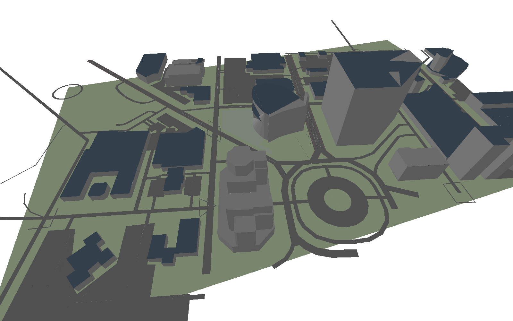

```{=html}
<div class="page-banner">
  
  <div class="hero-content">
    <div class="hero-eyebrow">iHuman Lab · Oklahoma State University</div>
    <div class="hero-title-top">iHuman Lab <span class="hero-title-accent">Presentations</span></div>
  </div>
</div>
```
