---
# MOSAIC hands-on tutorial — IEEE SMC 2026
# Render:  quarto render mosaic-tutorial.qmd
#          quarto preview mosaic-tutorial.qmd
title: "MOSAIC<span class='title-fullname'>Modular System for Adaptive<br>[Human–AI Collaboration]{.accent}</span>"
subtitle: "<span class='title-tagline'>A Configurable Testbed for Human–AI Teaming</span><span class='title-venue'>IEEE SMC 2026 · Bellevue, WA</span><span class='title-repo'>github.com/iHuman-Lab/mosaic</span>"
author: "Bennett Kwaku Dogbey · Elahe Oveisi · Hemanth Manjunatha"
description: "A hands-on introduction to MOSAIC: install it, play a search-and-rescue mission, and change the task, the interface, the AI teammate, and the sensing."
image: assets/gui-screenshot-live.png
event_type: "Tutorial"
date: "2026-10-04"
date-format: "MMMM D, YYYY"
format:
  revealjs:
    theme: [default, theme.scss]
    slide-number: true
    transition: fade
    background-transition: fade
    logo: assets/logo.png
    footer: "MOSAIC Tutorial · iHuman Lab · Oklahoma State University"
    width: 1280
    height: 720
    margin: 0.1
    navigation-mode: linear
    controls: true
    progress: true
    include-after-body:
      - text: |
          <script>
          // Restart a slide's clips when it is shown, so each starts at its first frame
          // and the three camera clips on the Camera Views slide play in step.
          (function () {
            function restart(slide) {
              slide.querySelectorAll('.camera-view img, .phase img, .run-split img').forEach(function (img) {
                var src = img.getAttribute('src');
                if (!src || !/\.gif(\?|$)/.test(src)) return;
                img.setAttribute('src', src.split('?')[0] + '?t=' + Date.now());
              });
            }
            function hook() { Reveal.on('slidechanged', function (e) { restart(e.currentSlide); }); }
            if (window.Reveal && Reveal.on) hook(); else window.addEventListener('load', hook);
          })();
          </script>
title-slide-attributes:
  data-background-image: assets/background.jpg
  data-background-opacity: "0.3"
  data-background-color: "#252525"
---

## Meet the [iHuman Lab]{.accent}

::: {.hook}
We study how people and intelligent systems work together.
:::

::: {.team}

::: {.member}


[Hemanth Manjunatha]{.member-name}
[Principal Investigator]{.member-role}
:::

::: {.member}


[Elahe Oveisi]{.member-name}
[PhD Candidate]{.member-role}
:::

::: {.member}


[Bennett Kwaku Dogbey]{.member-name}
[PhD Student]{.member-role}
:::

:::

::: {.member-link}
Our work spans brain–computer interfaces, human–robot interaction, human-AI interaction, and cognitive augmentation.

[iHuman Lab · Oklahoma State University](https://ihuman-lab.github.io/lab-website/)
:::

<!-- ============ PART 1 — no divider slide: the deck opens here ============ -->

## Studying [Human–AI Teaming]{.accent}

::: {.hook}
When an AI teammate advises people in dynamic, high-stakes tasks, researchers ask questions like these:
:::

:::: {.research-grid .question-cards}

::: {.research-question}
[Trust and reliance]{.research-topic}

When do people follow AI advice, and when is that reliance appropriate?
:::

::: {.research-question}
[Decisions under pressure]{.research-topic}

How do uncertainty and time constraints affect reliance?
:::

::: {.research-question}
[Situation awareness]{.research-topic}

What happens when the person and AI have access to different information?
:::

::: {.research-question}
[Cognitive state]{.research-topic}

How does AI advice affect attention and workload?
:::

::: {.research-question}
[AI teammate design]{.research-topic}

Which teammate behaviors and communication strategies improve team performance?
:::

::: {.research-question}
[Adaptive assistance]{.research-topic}

When should assistance change with task demands or human performance?
:::

::::

::: {.punchline}
Answering these questions requires observing the interaction [as it unfolds over time]{.accent}.
:::

::: {.notes}
These are the field's core questions. Each one plays out during the interaction,
as decisions, advice, and consequences build on each other.
:::

---

## Why Do We Need a Configurable [Testbed]{.accent}?

::: {.hook}
That takes four capabilities in one experiment. Existing tools rarely offer all four together.
:::

::::: {.need-map .no-core}

:::: {.need-column}

::: {.need-item .has-visual}
::: {.need-visual .icon}
```{=html}
<svg viewBox="0 0 80 64" role="img" aria-label="Icon: one decision branching into the next">
  <circle cx="8" cy="32" r="5" fill="#EC672C"/>
  <line x1="13" y1="32" x2="26" y2="32" stroke="#ffffff" stroke-width="3" stroke-linecap="round"/>
  <circle cx="32" cy="32" r="6" fill="none" stroke="#ffffff" stroke-width="3"/>
  <path d="M37 28 L61 13 M37 36 L61 51" fill="none" stroke="#ffffff" stroke-width="3" stroke-linecap="round"/>
  <circle cx="67" cy="10" r="5.5" fill="none" stroke="#ffffff" stroke-width="3"/>
  <circle cx="67" cy="54" r="5.5" fill="#EC672C"/>
</svg>
```
:::

::: {.need-text}
[01]{.need-index}

[Interactive decision making]{.need-title}

People make a sequence of decisions, and each outcome changes what happens next.
:::
:::

::: {.need-item .has-visual}
::: {.need-visual .icon}
```{=html}
<svg viewBox="0 0 64 64" role="img" aria-label="Icon: three sliders set to different values">
  <g stroke="#ffffff" stroke-width="3" stroke-linecap="round" opacity="0.8">
    <line x1="6" y1="14" x2="58" y2="14"/><line x1="6" y1="32" x2="58" y2="32"/><line x1="6" y1="50" x2="58" y2="50"/>
  </g>
  <g fill="#252525" stroke="#EC672C" stroke-width="3">
    <circle cx="20" cy="14" r="6"/><circle cx="44" cy="32" r="6"/><circle cx="30" cy="50" r="6"/>
  </g>
</svg>
```
:::

::: {.need-text}
[03]{.need-index}

[Configurable task conditions]{.need-title}

Researchers need to vary information access, uncertainty, time pressure, and the consequences of mistakes.
:::
:::

::::

:::: {.need-column}

::: {.need-item .has-visual}
::: {.need-visual .icon}
```{=html}
<svg viewBox="0 0 64 64" role="img" aria-label="Icon: an advice bubble with a setting inside">
  <path d="M9 8 H55 a5 5 0 0 1 5 5 V38 a5 5 0 0 1 -5 5 H27 L15 54 V43 H9 a5 5 0 0 1 -5 -5 V13 a5 5 0 0 1 5 -5 Z"
        fill="none" stroke="#ffffff" stroke-width="3" stroke-linejoin="round"/>
  <line x1="14" y1="26" x2="50" y2="26" stroke="#ffffff" stroke-width="3" stroke-linecap="round" opacity="0.45"/>
  <line x1="14" y1="26" x2="36" y2="26" stroke="#EC672C" stroke-width="3" stroke-linecap="round"/>
  <circle cx="36" cy="26" r="5.5" fill="#EC672C"/>
</svg>
```
:::

::: {.need-text}
[02]{.need-index}

[A customizable AI teammate]{.need-title}

Researchers need to vary what the AI knows, how reliable it is, and when and how it communicates.
:::
:::

::: {.need-item .has-visual}
::: {.need-visual .icon}
```{=html}
<svg viewBox="0 0 64 64" role="img" aria-label="Icon: three signals aligned on one timeline">
  <g fill="none" stroke="#ffffff" stroke-width="2.5" stroke-linejoin="round" stroke-linecap="round">
    <path d="M4 14 Q10 5 16 14 T28 14 T40 14 T52 14 T60 14"/>
    <path d="M4 36 H14 V28 H24 V36 H34 V28 H46 V36 H60"/>
    <polyline points="4,52 12,52 16,44 21,60 26,47 30,56 34,52 60,52"/>
  </g>
  <line x1="40" y1="2" x2="40" y2="62" stroke="#EC672C" stroke-width="3" stroke-linecap="round"/>
</svg>
```
:::

::: {.need-text}
[04]{.need-index}

[Synchronized data]{.need-title}

Task events, human actions, AI advice, physiological signals, and sensor measurements must share a common timeline.
:::
:::

::::

:::::

::: {.notes}
To study the interaction over time, researchers need an interactive task, a
customizable teammate, conditions they can vary, and synchronized data. The
next slide shows how MOSAIC brings them together.
:::

---

## What Is [MOSAIC]{.accent}?

::: {.hook}
MOSAIC is a modular testbed for human–AI teaming research. Configure its components for each study.
:::

::::: {.need-map .linked}

:::: {.need-column}

::: {.need-item .has-visual}
::: {.need-visual .thumb}
{fig-alt="One room of the search-and-rescue task: lava, a victim, and doors."}
:::

::: {.need-text}
[01]{.need-index}

[Interactive task]{.need-title}

Search and rescue, one decision at a time
:::
:::

::: {.need-item .has-visual}
::: {.need-visual .thumb .pair}
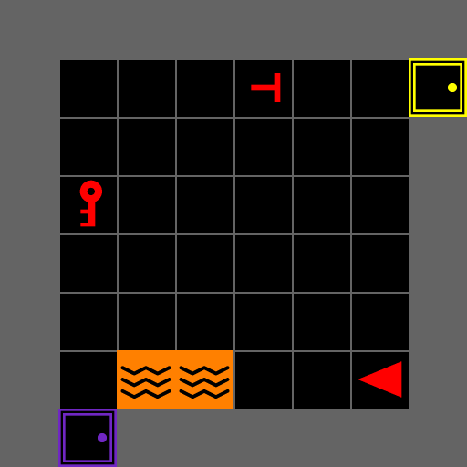{fig-alt="A room shown with the room camera."} 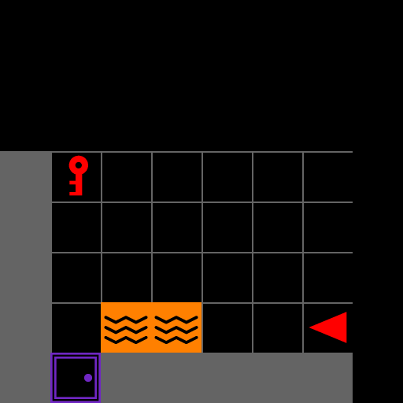{fig-alt="The same room shown with the cone camera."}
:::

::: {.need-text}
[03]{.need-index}

[Configurable conditions]{.need-title}

Map, view, timing, and scoring per study
:::
:::

::::

```{=html}
<div class="need-links" aria-hidden="true"><svg viewBox="0 0 100 100" preserveAspectRatio="none">
  <line x1="50" y1="50" x2="0" y2="24"/><line x1="50" y1="50" x2="0" y2="76"/>
  <line x1="50" y1="50" x2="100" y2="24"/><line x1="50" y1="50" x2="100" y2="76"/>
</svg></div>
```

::: {.need-core}
[MOSAIC]{.need-core-title}

[modular · configurable]{.need-core-subtitle}
:::

:::: {.need-column}

::: {.need-item .has-visual}
::: {.need-visual .thumb}
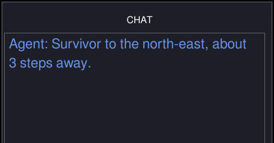{fig-alt="The chat panel with the teammate's reply: Survivor to the north-east, about 3 steps away."}
:::

::: {.need-text}
[02]{.need-index}

[Customizable AI teammate]{.need-title}

Scripted or LLM, with behavior you set
:::
:::

::: {.need-item .has-visual}
::: {.need-visual .thumb}
```{=html}
<svg viewBox="0 0 132 96" role="img" aria-label="An eye tracker and an EEG trace streaming into Lab Streaming Layer">
  <path d="M8 28 Q26 12 44 28 Q26 44 8 28 Z" fill="none" stroke="#ffffff" stroke-width="2.5"/>
  <circle cx="26" cy="28" r="6.5" fill="#EC672C"/>
  <circle cx="26" cy="28" r="2.5" fill="#252525"/>
  <polyline points="8,70 14,70 18,58 23,82 28,62 32,76 36,66 40,70 46,70"
            fill="none" stroke="#EC672C" stroke-width="2.5" stroke-linejoin="round"/>
  <path d="M52 30 L72 43 M52 68 L72 55" fill="none" stroke="#EC672C" stroke-width="2.5" stroke-linecap="round"/>
  <rect x="76" y="31" width="48" height="34" rx="6" fill="rgba(236,103,44,0.18)" stroke="#EC672C" stroke-width="2"/>
  <text x="100" y="54" text-anchor="middle" font-family="Rubik, sans-serif" font-size="16" font-weight="800" fill="#ffffff">LSL</text>
</svg>
```
:::

::: {.need-text}
[04]{.need-index}

[Synchronized data]{.need-title}

Actions, advice, and signals on one clock
:::
:::

::::

:::::

::: {.punchline}
MOSAIC lets researchers [vary the task and AI teammate, then record the interaction]{.accent}.
:::

::: {.notes}
MOSAIC stands for Modular System for Adaptive Human–AI Collaboration: an
open-source Python platform for studying human–AI teaming through configurable
tasks, built on MiniGrid. Like a mosaic
built from tiles, it assembles separate parts (task, teammate, interface, sensing)
into one study. Each box answers the need in the same position on the last slide:
the task, a teammate you can customize, conditions you set per study, and one
synchronized record. Modular: the environment, AI teammate, interface, sensing,
and analytics are separate components, so you replace one without touching the
others. Configurable: map, hazards, view, scoring, and the teammate are set per
study, not hard-coded. Search and rescue is the first testbed; the same pieces
can support other collaborative tasks (ihuman-lab.github.io/mosaic).
:::

---

## How [MOSAIC]{.accent} Works

::: {.hook}
Each part is a separate module: the participant acts on the task, the AI teammate advises from task context, and LSL aligns every stream into one session record.
:::

::: {.overview-diagram}
::: {.system-row}

::: {.system-node}
[Human participant]{.system-title}

Observes, decides, and acts.
:::

::: {.system-link .two-way}
[actions]{.link-top}

[observations]{.link-bottom}
:::

::: {.system-node .system-core}
[MOSAIC task]{.system-title}

Runs the task and the human-facing interface.
:::

::: {.system-link .two-way}
[task context]{.link-top}

[advice]{.link-bottom}
:::

::: {.system-node}
[AI teammate]{.system-title}

Interprets task context and provides advice.
:::

:::

::: {.drop-row}

::: {.record-drop}
[physiological signals]{.record-drop-label}
:::

::: {.record-drop}
[task and interaction stream]{.record-drop-label}
:::

:::

::: {.sync-row}

::: {.sync-node}
[Study sensors]{.system-title}

Physiological data: EEG, eye tracking, pupil diameter
:::

::: {.sync-link}
Time-stamped stream
:::

::: {.sync-node .sync-core}
[Lab Streaming Layer (LSL)]{.system-title}

Aligns streams on a shared clock
:::

::: {.sync-link}
Synchronized record
:::

::: {.sync-node .system-record}
[Session data]{.system-title}

Ready for analysis and replay
:::

:::
:::

::: {.notes}
Here is MOSAIC. You're the participant on the left. You act, the task updates, and
when you ask, the teammate reads the task context and answers. Everything the
researcher varies sits in configuration, and everything that happens, including gaze
and physiology, lands on one clock. Underneath, the reusable parts live in the
`mosaic` package and each study's choices live in `experiment/`; the code map at
the end shows that split.
:::

---

## The Task: [Search and Rescue]{.accent}

:::: {.columns .scenario-columns}

::: {.column width="58%"}
{fig-alt="The whole search-and-rescue building: nine rooms with victims, lava, keys, and locked doors."}
:::

::: {.column width="42%"}

::: {.scenario-brief}
[Mission]{.scenario-label}

Search a multiroom building and rescue the real victims.

Real victims and decoys look alike, so an AI teammate's advice can help or mislead.

Part Three plays the mission.
:::

:::

::::

::: {.punchline}
Search and rescue provides a controlled but [consequential setting]{.accent} for studying human–AI decisions.
:::

---

## The Human–AI [Teaming Loop]{.accent}

::: {.hook}
At every decision, the participant can act alone or ask for advice.
:::

::: {.teaming-diagram}

::: {.loop-return}
[next decision]{.arrow-label}
:::

::: {.loop-main}

::: {.loop-node}
[1]{.decision-number} [Observe]{.decision-title}

Read the room and the mission state.
:::

::: {.loop-arrow}
:::

::: {.loop-node .loop-choice}
[2]{.decision-number} [Decide]{.decision-title}

Act alone, or ask the AI teammate.
:::

::: {.loop-arrow}
[act alone]{.arrow-label}
:::

::: {.loop-node}
[3]{.decision-number} [Act]{.decision-title}

The participant always chooses the final action.
:::

::: {.loop-arrow}
:::

::: {.loop-node}
[4]{.decision-number} [Outcome]{.decision-title}

The environment updates and the score changes.
:::

:::

::: {.advice-branch}

::: {.branch-label}
Optional advice path
:::

::: {.branch-down}
[ask]{.arrow-label}
:::

::: {.branch-up}
[use or ignore]{.arrow-label}
:::

::: {.advice-box .ask}
[Request advice]{.advice-box-title}

MOSAIC sends task context to the AI teammate.
:::

::: {.loop-arrow .branch-across}
[advice]{.arrow-label}
:::

::: {.advice-box .evaluate}
[Evaluate advice]{.advice-box-title}

Compare it with what the participant can see.
:::

:::

:::

::: {.cycle-band}
[Recorded throughout]{.cycle-title} Task state · advice request · AI response · participant action · outcome
:::

::: {.punchline}
The central question is when and how AI advice [changes human decisions]{.accent}.
:::

::: {.notes}
Next, we will install MOSAIC, launch a mission, and change the task ourselves.
:::

---

<!-- ============ PART 2 ============ -->

::: {.divider}
[Part Two]{.divider-kicker}

[Install MOSAIC]{.divider-title}

[Check the system, install MOSAIC, and run the mission]{.divider-path}

::: {.you-are-here}
[Why]{.stop} [Install]{.stop .here} [Experience]{.stop} [Configure]{.stop}
:::

::: {.qr-card}
{fig-alt="QR code that opens the tutorial's Jupyter server"}

[Companion notebook]{.qr-title}
[On the tutorial server: every setup command to copy, and the mission with nothing to install]{.qr-line}
[Sign in with your password, then open `02_mosaic_human_ai.ipynb`]{.qr-line}
[jupyter.ihuman-lab.work]{.qr-url}
:::
:::

---

## Before You [Start]{.accent}

::: {.hook}
Check four things on your laptop before installing.
:::

:::: {.columns .prereq-split}

::: {.column width="47%"}
::: {.feature-list .prereq-list}
::: {.feature-row}
[Python]{.feature-name} 3.10 or 3.11 [check: `python --version`]{.check-cmd}
:::
::: {.feature-row}
[Git]{.feature-name} Any recent version [check: `git --version`]{.check-cmd}
:::
::: {.feature-row}
[Terminal]{.feature-name} PowerShell, macOS Terminal, or a Linux shell
:::
::: {.feature-row}
[Display]{.feature-name} A local desktop: the game opens its own window
:::
:::
:::

::: {.column width="53%"}
::: {.dep-panel .dep-groups}
[Installed for you by `pip install -e .`]{.dep-title}

::: {.dep-group}
[Task]{.dep-group-name}

::: {.dep-grid}
[minigrid]{.dep} [gymnasium]{.dep} [numpy]{.dep}
:::
:::

::: {.dep-group}
[Interface]{.dep-group-name}

::: {.dep-grid}
[pygame-ce]{.dep} [pygame_gui]{.dep}
:::
:::

::: {.dep-group}
[Study tools]{.dep-group-name}

::: {.dep-grid}
[pandas]{.dep} [pyyaml]{.dep} [python-dotenv]{.dep}
:::
:::
:::
:::

::::

::: {.punchline}
Nothing to install by hand: the next two slides [set everything up]{.accent}.
:::

::: {.fig-note}
No install, or prefer to copy and paste? The companion notebook is on the tutorial server: `jupyter.ihuman-lab.work`
:::

---

## Clone MOSAIC and Create the [Environment]{.accent}

::: {.hook}
Everything in the tutorial runs from one repository and one environment.
:::

:::: {.columns .install-split}

::: {.column width="60%"}
::: {.panel-tabset .install-code}

### macOS / Linux

```bash
git clone https://github.com/iHuman-Lab/mosaic.git
cd mosaic
python3 -m venv mosaic_env
source mosaic_env/bin/activate
```

### Windows PowerShell

```powershell
git clone https://github.com/iHuman-Lab/mosaic.git
cd mosaic
python -m venv mosaic_env
.\mosaic_env\Scripts\Activate.ps1
```

### Conda · Any Platform

```bash
git clone https://github.com/iHuman-Lab/mosaic.git
cd mosaic
conda create -n mosaic_env python=3.11 -y
conda activate mosaic_env
```

:::
:::

::: {.column width="40%"}
::: {.line-steps}
::: {.line-step}
[1]{.line-num} [Download the code]{.line-title}

Clones the MOSAIC repository
:::
::: {.line-step}
[2]{.line-num} [Enter the folder]{.line-title}

Stay in `mosaic` for the whole tutorial
:::
::: {.line-step}
[3]{.line-num} [Create the environment]{.line-title}

A private Python named `mosaic_env`
:::
::: {.line-step}
[4]{.line-num} [Activate it]{.line-title}

Every later command runs inside it
:::
:::
:::

::::

::: {.checkpoint}
Your prompt begins with `(mosaic_env)`, and `python --version` reports 3.10 or 3.11.
:::

::: {.notes}
Choose either venv or Conda, not both. Ubuntu attendees who see "ensurepip is not
available" should install python3-venv, delete the incomplete mosaic_env, and
repeat the step. PowerShell needs the leading dot-backslash on the activation
script. Everyone stays in the mosaic directory for the rest of the tutorial.
:::

---

## Install [MOSAIC]{.accent}

::: {.hook}
Five commands, run from the `mosaic` folder with `mosaic_env` active.
:::

:::: {.columns .install-split}

::: {.column width="63%"}
```bash
python -m pip install --upgrade pip
python -m pip install -e .
python -m pip uninstall -y pygame
python -m pip install --force-reinstall "pygame-ce>=2.5.2"
python -c "import mosaic.sar.env, mosaic.gui.main; print('MOSAIC ready')"
```

::: {.checkpoint}
The check prints a `pygame-ce` banner, then `MOSAIC ready`. If it says `cannot import name 'DIRECTION_LTR'`, rerun lines 3 and 4.
:::
:::

::: {.column width="37%"}
::: {.line-steps}
::: {.line-step}
[1]{.line-num} [Update pip]{.line-title}

Avoids old-installer errors
:::
::: {.line-step}
[2]{.line-num} [Install MOSAIC]{.line-title}

`-e` means your Part Four edits apply without reinstalling
:::
::: {.line-step}
[3–4]{.line-num style="width: auto; padding-right: 0.5em;"} [Switch to pygame-ce]{.line-title}

The interface needs it; plain `pygame` hides it
:::
::: {.line-step}
[5]{.line-num} [Check it]{.line-title}

Imports the task and the interface
:::
:::
:::

::::

::: {.notes}
Lines 3 and 4 work around a packaging gap: MOSAIC's `pyproject.toml` declares
`pygame`, but `pygame_gui` needs `pygame-ce`, and both install into the same
`pygame` folder. Skipping them ends in `ImportError: cannot import name
'DIRECTION_LTR' from 'pygame'` (reproduced on a clean clone of iHuman-Lab/mosaic
main, 1018587, Python 3.11). `--force-reinstall` is required: uninstalling
`pygame` deletes files `pygame-ce` shares. `pip check` then reports "mosaic
0.1.0 requires pygame"; that is harmless. Once upstream depends on `pygame-ce`
the two lines do nothing harmful and can come off the slide.
:::

---

## Run the Included [Mission]{.accent}

:::: {.columns .run-split}

::: {.column width="50%"}

::: {.panel-tabset .install-code}

### macOS / Linux

```bash
PYTHONPATH=src python -m experiment.main
```

### Windows PowerShell

```powershell
$env:PYTHONPATH = "src"
python -m experiment.main
```

:::

::: {.feature-list .compact}
::: {.feature-row}
[Window]{.feature-name} It opens fullscreen. `F11` toggles a window (macOS: `fn`+`F11`, or set `fullscreen: false` in `configs/experiment.yaml`).
:::
::: {.feature-row}
[Move]{.feature-name} Arrow keys turn and walk the agent
:::
::: {.feature-row}
[Terminal]{.feature-name} Font warnings and `connect_all failed` lines are normal
:::
:::

:::

::: {.column width="50%"}
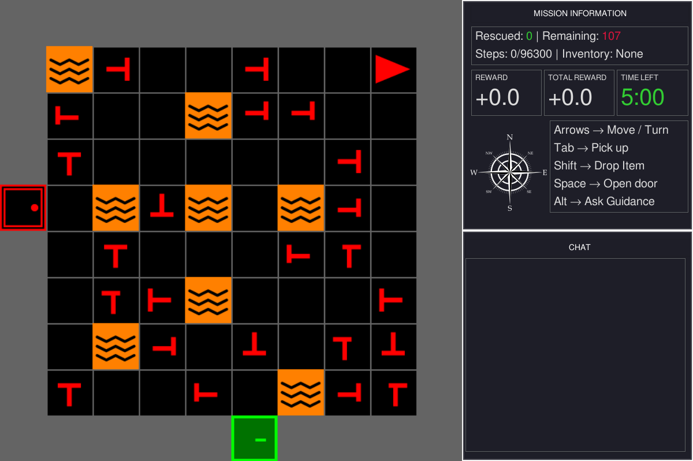{fig-alt="The MOSAIC window at launch: a room crowded with victims and lava on the left; the mission, controls, and chat panels on the right"}

::: {.fig-note}
You should see this: the room on the left, the panels on the right.
:::
:::

::::

::: {.notes}
This is MOSAIC's own study runner from the cloned repository — no extra file is
needed. Hold here until most attendees can move the agent. Ask everyone to keep
the game open: Part Three walks through it live. The terminal fills with
pygame_gui font warnings and "Timeout during mission generation: connect_all
failed" lines on every launch; both are harmless (the level generator retries).
:::

---

## First [Checkpoint]{.accent}

:::: {.columns}

::: {.column width="38%"}
::: {.check-card}
[Confirm]{.check-title}

::: {.check-item}
The window opened
:::
::: {.check-item}
Arrow keys move the agent
:::
::: {.check-item}
The information panel updates
:::
::: {.check-item}
It stays open for Part Three
:::
:::
:::

::: {.column width="62%"}
::: {.tight-table}

| Symptom | Recovery |
|---|---|
| `cannot import name 'DIRECTION_LTR'` | Rerun install lines 3 and 4 (`pygame-ce`) |
| `No module named 'mosaic'` | Activate `mosaic_env`, rerun `pip install -e .` |
| `No module named 'experiment'` | Run from the repo root with `PYTHONPATH=src` |
| `python --version` shows 3.9 or older, or 3.12 and newer | Recreate `mosaic_env` with Python 3.10 or 3.11 |
| No window, or `No available video device` | Run locally, not over SSH |

:::
:::

::::

::: {.punchline}
Everyone with a window open is ready for [Part Three]{.accent}. Leave it open.
:::

---

<!-- ============ PART 3 ============ -->

::: {.divider}
[Part Three]{.divider-kicker}

[Experience the SAR Mission]{.divider-title}

[Play one mission and learn to read the screen]{.divider-path}

::: {.you-are-here}
[Why]{.stop} [Install]{.stop} [Experience]{.stop .here} [Configure]{.stop}
:::
:::

---

## The Search-and-Rescue [Mission]{.accent}

::: {.hook}
Explore, tell real victims from decoys, and rescue them before time runs out.
:::

:::: {.columns .scenario-columns}

::: {.column width="58%"}
{fig-alt="The real interface: the agent rescues a real victim (green flash), then a decoy (red flash), then another real victim."}
:::

::: {.column width="42%"}

::: {.scenario-brief}
[Explore]{.scenario-label}

Move room to room. A locked door needs the key of the same color.

[Identify]{.scenario-label}

Both are red T shapes. A real victim's stem is centered; a decoy's is off-center.

[Decide]{.scenario-label}

A real victim earns a point, a decoy costs one, and the clock keeps running.
:::

:::

::::

::: {.punchline}
Every choice has [a consequence you can see and score]{.accent}.
:::

::: {.notes}
No code in this part: the goal is to know the mission the way a participant
does. The clip is the real interface: a real victim (green flash, +1), a decoy
(red flash, -1), then another real victim. In today's run the clock only counts
down: at 0:00 the timer stops and the mission keeps going (appendix slide "Time
Limit"); the lab's study runner is what ends a trial.
:::

---

## Game [Interface]{.accent}

::: {.hook}
What each tile means, and where to read the mission.
:::

:::: {.columns .interface-split}

::: {.column width="73%"}
::: {.annotated}
{height="480" fig-alt="MOSAIC interface caught mid-flash: a green edge vignette rings the game view after a rescue"}

::: {.anno .fragment .fade-in-then-out .mid style="--x:0.3%; --y:0.4%; --w:66%; --h:99%;"}
Game viewport — the green flash is rescue feedback
:::

::: {.anno .fragment .fade-in-then-out .left style="--x:67.7%; --y:5%; --w:31.5%; --h:9.8%;"}
Information panel — rescued, remaining, steps, inventory
:::

::: {.anno .fragment .fade-in-then-out .left style="--x:67.7%; --y:15.2%; --w:31.5%; --h:10.4%;"}
Mission status and score — reward and the clock
:::

::: {.anno .fragment .fade-in-then-out .left style="--x:67.7%; --y:25.8%; --w:31.5%; --h:23.2%;"}
Controls, always on screen
:::

::: {.anno .fragment .fade-in-then-out .left style="--x:67.1%; --y:50.4%; --w:32.5%; --h:49.2%;"}
Chat panel — where AI teammate advice arrives
:::
:::
:::

::: {.column width="27%"}
::: {.world-rail}

::: {.world-item}


[You]{.world-name} [the red triangle]{.world-note}
:::

::: {.world-item}


[Victim]{.world-name} [rescue with `Tab`]{.world-note}
:::

::: {.world-item}


[Decoy]{.world-name} [costs a point]{.world-note}
:::

::: {.world-item}


[Lava]{.world-name} [ends the mission]{.world-note}
:::

::: {.world-item}
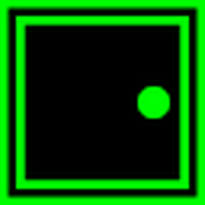

[Door]{.world-name} [`Space` opens it]{.world-note}
:::

::: {.world-item}
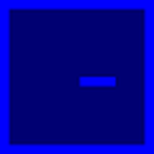

[Locked door]{.world-name} [needs the key of its color]{.world-note}
:::

::: {.world-item}


[Key]{.world-name} [`Tab` picks it up]{.world-note}
:::
:::
:::

::::

---

## Victims and [Decoys]{.accent}

::: {.hook}
Real victims and decoys are both red T shapes. Only real victims have health.
:::

:::: {.columns .scenario-columns}

::: {.column width="42%"}
::: {.victim-figure}
{fig-alt="Four orientations of a symmetric real victim above four orientations of an offset decoy victim"}

::: {.victim-row-labels}
[REAL VICTIM]{.vrow .vrow-real}
[DECOY]{.vrow .vrow-decoy}
:::
:::

::: {.health-strip}
::: {.health-tiles}
{fig-alt="Real victim, full health bar"} {fig-alt="Real victim, 60% health"} {fig-alt="Real victim, 25% health"} {fig-alt="Real victim, no health left"}
:::

::: {.health-scale}
[100%]{} [60%]{} [25%]{} [0%]{}
:::

[In the study runner, the white bar shows a victim’s health.]{.health-caption}
:::
:::

::: {.column width="58%"}
::: {.feature-list}
::: {.feature-row}
[Symbols]{.feature-name} A real victim's stem sits in the middle of the bar. A decoy's is off-center.
:::
::: {.feature-row}
[Health]{.feature-name} In the lab's study runner, health drains while a victim is in view, faster near lava, and the victim dies at zero. In today's mission it stays full.
:::
::: {.feature-row}
[Rescue]{.feature-name} Stand next to a victim, face it, and press `Tab`. The score updates at once.
:::
:::

::: {.stats}
::: {.stat}
[+1.0]{.stat-number}
[Real victim rescued]{.stat-label}
:::
::: {.stat .secondary}
[−1.0]{.stat-number}
[Decoy rescued]{.stat-label}
:::
::: {.stat .secondary}
[−2.0]{.stat-number}
[Victim died · study runner]{.stat-label}
:::
:::
:::

::::

::: {.punchline}
Real victims earn points and decoys cost them. [Telling them apart is where advice matters.]{.accent}
:::

::: {.notes}
Health lives on every victim (`health`, `deplete_rate` in mosaic/sar/objects.py).
The study's `LavaRiskVictimPlacer` sets starting health by facing and the drain
rate by distance to lava; the study env `TunedPickupVictimEnv` drains victims in
view each step and emits `victim_died` at zero. The bar is drawn only while
advice is on screen (the study reveals it on each reply). In the tutorial's
`experiment.main` run, health does not drain, so the health bar and the −2.0 outcome
do not appear; say so if asked. The reusable `VictimPlacer` places real victims
only; decoys come from the study layer.
:::

---

## Controls and [Gameplay]{.accent}

::: {.hook}
Four actions. Each clip shows what its keys do.
:::

::: {.phase-grid .phase-clips}

::: {.phase}
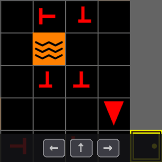{fig-alt="The agent walks and turns inside a room while the arrow keycaps light up"}

::: {.phase-body}
[Navigate]{.phase-name}

::: {.key-row}
[↑]{.keycap} [Move forward one tile]{.key-action}
:::

::: {.key-row}
[←]{.keycap}[→]{.keycap} [Turn to face a new direction]{.key-action}
:::
:::
:::

::: {.phase}
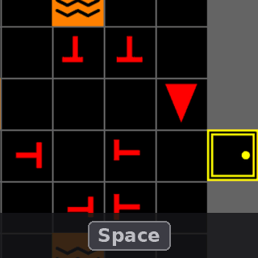{fig-alt="The agent walks up to a closed yellow door and Space opens it"}

::: {.phase-body}
[Open]{.phase-name}

::: {.key-row}
[Space]{.keycap .wide} [Open the door you are facing]{.key-action}
:::

[Locked doors open only while you carry the matching key.]{.phase-note}
:::
:::

::: {.phase}
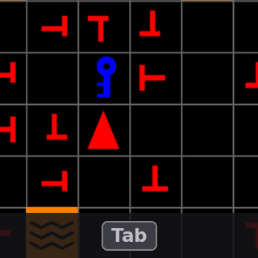{fig-alt="Tab picks up a key, then Tab rescues a victim and the view flashes green"}

::: {.phase-body}
[Pick up or rescue]{.phase-name}

::: {.key-row}
[Tab]{.keycap} [Take the key, or rescue the victim, you are facing]{.key-action}
:::
:::
:::

::: {.phase}
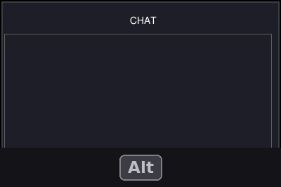{fig-alt="Alt asks the teammate; the chat panel shows thinking, then the reply, and blinks"}

::: {.phase-body}
[Request advice]{.phase-name}

::: {.key-row}
[Alt]{.keycap} [Ask the AI teammate]{.key-action}
:::

[The reply appears in the chat panel. Today's placeholder teammate answers “Currently, no commands are available.” Part Four gives it a real one.]{.phase-note}
:::
:::

:::

::: {.notes}
The advice clip uses the grounded teammate from the Part Four slide "An AI Teammate Without a Key", so the reply is true
for that building. In the attendees' own run the runner attaches the keyless
dummy teammate, so Alt replies "Currently, no commands are available."
:::

---

<!-- ============ BREAK ============ -->

::: {.divider}
[Break · 15 minutes]{.divider-kicker}

[Take a Break]{.divider-title}

[Next · Part Four: Configure MOSAIC]{.divider-path}
:::

::: {.notes}
Fifteen minutes. Leave this slide up for the whole break. Helpers use the time to finish any
install that is still stuck. Before starting Part Four, check that everyone can
move the agent; anyone who closed the game relaunches it with the command on
"Run the Included Mission". Part Four edits the file that window was launched
from, so the game has to be working first.
:::

---

<!-- ============ PART 4 ============ -->

::: {.divider}
[Part Four]{.divider-kicker}

[Configure MOSAIC]{.divider-title}

[experiment/main.py in four parts: SAR, GUI, LLM, Sensing]{.divider-path}

::: {.you-are-here}
[Why]{.stop} [Install]{.stop} [Experience]{.stop} [Configure]{.stop .here}
:::

::: {.qr-card}
{fig-alt="QR code that opens the tutorial's Jupyter server"}

[Companion notebook]{.qr-title}
[On the tutorial server: every change in this part, as the edit and as a cell you can run]{.qr-line}
[Sign in with your password, then open `02_mosaic_human_ai.ipynb`]{.qr-line}
[jupyter.ihuman-lab.work]{.qr-url}
:::
:::

---

## Runtime [Architecture]{.accent}

::: {.hook}
Four parts you can change, built on Gymnasium and MiniGrid.
:::

::: {.overview-diagram .arch-visual}
::: {.system-row}

::: {.system-node .visual-node}
::: {.node-visual .keys-visual}
[↑]{.keycap} [←]{.keycap} [→]{.keycap} [Space]{.keycap .wide} [Tab]{.keycap} [Alt]{.keycap}
:::

[Human participant]{.system-title}

Watches the screen and presses keys.
:::

::: {.system-link .two-way}
[keys]{.link-top}

[frames]{.link-bottom}
:::

::: {.system-node .system-core .visual-node}
::: {.node-visual}
{fig-alt="The MOSAIC interface"}
:::

[[4.2]{.part-badge} GUI]{.system-title} [`mosaic.gui`]{.node-path}

Game view, panels, chat, and feedback.
:::

::: {.system-link .two-way}
[action]{.link-top}

[observation]{.link-bottom}
:::

::: {.system-node .visual-node}
::: {.node-visual}
{fig-alt="The whole search-and-rescue building"}
:::

[[4.1]{.part-badge} SAR]{.system-title} [`mosaic.sar`]{.node-path}

Rooms, victims, rules, and rewards.
:::

:::

::: {.drop-row .arch-drops}

::: {.record-drop}
[physiological signals]{.record-drop-label}
:::

::: {.record-drop .two-way-drop}
[context · advice]{.record-drop-label}
:::

::: {.record-drop .built-on}
[built on]{.record-drop-label}
:::

:::

::: {.support-row}

::: {.support-card}
::: {.support-visual}
```{=html}
<svg viewBox="0 0 330 76" role="img" aria-label="Representative icon: an eye tracker and an EEG trace streaming into Lab Streaming Layer">
  <path d="M6 38 Q46 8 86 38 Q46 68 6 38 Z" fill="none" stroke="#ffffff" stroke-width="3"/>
  <circle cx="46" cy="38" r="12" fill="#EC672C"/>
  <circle cx="46" cy="38" r="4.5" fill="#252525"/>
  <polyline points="100,38 112,38 119,18 127,58 134,26 141,48 147,34 153,38 176,38"
            fill="none" stroke="#EC672C" stroke-width="3" stroke-linejoin="round"/>
  <line x1="184" y1="38" x2="226" y2="38" stroke="#EC672C" stroke-width="3"/>
  <polygon points="226,31 238,38 226,45" fill="#EC672C"/>
  <rect x="244" y="14" width="80" height="48" rx="7" fill="rgba(236,103,44,0.18)" stroke="#EC672C" stroke-width="2.5"/>
  <text x="284" y="45" text-anchor="middle" font-family="Rubik, sans-serif" font-size="22" font-weight="800" fill="#ffffff">LSL</text>
</svg>
```
:::

[[4.4]{.part-badge} Sensing]{.system-title} [`experiment/`]{.node-path}

Gaze and EEG on the game's clock, through LSL.
:::

::: {.support-card}
::: {.support-visual}
{fig-alt="The chat panel showing the reply: Survivor to the north-east, about 3 steps away."}
:::

[[4.3]{.part-badge} LLM]{.system-title} [`mosaic.llm`]{.node-path}

Reads the task, replies in the chat.
:::

::: {.support-card}
::: {.support-visual .code-visual}
`obs, reward, terminated, truncated, info = env.step(action)`
:::

[Gymnasium + MiniGrid]{.system-title}

The step API and the grid world.
:::

:::
:::

::: {.notes}
Point at the attendee's own window: the keys they press, the GUI that draws it,
the environment that decides what happens. Each numbered block is one section
of Part Four. The chat image is a real reply from the keyless teammate on
"An AI Teammate Without a Key". Sensing is study-layer only — the tutorial run
has no sensors attached. Sensors never talk to the game directly: each one
streams into Lab Streaming Layer, which puts game and sensor samples on one
clock. The env.step line is src/mosaic/gui/user.py:53.
:::

---

## One File, [Four Parts]{.accent}

::: {.custom-strip}
[Map]{.stop .here} [4.1 SAR]{.stop} [4.2 GUI]{.stop} [4.3 LLM]{.stop} [4.4 Sensing]{.stop}
:::

:::: {.columns .compose-split}

::: {.column width="61%"}
::: {.src}
[`src/experiment/main.py` · lines 31–51]{.src-cap}

::: {.compose-code}
```{.python startFrom="31" code-line-numbers="|2-14|20-21|17-19|16"}
    env = build_sar_env(
        screen_size=800,
        num_rows=3,
        num_cols=3,
        room_size=10,
        victim_placer=LavaRiskVictimPlacer(
            num_real_victims=game_config.get("num_real_victims", 6),
            num_fake_victims=game_config.get("num_fake_victims", 12),
        ),
        lava_placer=SectorSpreadLavaPlacer(
            lava_per_room=game_config.get("lava_per_room", 8),
        ),
        locked_room_placer=LockedRoomPlacer(locked_room_prob=0.5),
        camera_strategy=AgentFOVCamera(),
    )
    env.reset()
    llm_client = build_llm_client(
        provider=config.get("provider", "dummy"), model=config.get("model")
    )
    gui = SAREnvGUI(env, config=config, llm_client=llm_client)
    gui.run()
```
:::
:::
:::

::: {.column width="39%"}
::: {.compose-map}

::: {.compose-row}
[4.1]{.compose-num} [SAR]{.compose-what}

The building, what fills it, the camera
:::

::: {.compose-row}
[4.2]{.compose-num} [GUI]{.compose-what}

The participant's window
:::

::: {.compose-row}
[4.3]{.compose-num} [LLM]{.compose-what}

Who answers `Alt`
:::

::: {.compose-row}
[4.4]{.compose-num} [Sensing]{.compose-what}

What every step records
:::

:::
:::

::::

::: {.notes}
This is the file attendees launched. Step through the highlights; each one is a
section of Part Four, in this order: SAR (the building, what fills it, the
camera), GUI (the window), LLM (who answers `Alt`), and Sensing (what every
step records). Rewards are a keyword argument you add to the SAR call. This is
main.py as the tutorial needs it: imports enabled and the provider defaulting
to "dummy". Upstream MOSAIC must carry that default before the session
(iHuman-Lab/mosaic main, 1018587, has the imports but still defaults the
provider to "openai", so `Alt` replies "Import tabulate failed"). If it has not
landed, have everyone add `provider: dummy` as a top-level line in
`configs/experiment.yaml` before Part Three.
:::

---

## 4.1 · [SAR]{.accent}

::: {.custom-strip}
[Map]{.stop} [4.1 SAR]{.stop .here} [4.2 GUI]{.stop} [4.3 LLM]{.stop} [4.4 Sensing]{.stop}
:::

::: {.task-what}
Lines 31–44 build the task. Notebook: `notebooks/02_mosaic_human_ai.ipynb`
:::

:::: {.section-grid}

::: {.section-left}
::: {.code-card .section-code}
[`src/experiment/main.py`]{.code-file} [lines 31–44]{.code-where}

```{.python startFrom="31"}
    env = build_sar_env(
        screen_size=800,
        num_rows=3,
        num_cols=3,
        room_size=10,
        victim_placer=LavaRiskVictimPlacer(
            num_real_victims=game_config.get("num_real_victims", 6),
            num_fake_victims=game_config.get("num_fake_victims", 12),
        ),
        lava_placer=SectorSpreadLavaPlacer(
            lava_per_room=game_config.get("lava_per_room", 8),
        ),
        locked_room_placer=LockedRoomPlacer(locked_room_prob=0.5),
        camera_strategy=AgentFOVCamera(),
```
:::
:::

::: {.knob-list}
[Three things to change]{.task-label}

::: {.knob-card}
[1]{.knob-num} [The building]{.knob-name} [Notebook]{.change-when}

YAML counts · `num_rows` · `locked_room_prob`

[How big, crowded, and locked]{.knob-effect}
:::

::: {.knob-card}
[2]{.knob-num} [Camera]{.knob-name} [Next]{.change-when}

`camera_strategy=`

[What the participant sees]{.knob-effect}
:::

::: {.knob-card .live}
[3]{.knob-num} [Rewards]{.knob-name} [Try it]{.change-when}

`action=RescueAction(...)`

[What a mistake costs]{.knob-effect}
:::

:::

::::

::: {.notes}
Lines 31–44 are the whole SAR task: building size, the placers that fill it, and
the camera. Counts are per room (12 real victims across a 3×3 building is 108).
The building settings are Step 6 of the notebook, which is in the repository
attendees cloned (notebooks/02_mosaic_human_ai.ipynb; it also needs matplotlib,
scipy, pylsl, and pyxdf). Its own small building has no decoys; its
`make_mission()` mirrors these lines and has them, and the notebook also shows
the three cameras (Step 2) and the reward change (Step 6). The camera and
rewards get the next two slides. Code lives in
src/mosaic/sar/, src/mosaic/core/, and src/experiment/placers.py.
:::

---

## What the Participant [Sees]{.accent}

::: {.custom-strip}
[Map]{.stop} [4.1 SAR]{.stop .here} [4.2 GUI]{.stop} [4.3 LLM]{.stop} [4.4 Sensing]{.stop}
:::

::: {.task-what}
Line 44 sets the camera. One walk through a door, three cameras:
:::

::: {.camera-grid}

::: {.camera-view}
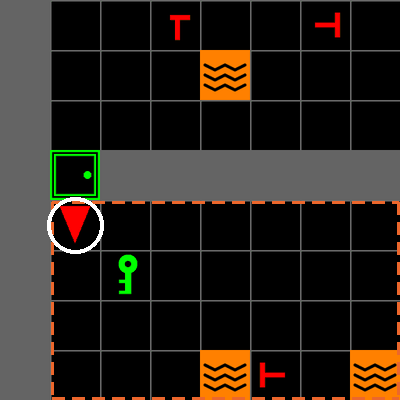{fig-alt="EdgeFollowCamera: an eight-by-eight window that scrolls with the agent and shows parts of neighboring rooms"}

[Edge-following]{.camera-title}

`EdgeFollowCamera` · scrolls with the agent
:::

::: {.camera-view}
{fig-alt="AgentFOVCamera: the view is always exactly the agent's room and switches rooms at the door"}

[Whole room]{.camera-title}

`AgentFOVCamera` · the default
:::

::: {.camera-view}
{fig-alt="AgentConeCamera: only the forward wedge of the room in front of the agent is visible"}

[Forward cone]{.camera-title}

`AgentConeCamera` · only what is ahead
:::

:::

::: {.camera-key}
[Agent]{.ckey .ckey-ring} same tile in all three &nbsp;&nbsp;·&nbsp;&nbsp; [Room]{.ckey .ckey-room} the agent's room
:::

::: {.punchline}
Same task. The camera sets [what the participant can see]{.accent}.
:::

::: {.notes}
To swap it: import the class from mosaic.core.camera and change line 44.
Cameras are a strategy interface: `CameraStrategy` in src/mosaic/core/camera.py
returns an image from `get_crop()`, and `env.switch_camera()` swaps it
mid-session. Avoid FullviewCamera and AgentCenteredCamera: both raise
AttributeError on env reset because they have no reset() method.
:::

---

## Rescue [Rewards]{.accent}

::: {.custom-strip}
[Map]{.stop} [4.1 SAR]{.stop .here} [4.2 GUI]{.stop} [4.3 LLM]{.stop} [4.4 Sensing]{.stop}
:::

::: {.task-what}
[Try it]{.mode-tag} Make rescuing a decoy cost 5 points instead of 1.
:::

:::: {.task-split}

::: {.task-col}
::: {.code-card}
[`src/experiment/main.py`]{.code-file} [an import, then inside `build_sar_env`]{.code-where}

```{.diff code-line-numbers="false"}
+from mosaic.sar.actions import RescueAction, RescueRewards
@@ inside build_sar_env(...) @@
         camera_strategy=AgentFOVCamera(),
+        action=RescueAction(
+            rewards=RescueRewards(fake_victim=-5.0)),
```
:::

[Run]{.task-label} Relaunch and rescue a decoy.

[What will the reward read?]{.predict}
:::

::: {.result-col .fragment}
::: {.result-pair .ui-pair}
::: {.result-img .ui-crop}
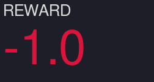{fig-alt="Reward panel reading minus 1.0 after a decoy."}

[Before · the default]{.result-label}
:::

::: {.result-img .ui-crop}
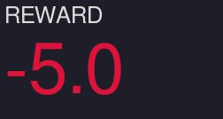{fig-alt="Reward panel reading minus 5.0 after a decoy."}

[After · `fake_victim=-5.0`]{.result-label}
:::
:::
:::

::::

::: {.notes}
`action=` goes inside the `build_sar_env(...)` call, after `camera_strategy=`.
The defaults in `RescueRewards` (src/mosaic/sar/actions.py) are +1 / -1 / -2
(`real_victim_alive`, `fake_victim`, `real_victim_dead`); the lab's study passes
10 / -10 / -20 (src/experiment/game.py line 86). Every rescue also reports an
event in `info["events"]`. A NameError on RescueAction means the import is missing.
:::

---

## 4.2 · [GUI]{.accent}

::: {.custom-strip}
[Map]{.stop} [4.1 SAR]{.stop} [4.2 GUI]{.stop .here} [4.3 LLM]{.stop} [4.4 Sensing]{.stop}
:::

::: {.task-what}
Lines 50–51 open the participant's window.
:::

:::: {.section-grid}

::: {.section-left}
::: {.code-card .section-code}
[`src/experiment/main.py`]{.code-file} [lines 50–51]{.code-where}

```{.python startFrom="50"}
    gui = SAREnvGUI(env, config=config, llm_client=llm_client)
    gui.run()
```
:::

::: {.result-img .section-shot}
{fig-alt="The MOSAIC window: the game view, the mission panel, and the chat panel."}
:::
:::

::: {.knob-list}
[Three things to change]{.task-label}

::: {.knob-card .live}
[1]{.knob-num} [Feedback flash]{.knob-name} [Demo · next]{.change-when}

`vignette=EdgeVignette(...)`

[How a mistake feels]{.knob-effect}
:::

::: {.knob-card}
[2]{.knob-num} [Info panel]{.knob-name} [Appendix]{.change-when}

`info_panel=`

[What progress is shown]{.knob-effect}
:::

::: {.knob-card}
[3]{.knob-num} [Time limit]{.knob-name} [Appendix]{.change-when}

`max_time:` (YAML)

[How much time pressure]{.knob-effect}
:::

:::

::::

::: {.notes}
The GUI lives in src/mosaic/gui/. `SAREnvGUI` takes the env, the whole YAML
config, the teammate, and optional replacements for the info panel, chat panel,
vignette, and prompt builder.
:::

---

## Feedback [Flashes]{.accent}

::: {.custom-strip}
[Map]{.stop} [4.1 SAR]{.stop} [4.2 GUI]{.stop .here} [4.3 LLM]{.stop} [4.4 Sensing]{.stop}
:::

::: {.task-what}
[Presenter demo]{.mode-tag} Make the red flash after a decoy stronger and longer.
:::

:::: {.task-split}

::: {.task-col}
::: {.code-card}
[`src/experiment/main.py`]{.code-file} [an import, then the `gui =` line]{.code-where}

```{.diff code-line-numbers="false"}
+from mosaic.gui.feedback import EdgeVignette, VignetteStyle
@@ further down @@
-    gui = SAREnvGUI(env, config=config, llm_client=llm_client)
+    gui = SAREnvGUI(env, config=config, llm_client=llm_client,
+        vignette=EdgeVignette(800, styles={"wrong_victim":
+            VignetteStyle((200, 0, 0), 200, 1.5, "fade")}))
```
:::

[Run]{.task-label} Relaunch and rescue a decoy.

[How will the mistake feel different?]{.predict}
:::

::: {.result-col .fragment}
::: {.result-pair}
::: {.result-img}
{fig-alt="A faint red edge: the default decoy flash, already fading."}

[Before · default, 0.6 s]{.result-label}
:::

::: {.result-img}
{fig-alt="A strong red edge: the tuned decoy flash."}

[After · stronger, 1.5 s]{.result-label}
:::
:::
:::

::::

::: {.notes}
One style per event in `DEFAULT_VIGNETTE_STYLES` (src/mosaic/gui/feedback.py):
color, strength, length, and fade or pulse. Your styles override the defaults.
`SAREnvGUI(info_panel=..., chat_panel=...)` replaces the side panels, and
`gui.set_advice_callbacks(...)` runs code when advice arrives.
:::

---

## 4.3 · [LLM]{.accent}

::: {.custom-strip}
[Map]{.stop} [4.1 SAR]{.stop} [4.2 GUI]{.stop} [4.3 LLM]{.stop .here} [4.4 Sensing]{.stop}
:::

::: {.task-what}
Lines 47–49 pick the AI teammate. Today it is the `dummy` placeholder.
:::

:::: {.section-grid}

::: {.section-left}
::: {.code-card .section-code}
[`src/experiment/main.py`]{.code-file} [lines 47–49]{.code-where}

```{.python startFrom="47"}
    llm_client = build_llm_client(
        provider=config.get("provider", "dummy"), model=config.get("model")
    )
```
:::

::: {.result-img .ui-crop .section-wide}
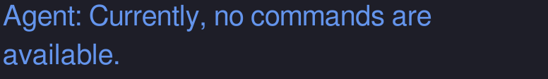{fig-alt="Chat panel: Currently, no commands are available."}

[Today, after `Alt`]{.result-label}
:::
:::

::: {.knob-list}
[Three things to change]{.task-label}

::: {.knob-card .live}
[1]{.knob-num} [Keyless teammate]{.knob-name} [Try it · next]{.change-when}

`llm_client=ReliableTeammate(0.7)`

[How reliable the advice is]{.knob-effect}
:::

::: {.knob-card .live}
[2]{.knob-num} [Real LLM]{.knob-name} [On your own]{.change-when}

`provider:` in the YAML, key in `.env`

[Who answers `Alt`]{.knob-effect}
:::

::: {.knob-card}
[3]{.knob-num} [Prompt]{.knob-name} [Appendix]{.change-when}

`prompt_builder=`

[What the teammate is told]{.knob-effect}
:::

:::

::::

::: {.notes}
The teammate contract lives in src/mosaic/llm/; hosted providers are built in
src/experiment/llm.py. Any teammate implements one method of `LLMClient`,
`query(prompt) -> str`. `prompt_type: sparse` or `detailed` (top of the YAML)
changes how a real LLM talks; `llm_nudge_interval: N` makes it speak every N
steps without `Alt`.
:::

---

## An AI Teammate Without a [Key]{.accent}

::: {.custom-strip}
[Map]{.stop} [4.1 SAR]{.stop} [4.2 GUI]{.stop} [4.3 LLM]{.stop .here} [4.4 Sensing]{.stop}
:::

::: {.task-what}
[Try it]{.mode-tag} Swap in a teammate that reads the map and is right 7 times in 10.
:::

:::: {.task-split}

::: {.task-col}
[Get]{.task-label} `advisor.py` into `src/experiment/`, from\
[github.com/iHuman-Lab/presentations]{.dl-src} · `mosaic-tutorial/labs/`

::: {.code-card}
[`src/experiment/main.py`]{.code-file} [imports, then the `gui =` line]{.code-where}

```{.diff code-line-numbers="false"}
+import json
+from .advisor import ReliableTeammate
@@ further down @@
-    gui = SAREnvGUI(env, config=config, llm_client=llm_client)
+    gui = SAREnvGUI(env, config=config,
+                    llm_client=ReliableTeammate(0.7),
+                    prompt_builder=json.dumps)
```
:::

[Run]{.task-label} Relaunch and press `Alt`.

[Is the advice always right?]{.predict}
:::

::: {.result-col .fragment}
::: {.result-stack .ui-stack}
::: {.result-img .ui-crop}
{fig-alt="Chat panel: Currently, no commands are available."}

[Before · the `dummy` placeholder]{.result-label}
:::

::: {.result-img .ui-crop}
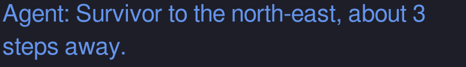{fig-alt="Chat panel: Survivor to the north-east, about 3 steps away."}

[After · `ReliableTeammate`, grounded in the map]{.result-label}
:::
:::
:::

::::

::: {.notes}
labs/advisor.py is in the tutorial repository (github.com/iHuman-Lab/presentations,
mosaic-tutorial/labs/). Any teammate implements one method of `LLMClient`,
`query(prompt) -> str` (src/mosaic/llm/client.py). At 0.7, about three replies
in ten point at a decoy: ask the room whether anyone noticed. That is the
reliance question from the start of the tutorial. The "after" image was
captured at reliability 1.0. No API key is used in this session, so this is the
one teammate attendees see give grounded advice.
:::

---

## Connect a Real [LLM]{.accent}

::: {.custom-strip}
[Map]{.stop} [4.1 SAR]{.stop} [4.2 GUI]{.stop} [4.3 LLM]{.stop .here} [4.4 Sensing]{.stop}
:::

::: {.task-what}
[On your own]{.mode-tag} With your own key: two packages, one key, two lines of YAML.
:::

:::: {.task-split}

::: {.task-col}
::: {.code-card .mini}
[terminal]{.code-file} [once, with `mosaic_env` active]{.code-where}

```{.bash code-line-numbers="false"}
python -m pip install llama-index-llms-openai tabulate
```
:::

::: {.code-card .mini}
[`.env`]{.code-file} [a new file in the `mosaic` folder]{.code-where}

```{.ini code-line-numbers="false"}
OPENAI_API_KEY=<your key>
```
:::

::: {.code-card .mini}
[`configs/experiment.yaml`]{.code-file} [new top-level lines]{.code-where}

```{.diff code-line-numbers="false"}
+provider: openai
+model: gpt-4o-mini
```
:::

[Run]{.task-label} Relaunch and press `Alt`.
:::

::: {.result-col .fragment}
[How it answers]{.task-label}

::: {.watch-list}
::: {.watch-item}
[1]{.watch-num} [Prompt]{.watch-title} The game state, as rules and a table
:::

::: {.watch-item}
[2]{.watch-num} [Model]{.watch-title} One reply, a few seconds later
:::

::: {.watch-item}
[3]{.watch-num} [Chat]{.watch-title} The participant decides whether to follow it
:::
:::
:::

::::

::: {.notes}
Not run live: no API key is used in this session. Walk through the three cards
so attendees can do it afterwards with their own key, then reveal how the reply
is produced. A key belongs only in a local `.env`, never in a repository.
`main.py` already reads `provider` and `model` from the top of the YAML and
loads `.env` (`load_dotenv()`); `build_llm_client` connects on the first `Alt`,
not at launch, so no key or a typo shows as an error in the chat and the game
keeps running. The model name must be one the package recognizes.
`tabulate` builds the prompt's table (`DataFrame.to_markdown()`);
MOSAIC does not declare it yet, and without it `Alt` replies "Import tabulate
failed". What the model is told is on the appendix slide "What the Teammate
Is Told".
:::

---

## 4.4 · [Sensing]{.accent}

::: {.custom-strip}
[Map]{.stop} [4.1 SAR]{.stop} [4.2 GUI]{.stop} [4.3 LLM]{.stop} [4.4 Sensing]{.stop .here}
:::

::: {.task-what}
Each step produces an observation. The study runner streams it with sensors on one clock.
:::

:::: {.section-grid}

::: {.section-left}
::: {.code-card .section-code}
[`src/experiment/main.py`]{.code-file} [line 46]{.code-where}

```{.python startFrom="46"}
    env.reset()
```
:::

::: {.result-terminal .section-terminal}
```{.text code-line-numbers="false"}
obs → agent_x, agent_y, direction, grid,
      saved_victims, remaining_victims,
      victim_health, step_count, …
    + action, reward, llm_response
    → study runner: one JSON line per frame on LSL
```
:::
:::

::: {.knob-list}
[Three things to change]{.task-label}

::: {.knob-card}
[1]{.knob-num} [Recorded fields]{.knob-name} [Notebook]{.change-when}

`print(sorted(obs))`

[What each step holds]{.knob-effect}
:::

::: {.knob-card}
[2]{.knob-num} [Custom fields]{.knob-name}

`observation=` in `build_sar_env`

[Add or drop fields]{.knob-effect}
:::

::: {.knob-card .live}
[3]{.knob-num} [Sensors]{.knob-name} [Demo · next]{.change-when}

`register_sensor(...)`

[Gaze or EEG on the game's clock]{.knob-effect}
:::

:::

::::

::: {.notes}
Observations are built in src/mosaic/sar/observations.py; the study runner is
in src/experiment/. `read_data()` is in src/experiment/game.py (lines 108–124,
`SARGameTrial`). The notebook (notebooks/02_mosaic_human_ai.ipynb) prints the
fields in Step 4 and records them with gaze in Steps 8–9. Change what each step records by subclassing
`ObservationProcessor` and passing it as `observation=`. `replay.py` plays a
recording back. The full study runner needs the lab's `ixp` package and LSL,
which this tutorial does not install.
:::

---

## Live Demo: Eye [Tracking]{.accent}

::: {.custom-strip}
[Map]{.stop} [4.1 SAR]{.stop} [4.2 GUI]{.stop} [4.3 LLM]{.stop} [4.4 Sensing]{.stop .here}
:::

::: {.task-what}
[Presenter demo]{.mode-tag} A Tobii eye tracker on the lab's study runner, while a volunteer plays.
:::

:::: {.task-split}

::: {.task-col}
::: {.code-card}
[`src/experiment/eye_demo.py`]{.code-file} [the study runner]{.code-where}

```{.diff code-line-numbers="false"}
     experiment = Experiment(config)
+    experiment.register_sensor(
+        name="TobiiEyeTracker", sensor_cls=TobiiEyeTracker,
+        sensor_config={})
+    experiment.calibrate_sensor(
+        "TobiiEyeTracker", screen=config["display"],
+        fullscreen=config["fullscreen"])
     experiment.add_task(task_cls=SARGameDemo, ...)
```
:::

[What lands next to the game data?]{.predict}
:::

::: {.result-col}
[Watch for]{.task-label}

::: {.watch-list}
::: {.watch-item}
[1]{.watch-num} [Calibration]{.watch-title} Five dots
:::

::: {.watch-item}
[2]{.watch-num} [Play]{.watch-title} A short mission
:::

::: {.watch-item .fragment}
[3]{.watch-num} [Two streams, one clock]{.watch-title} `TobiiEyeTracker` (gaze, 60 Hz) and `SARGame` (game state, every frame), side by side in LabRecorder
:::
:::
:::

::::

::: {.notes}
Presenter only: the lab's `ixp` package (not on PyPI), `tobii_research`,
PsychoPy, pylsl, ray, and LabRecorder. Machine setup and the rehearsed steps
are in EYETRACKER_SETUP.md. Run `PYTHONPATH=src python -m experiment.eye_demo`
from the `mosaic` folder. The two calls on the slide are the same ones the
lab's full study uses (experiment.py); `eye_demo.py` adds them to a single
two-minute mission with the keyless teammate, so no API key is used and the
study files are not edited. Seat the volunteer 60 to 65 cm from the screen.
Calibration is five points (center and four at 0.2 from the edges): look at
each dot until it disappears; SPACE accepts, R redoes. `Esc` ends the mission.
Reveal the third item once LabRecorder is on screen: TobiiEyeTracker is gaze at
60 Hz, 9 channels; SARGame is one JSON state per frame, about 30 a second. Gaze
and game land on one clock, so you can see where the volunteer looked before
and after each rescue; notebook Step 9 reads the saved recording. If the device
fails, go to the next slide, which shows the rehearsal recording.
:::

---

## The Synchronized [Record]{.accent}

::: {.custom-strip}
[Map]{.stop} [4.1 SAR]{.stop} [4.2 GUI]{.stop} [4.3 LLM]{.stop} [4.4 Sensing]{.stop .here}
:::

:::: {.task-split}

::: {.task-col}
[One recorded mission]{.task-label} [gaze and game on the same clock]{.src-cap}

::: {.result-img}
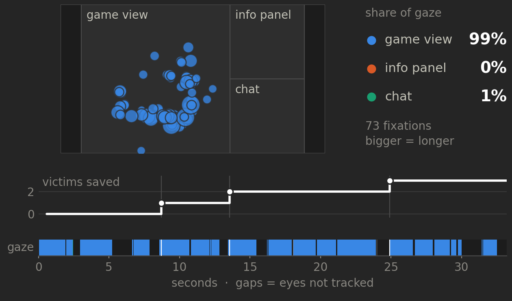{fig-alt="Fixations drawn on the screen's three areas, almost all on the game view, above a timeline of three rescues and a strip showing the gaze stayed on the game view, with gaps where the tracker lost the eyes."}
:::
:::

::: {.result-col}
[What to look for]{.task-label}

::: {.feature-list}
::: {.feature-row}
[Where]{.feature-name} Which part of the screen holds the gaze?
:::
::: {.feature-row}
[When]{.feature-name} What do the eyes do in the second after a rescue?
:::
::: {.feature-row}
[Advice]{.feature-name} Where does gaze go when the teammate replies?
:::
:::
:::

::::

::: {.punchline}
Gaze and game share one clock, so [every look lines up with what happened]{.accent}.
:::

::: {.notes}
The figure is real: tools/make_gaze_figure.py drew it from the rehearsal
recording, the LabRecorder file of the slide 33 demo, with the same code as
notebook Step 9. Top: each circle is a fixation, bigger for longer, on the
screen's three areas. Bottom: one clock, the victims saved and under it the
area the gaze was in; dark gaps are moments the tracker lost the eyes. In this
recording the gaze stayed on the game view (99%) and did not go to the info
panel after any of the three rescues. The three rows are the questions a
researcher asks of a record like this. Say that the third needs a real LLM
teammate: this mission ran with the keyless one, so it has no advice in it. This slide is also the fallback: if the tracker fails, skip the
live demo and show this. Rehearsal calibration was rough, so the gaze sits low
on the screen; after the venue rehearsal redraw it with
`python tools/make_gaze_figure.py <recording.xdf>` and render again.
:::

---

## Where to Go [Next]{.accent}

::: {.hook}
The parts you changed today, and where they live.
:::

::: {.code-map}

::: {.pkg-card .pkg-study}
[`src/experiment/`]{.pkg-path} [One study built on the package. Copy this folder to start yours.]{.pkg-role}

::: {.pkg-tree .tree-row}
`main.py`

`placers.py`

`llm.py`

`pacing.py`

`game.py`

`replay.py`

`sensors/`
:::

[API]{.pkg-label} `build_llm_client` · `LavaRiskVictimPlacer` · `SARGameTrial`
:::

::: {.record-drop .compose-drop}
[composes]{.record-drop-label}
:::

::: {.pkg-row}

::: {.pkg-card}
[`src/mosaic/core/`]{.pkg-path} [4.1]{.part-badge}

[Level generation and cameras]{.pkg-role}

::: {.pkg-tree}
`level.py`

`placers.py`

`camera.py`
:::

[API]{.pkg-label .pkg-label-block}
`Placer` · `CameraStrategy`
:::

::: {.pkg-card}
[`src/mosaic/sar/`]{.pkg-path} [4.1]{.part-badge} [4.4]{.part-badge}

[The search-and-rescue task]{.pkg-role}

::: {.pkg-tree}
`env.py`

`placers.py`

`actions.py`

`objects.py`

`observations.py`
:::

[API]{.pkg-label .pkg-label-block}
`build_sar_env` · `RescueAction`
:::

::: {.pkg-card}
[`src/mosaic/gui/`]{.pkg-path} [4.2]{.part-badge}

[What the participant sees]{.pkg-role}

::: {.pkg-tree}
`main.py`

`user.py`

`chat.py`

`info.py`

`feedback.py`
:::

[API]{.pkg-label .pkg-label-block}
`SAREnvGUI` · `EdgeVignette`
:::

::: {.pkg-card}
[`src/mosaic/llm/`]{.pkg-path} [4.3]{.part-badge}

[The teammate contract]{.pkg-role}

::: {.pkg-tree}
`client.py`

`process_prompts.py`

`prompts.yaml`

`pathfinding.py`

`parser.py`
:::

[API]{.pkg-label .pkg-label-block}
`LLMClient` · `ask`
:::

:::

:::

::: {.notes}
Have the repository open in an editor beside this slide. `mosaic/` is the
reusable package; `experiment/` is one study built on it, and it is the folder
attendees copy and change for their own work (its `sensors/` folder is the rest
of 4.4). Every file named here exists in the MOSAIC repository. The badges match
the four parts of Part Four.
:::

---

## MOSAIC in a [Study]{.accent}

::: {.hook}
What you configured today, put to work in a study of people and an LLM teammate.
:::

:::: {.task-split}

::: {.task-col}
[LLM-Mediated Human-AI Interaction in Search and Rescue: Impact of Expertise on Attentional Allocation]{.paper-title}
[Elahe Oveisi · Hemanth Manjunatha]{.paper-authors}

::: {.feature-list}
::: {.feature-row}
[Task]{.feature-name} The search-and-rescue mission, with victims whose health runs down.
:::
::: {.feature-row}
[Teammate]{.feature-name} Two LLM teammates and a no-LLM baseline, three trials per participant.
:::
::: {.feature-row}
[Sensing]{.feature-name} A Tobii eye tracker and the game on one clock, through LSL.
:::
::: {.feature-row}
[Question]{.feature-name} Does guidance change where people look, and does expertise matter?
:::
:::
:::

::: {.result-col}
::: {.qr-card .qr-stack}
{fig-alt="QR code that opens the slides of the paper's talk"}

[Monday, October 5 · 14:00–14:15]{.qr-title}
[Grand C · Session MoA10]{.qr-line}
[Scan for the talk's slides]{.qr-line}
:::
:::

::::

::: {.punchline}
Come and hear what they found: [Monday at 14:00, Grand C]{.accent}.
:::

::: {.notes}
An invitation, and an application of what attendees just configured: say what
the study did, and leave the results for the talk. Paper MoA10.3 in the regular
session Decision Support System I, Monday October 5, 14:00 to 14:15, room
Grand C. Thirteen participants each played three trials in random order: two
with an LLM teammate and one no-LLM baseline, up to 15 minutes or 1,000 moves.
Victim health deteriorates, and `Alt` asks for advice and reveals victim health
for five seconds. Gaze and pupil data came from a Tobii eye tracker, on one
clock with the game through LSL: the same pieces as Part Four. Participants
were grouped into experts and novices. The code opens the talk's slides
(ihuman-lab.github.io/presentations/ieee-smc-eo/); the program entry is
conf.papercept.net, SMC26 program, Monday, MoA10.3. Check the time and room
against the final program on the day.
:::

---

## {background-image="assets/background.jpg" background-opacity="0.25"}

::: {.closing}
[Thanks!]{.closing-title}

[Questions?]{.closing-sub}

::: {.closing-links}
[MOSAIC]{.closing-label}
[github.com/iHuman-Lab/mosaic]{.closing-link}
:::
:::

---

<!-- ============ APPENDIX ============ -->

::: {.divider}
[Appendix]{.divider-title}

[More changes and reference]{.divider-subtitle}

[Each change starts from the stock files]{.divider-path}
:::

---

## Locked [Rooms]{.accent}

::: {.task-what}
Set the chance that a room is locked: `0.5` locks about half, `0.9` most.
:::

:::: {.task-split}

::: {.task-col}
::: {.code-card}
[`src/experiment/main.py`]{.code-file} [line 43]{.code-where}

```{.diff code-line-numbers="false"}
-locked_room_placer=LockedRoomPlacer(locked_room_prob=0.5),
+locked_room_placer=LockedRoomPlacer(locked_room_prob=0.9),
```
:::

[Run]{.task-label} Relaunch and walk to the nearest door.

[How much of the building can you still reach?]{.predict}
:::

::: {.result-col .fragment}
::: {.result-pair}
::: {.result-img}
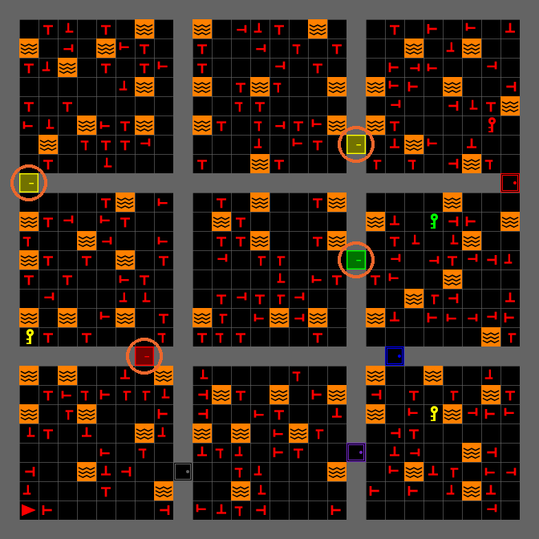{fig-alt="The building at locked_room_prob 0.5, with four locked doors ringed in orange."}

[Before · `0.5`: 4 locked doors]{.result-label}
:::

::: {.result-img}
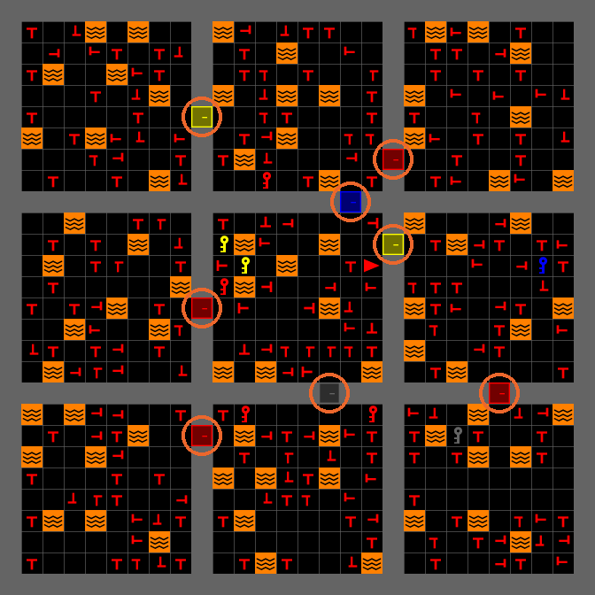{fig-alt="The building at locked_room_prob 0.9, with eight locked doors ringed in orange."}

[After · `0.9`: 8 locked doors]{.result-label}
:::
:::
:::

::::

::: {.notes}
Keep locked_room_prob below 1.0: at 1.0 generation never finishes. The count is
`max(1, int(rooms × prob))`, so a 3×3 building always locks 4 rooms at 0.5 and
8 at 0.9; which rooms changes run to run. `LockedRoomPlacer`
lives in src/mosaic/sar/placers.py; its `place_all()` picks which rooms lock and
hides each key in an unlocked room. Placement is a pluggable interface: `Placer`
in src/mosaic/core/placers.py has one method, `place_all`.
:::

---

## Time [Limit]{.accent}

::: {.task-what}
Give the mission 2 minutes instead of 5.
:::

:::: {.task-split}

::: {.task-col}
::: {.code-card}
[`configs/experiment.yaml`]{.code-file} [a new top-level line, not under `game:`]{.code-where}

```{.diff code-line-numbers="false"}
 display: &display 0
 fullscreen: &fullscreen true
+max_time: 2
```
:::

[Run]{.task-label} Relaunch and watch the timer.

[How will you play with only 2 minutes?]{.predict}
:::

::: {.result-col .fragment}
::: {.result-pair .ui-pair}
::: {.result-img .ui-crop}
{fig-alt="The timer at the start reads 5:00."}

[Before · the default]{.result-label}
:::

::: {.result-img .ui-crop}
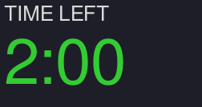{fig-alt="The timer at the start reads 2:00."}

[After · `max_time: 2`]{.result-label}
:::
:::

[At 0:00 the timer stops; the mission keeps going.]{.result-note}
:::

::::

::: {.notes}
main.py passes the whole YAML to `SAREnvGUI` (src/mosaic/gui/main.py), which
reads `max_time` (minutes) from the top level. The `max_time` under `game:`
configures the lab's full study runner, not this run. On its own the timer only
counts down: at 0:00 the mission keeps going. The lab's study runner
(`SARGameTrial.execute`) is what ends a trial.
:::

---

## The Info [Panel]{.accent}

::: {.task-what}
Hide how many victims remain.
:::

:::: {.task-split}

::: {.task-col}
[Get]{.task-label} `panel.py` into `src/experiment/`, from\
[github.com/iHuman-Lab/presentations]{.dl-src} · `mosaic-tutorial/labs/`

::: {.code-card}
[`src/experiment/main.py`]{.code-file} [an import, then the `gui =` line]{.code-where}

```{.diff code-line-numbers="false"}
+from .panel import NoProgressPanel
@@ further down @@
-    gui = SAREnvGUI(env, config=config, llm_client=llm_client)
+    gui = SAREnvGUI(env, config=config, llm_client=llm_client,
+                    info_panel=NoProgressPanel(800, 400, 400))
```
:::

[Run]{.task-label} Relaunch and look at the mission box.

[What does the participant no longer know?]{.predict}
:::

::: {.result-col .fragment}
::: {.result-stack .ui-stack}
::: {.result-img .ui-crop}
{fig-alt="Mission box showing rescued and remaining counts."}

[Before · rescued and remaining]{.result-label}
:::

::: {.result-img .ui-crop}
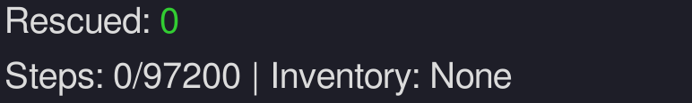{fig-alt="Mission box showing only the rescued count."}

[After · no remaining count]{.result-label}
:::
:::
:::

::::

::: {.notes}
`NoProgressPanel` (labs/panel.py, tutorial repo) subclasses `InfoPanel`
(src/mosaic/gui/info.py) and overrides one method, `_mission_html`. The three
numbers are the panel's x offset, width, and height in the 800-px window.
`chat_panel=` accepts a `ChatPanel` subclass the same way.
:::

---

## What the Teammate Is [Told]{.accent}

::: {.task-what}
Before trusting its advice, look at what it is told.
:::

:::: {.task-split}

::: {.task-col}
[Every `Alt` sends]{.task-label}

::: {.watch-list}
::: {.watch-item}
[1]{.watch-num} [Rules]{.watch-title} Rescue real survivors, nearest first, never through lava
:::

::: {.watch-item}
[2]{.watch-num} [Every real victim]{.watch-title} Even ones out of your view
:::

::: {.watch-item}
[3]{.watch-num} [No decoys]{.watch-title} Left out, so it never points at one
:::
:::

[Change it]{.task-label} `SAREnvGUI(..., prompt_builder=...)`
:::

::: {.result-col}
[The start of one prompt]{.task-label}

::: {.result-terminal}
```{.text code-line-numbers="false"}
Agent: room (0,1) facing West | …

Object       Direction  Visible  PathLength
Victim4      East       Yes      9
Victim2      South      Yes      0
RedKey1      East       Yes      5
PurpleKey1   East       Yes      6
PurpleDoor1  South      Yes      34
RedDoor1     East       No       10
```
:::
:::

::::

::: {.notes}
`build_prompt` and `_build_table` are in src/mosaic/llm/process_prompts.py;
`_build_table` skips `FAKE_VICTIM` cells (line 60), so decoys never reach the
model. Every real victim, key, and door in the building is listed with
direction, reachability, and path length; `Visible` marks what is near the
participant. The rules are the preamble in src/mosaic/llm/prompts.yaml. This
asymmetry matters for any study of reliance: the AI knows where the real
victims are, and the participant has to tell them from decoys.
:::
