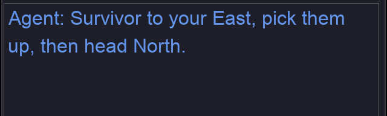
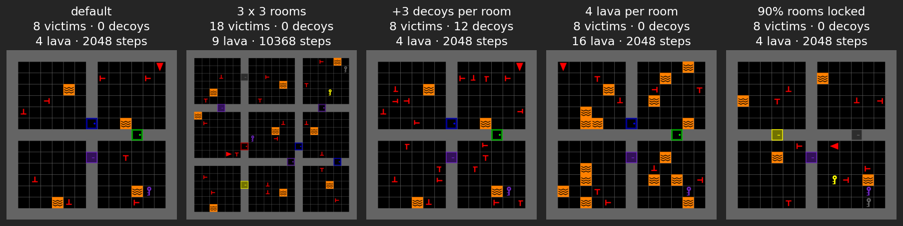
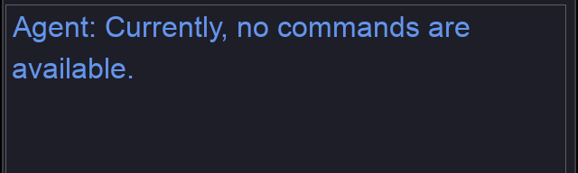
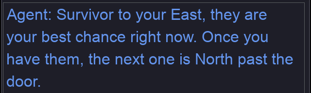

---
# MOSAIC hands-on tutorial — IEEE SMC 2026
# Render:  quarto render mosaic-tutorial.qmd
#          quarto preview mosaic-tutorial.qmd
title: "Closing the [Human–AI]{.accent} Loop<span class='title-fullname'>Modular Architectures for Autonomous Teaming<br>and [Physiological Sensing]{.accent}</span>"
subtitle: "<span class='title-tagline'>A two-session hands-on tutorial: MOSAIC and SHaSTA</span><span class='title-venue'>IEEE SMC 2026 · Bellevue, WA</span>"
institute: "iHuman Lab · Oklahoma State University<br>Human in the Loop Systems Lab (HILS Lab) · University at Buffalo"
author: "Organizers: Hemanth Manjunatha · Ehsan Esfahani · Elahe Oveisi<br>Kristian Dalland · Bennett Kwaku Dogbey"
description: "Closing the Human–AI Loop: Modular Architectures for Autonomous Teaming and Physiological Sensing. Session 1 is a hands-on introduction to MOSAIC: play a search-and-rescue mission in your browser, and change the task, the interface, the AI teammate, and the sensing."
image: assets/gui-screenshot-live.png
event_type: "Tutorial"
date: "2026-10-04"
date-format: "MMMM D, YYYY"
format:
  revealjs:
    theme: [default, theme.scss]
    slide-number: true
    transition: fade
    background-transition: fade
    logo: assets/logo.png
    footer: "MOSAIC Tutorial · OSU · UB"
    width: 1280
    height: 720
    margin: 0.1
    navigation-mode: linear
    controls: true
    progress: true
    include-after-body:
      - text: |
          <script>
          // Restart a slide's clips when it is shown, so each starts at its first frame
          // and the three camera clips on the Camera Views slide play in step.
          (function () {
            function restart(slide) {
              slide.querySelectorAll('.camera-view img, .phase img, .run-split img').forEach(function (img) {
                var src = img.getAttribute('src');
                if (!src || !/\.gif(\?|$)/.test(src)) return;
                img.setAttribute('src', src.split('?')[0] + '?t=' + Date.now());
              });
            }
            function hook() { Reveal.on('slidechanged', function (e) { restart(e.currentSlide); }); }
            if (window.Reveal && Reveal.on) hook(); else window.addEventListener('load', hook);
          })();
          </script>
      - text: |
          <script>
          // The two universities on the title slide
          document.addEventListener('DOMContentLoaded', function () {
            var titleSlide = document.getElementById('title-slide');
            if (!titleSlide) return;
            var col = document.createElement('div');
            col.style.cssText = 'position:absolute; top:50%; right:70px; transform:translateY(-50%); display:flex; flex-direction:column; align-items:center; gap:26px;';
            col.innerHTML =
              '' +
              '';
            titleSlide.appendChild(col);
          });
          </script>
title-slide-attributes:
  data-background-color: "#252525"
---

## Today's [Sessions]{.accent}

::: {.hook}
Two hands-on sessions, back to back, in the same room.
:::

:::: {.columns}

::: {.column width="50%"}
::: {.stat}
[8:30–10:30 AM]{.stat-number}
[Session 1 · MOSAIC]{.stat-label}
:::

A configurable testbed for human–AI teaming. Play a search-and-rescue mission in your browser, then change the task, the AI teammate and the sensing.
:::

::: {.column width="50%"}
::: {.stat .secondary}
[11:00 AM–1:00 PM]{.stat-number}
[Session 2 · SHaSTA]{.stat-label}
:::

A simulator for human–swarm teaming. Put a human in the loop with a swarm, and log what they do on one clock.
:::

::::

::: {.stats}
::: {.stat}
[Evergreen C]{.stat-number}
[Where]{.stat-label}
:::
::: {.stat}
[@Hyatt_Meeting]{.stat-number}
[Wi-Fi network]{.stat-label}
:::
::: {.stat}
[SMC26]{.stat-number}
[Wi-Fi password]{.stat-label}
:::
:::

::: {.notes}
Welcome. This is the tutorial "Closing the Human-AI Loop: Modular Architectures for
Autonomous Teaming and Physiological Sensing", in two sessions in Evergreen C.
Session 1, 8:30 to 10:30, is MOSAIC; Session 2, 11:00 to 1:00, is SHaSTA. Wi-Fi:
network @Hyatt_Meeting, password SMC26. Leave this slide up while people settle and
connect.
:::

---

::: {.divider}
[Session 1 · 8:30–10:30 AM]{.divider-kicker}

[MOSAIC]{.divider-title}

[Modular System for Adaptive Human–AI Collaboration]{.divider-subtitle}

[A configurable testbed for human–AI teaming · github.com/iHuman-Lab/mosaic]{.divider-path}
:::

---

## Meet the [iHuman Lab]{.accent}

::: {.hook}
We study how people and intelligent systems work together.
:::

::: {.team}

::: {.member}


[Hemanth Manjunatha]{.member-name}
[Principal Investigator]{.member-role}
:::

::: {.member}


[Elahe Oveisi]{.member-name}
[PhD Candidate]{.member-role}
:::

::: {.member}


[Bennett Kwaku Dogbey]{.member-name}
[PhD Student]{.member-role}
:::

:::

::: {.member-link}
Our work spans brain–computer interfaces, human–robot interaction, human-AI interaction, and cognitive augmentation.

[iHuman Lab · Oklahoma State University](https://ihuman-lab.github.io/lab-website/)
:::

<!-- ============ PART 1 — no divider slide: the deck opens here ============ -->

## Studying [Human–AI Teaming]{.accent}

::: {.hook}
When an AI teammate advises people in dynamic, high-stakes tasks, researchers ask questions like these:
:::

:::: {.research-grid .question-cards}

::: {.research-question}
[Trust and reliance]{.research-topic}

When do people follow AI advice, and when is that reliance appropriate?
:::

::: {.research-question}
[Decisions under pressure]{.research-topic}

How do uncertainty and time constraints affect reliance?
:::

::: {.research-question}
[Situation awareness]{.research-topic}

What happens when the person and AI have access to different information?
:::

::: {.research-question}
[Cognitive state]{.research-topic}

How does AI advice affect attention and workload?
:::

::: {.research-question}
[AI teammate design]{.research-topic}

Which teammate behaviors and communication strategies improve team performance?
:::

::: {.research-question}
[Adaptive assistance]{.research-topic}

When should assistance change with task demands or human performance?
:::

::::

::: {.punchline}
Answering these questions requires observing the interaction [as it unfolds over time]{.accent}.
:::

::: {.notes}
These are the field's core questions. Each one plays out during the interaction,
as decisions, advice, and consequences build on each other.
:::

---

## Why Do We Need a Configurable [Testbed]{.accent}?

::: {.hook}
That takes four capabilities in one experiment. Existing tools rarely offer all four together.
:::

::::: {.need-map .no-core}

:::: {.need-column}

::: {.need-item .has-visual}
::: {.need-visual .icon}
```{=html}
<svg viewBox="0 0 80 64" role="img" aria-label="Icon: one decision branching into the next">
  <circle cx="8" cy="32" r="5" fill="#EC672C"/>
  <line x1="13" y1="32" x2="26" y2="32" stroke="#ffffff" stroke-width="3" stroke-linecap="round"/>
  <circle cx="32" cy="32" r="6" fill="none" stroke="#ffffff" stroke-width="3"/>
  <path d="M37 28 L61 13 M37 36 L61 51" fill="none" stroke="#ffffff" stroke-width="3" stroke-linecap="round"/>
  <circle cx="67" cy="10" r="5.5" fill="none" stroke="#ffffff" stroke-width="3"/>
  <circle cx="67" cy="54" r="5.5" fill="#EC672C"/>
</svg>
```
:::

::: {.need-text}
[01]{.need-index}

[Interactive decision making]{.need-title}

People make a sequence of decisions, and each outcome changes what happens next.
:::
:::

::: {.need-item .has-visual}
::: {.need-visual .icon}
```{=html}
<svg viewBox="0 0 64 64" role="img" aria-label="Icon: three sliders set to different values">
  <g stroke="#ffffff" stroke-width="3" stroke-linecap="round" opacity="0.8">
    <line x1="6" y1="14" x2="58" y2="14"/><line x1="6" y1="32" x2="58" y2="32"/><line x1="6" y1="50" x2="58" y2="50"/>
  </g>
  <g fill="#252525" stroke="#EC672C" stroke-width="3">
    <circle cx="20" cy="14" r="6"/><circle cx="44" cy="32" r="6"/><circle cx="30" cy="50" r="6"/>
  </g>
</svg>
```
:::

::: {.need-text}
[03]{.need-index}

[Configurable task conditions]{.need-title}

Researchers need to vary information access, uncertainty, time pressure, and the consequences of mistakes.
:::
:::

::::

:::: {.need-column}

::: {.need-item .has-visual}
::: {.need-visual .icon}
```{=html}
<svg viewBox="0 0 64 64" role="img" aria-label="Icon: an advice bubble with a setting inside">
  <path d="M9 8 H55 a5 5 0 0 1 5 5 V38 a5 5 0 0 1 -5 5 H27 L15 54 V43 H9 a5 5 0 0 1 -5 -5 V13 a5 5 0 0 1 5 -5 Z"
        fill="none" stroke="#ffffff" stroke-width="3" stroke-linejoin="round"/>
  <line x1="14" y1="26" x2="50" y2="26" stroke="#ffffff" stroke-width="3" stroke-linecap="round" opacity="0.45"/>
  <line x1="14" y1="26" x2="36" y2="26" stroke="#EC672C" stroke-width="3" stroke-linecap="round"/>
  <circle cx="36" cy="26" r="5.5" fill="#EC672C"/>
</svg>
```
:::

::: {.need-text}
[02]{.need-index}

[A customizable AI teammate]{.need-title}

Researchers need to vary what the AI knows, how reliable it is, and when and how it communicates.
:::
:::

::: {.need-item .has-visual}
::: {.need-visual .icon}
```{=html}
<svg viewBox="0 0 64 64" role="img" aria-label="Icon: three signals aligned on one timeline">
  <g fill="none" stroke="#ffffff" stroke-width="2.5" stroke-linejoin="round" stroke-linecap="round">
    <path d="M4 14 Q10 5 16 14 T28 14 T40 14 T52 14 T60 14"/>
    <path d="M4 36 H14 V28 H24 V36 H34 V28 H46 V36 H60"/>
    <polyline points="4,52 12,52 16,44 21,60 26,47 30,56 34,52 60,52"/>
  </g>
  <line x1="40" y1="2" x2="40" y2="62" stroke="#EC672C" stroke-width="3" stroke-linecap="round"/>
</svg>
```
:::

::: {.need-text}
[04]{.need-index}

[Synchronized data]{.need-title}

Task events, human actions, AI advice, physiological signals, and sensor measurements must share a common timeline.
:::
:::

::::

:::::

::: {.notes}
To study the interaction over time, researchers need an interactive task, a
customizable teammate, conditions they can vary, and synchronized data. The
next slide shows how MOSAIC brings them together.
:::

---

## What Is [MOSAIC]{.accent}?

::: {.hook}
MOSAIC is a modular testbed for human–AI teaming research. Configure its components for each study.
:::

::::: {.need-map .linked}

:::: {.need-column}

::: {.need-item .has-visual}
::: {.need-visual .thumb}
{fig-alt="One room of the search-and-rescue task: lava, a victim, and doors."}
:::

::: {.need-text}
[01]{.need-index}

[Interactive task]{.need-title}

Search and rescue, one decision at a time
:::
:::

::: {.need-item .has-visual}
::: {.need-visual .thumb .pair}
{fig-alt="A room shown with the room camera."} {fig-alt="The same room shown with the cone camera."}
:::

::: {.need-text}
[03]{.need-index}

[Configurable conditions]{.need-title}

Map, view, timing, and scoring per study
:::
:::

::::

```{=html}
<div class="need-links" aria-hidden="true"><svg viewBox="0 0 100 100" preserveAspectRatio="none">
  <line x1="50" y1="50" x2="0" y2="24"/><line x1="50" y1="50" x2="0" y2="76"/>
  <line x1="50" y1="50" x2="100" y2="24"/><line x1="50" y1="50" x2="100" y2="76"/>
</svg></div>
```

::: {.need-core}
[MOSAIC]{.need-core-title}

[modular · configurable]{.need-core-subtitle}
:::

:::: {.need-column}

::: {.need-item .has-visual}
::: {.need-visual .thumb}
{fig-alt="The chat panel with the teammate's reply: Survivor to the north-east, about 3 steps away."}
:::

::: {.need-text}
[02]{.need-index}

[Customizable AI teammate]{.need-title}

Scripted or LLM, with behavior you set
:::
:::

::: {.need-item .has-visual}
::: {.need-visual .thumb}
```{=html}
<svg viewBox="0 0 132 96" role="img" aria-label="An eye tracker and an EEG trace streaming into Lab Streaming Layer">
  <path d="M8 28 Q26 12 44 28 Q26 44 8 28 Z" fill="none" stroke="#ffffff" stroke-width="2.5"/>
  <circle cx="26" cy="28" r="6.5" fill="#EC672C"/>
  <circle cx="26" cy="28" r="2.5" fill="#252525"/>
  <polyline points="8,70 14,70 18,58 23,82 28,62 32,76 36,66 40,70 46,70"
            fill="none" stroke="#EC672C" stroke-width="2.5" stroke-linejoin="round"/>
  <path d="M52 30 L72 43 M52 68 L72 55" fill="none" stroke="#EC672C" stroke-width="2.5" stroke-linecap="round"/>
  <rect x="76" y="31" width="48" height="34" rx="6" fill="rgba(236,103,44,0.18)" stroke="#EC672C" stroke-width="2"/>
  <text x="100" y="54" text-anchor="middle" font-family="Rubik, sans-serif" font-size="16" font-weight="800" fill="#ffffff">LSL</text>
</svg>
```
:::

::: {.need-text}
[04]{.need-index}

[Synchronized data]{.need-title}

Actions, advice, and signals on one clock
:::
:::

::::

:::::

::: {.punchline}
MOSAIC lets researchers [vary the task and AI teammate, then record the interaction]{.accent}.
:::

::: {.notes}
MOSAIC stands for Modular System for Adaptive Human–AI Collaboration: an
open-source Python platform for studying human–AI teaming through configurable
tasks, built on MiniGrid and extending its BabyAI level generator. Like a mosaic
built from tiles, it assembles separate parts (task, teammate, interface, sensing)
into one study. Each box answers the need in the same position on the last slide:
the task, a teammate you can customize, conditions you set per study, and one
synchronized record. Modular: the environment, AI teammate, interface, sensing,
and analytics are separate components, so you replace one without touching the
others. Configurable: map, hazards, view, scoring, and the teammate are set per
study, not hard-coded. Search and rescue is the first testbed; the same pieces
can support other collaborative tasks (ihuman-lab.github.io/mosaic).
:::

---

## How [MOSAIC]{.accent} Works

::: {.hook}
Each part is a separate module: the participant acts on the task, the AI teammate advises from task context, and LSL aligns every stream into one session record.
:::

::: {.overview-diagram}
::: {.system-row}

::: {.system-node}
[Human participant]{.system-title}

Observes, decides, and acts.
:::

::: {.system-link .two-way}
[actions]{.link-top}

[observations]{.link-bottom}
:::

::: {.system-node .system-core}
[MOSAIC task]{.system-title}

Runs the task and the human-facing interface.
:::

::: {.system-link .two-way}
[task context]{.link-top}

[advice]{.link-bottom}
:::

::: {.system-node}
[AI teammate]{.system-title}

Interprets task context and provides advice.
:::

:::

::: {.drop-row}

::: {.record-drop}
[physiological signals]{.record-drop-label}
:::

::: {.record-drop}
[task and interaction stream]{.record-drop-label}
:::

:::

::: {.sync-row}

::: {.sync-node}
[Study sensors]{.system-title}

Physiological data: EEG, eye tracking, pupil diameter
:::

::: {.sync-link}
Time-stamped stream
:::

::: {.sync-node .sync-core}
[Lab Streaming Layer (LSL)]{.system-title}

Aligns streams on a shared clock
:::

::: {.sync-link}
Synchronized record
:::

::: {.sync-node .system-record}
[Session data]{.system-title}

Ready for analysis and replay
:::

:::
:::

::: {.notes}
Here is MOSAIC. You're the participant on the left. You act, the task updates, and
when you ask, the teammate reads the task context and answers. Everything the
researcher varies sits in configuration, and everything that happens, including gaze
and physiology, lands on one clock. Underneath, the reusable parts live in the
`mosaic` package; the notebook you will use today is built on it, and the code map
at the end shows where each part lives.
:::

---

## The Task: [Search and Rescue]{.accent}

:::: {.columns .scenario-columns}

::: {.column width="58%"}
{fig-alt="The whole search-and-rescue building: nine rooms with victims, lava, keys, and locked doors."}
:::

::: {.column width="42%"}

::: {.scenario-brief}
[Mission]{.scenario-label}

Search a multiroom building and rescue the real victims.

Real victims and decoys look alike, so an AI teammate's advice can help or mislead.

Part Three plays the mission.
:::

:::

::::

::: {.punchline}
Search and rescue provides a controlled but [consequential setting]{.accent} for studying human–AI decisions.
:::

---

## The Human–AI [Teaming Loop]{.accent}

::: {.hook}
At every decision, the participant can act alone or ask for advice.
:::

::: {.teaming-diagram}

::: {.loop-return}
[next decision]{.arrow-label}
:::

::: {.loop-main}

::: {.loop-node}
[1]{.decision-number} [Observe]{.decision-title}

Read the room and the mission state.
:::

::: {.loop-arrow}
:::

::: {.loop-node .loop-choice}
[2]{.decision-number} [Decide]{.decision-title}

Act alone, or ask the AI teammate.
:::

::: {.loop-arrow}
[act alone]{.arrow-label}
:::

::: {.loop-node}
[3]{.decision-number} [Act]{.decision-title}

The participant always chooses the final action.
:::

::: {.loop-arrow}
:::

::: {.loop-node}
[4]{.decision-number} [Outcome]{.decision-title}

The environment updates and the score changes.
:::

:::

::: {.advice-branch}

::: {.branch-label}
Optional advice path
:::

::: {.branch-down}
[ask]{.arrow-label}
:::

::: {.branch-up}
[use or ignore]{.arrow-label}
:::

::: {.advice-box .ask}
[Request advice]{.advice-box-title}

MOSAIC sends task context to the AI teammate.
:::

::: {.loop-arrow .branch-across}
[advice]{.arrow-label}
:::

::: {.advice-box .evaluate}
[Evaluate advice]{.advice-box-title}

Compare it with what the participant can see.
:::

:::

:::

::: {.cycle-band}
[Recorded throughout]{.cycle-title} Task state · advice request · AI response · participant action · outcome
:::

::: {.punchline}
The central question is when and how AI advice [changes human decisions]{.accent}.
:::

::: {.notes}
Next, we open the notebook, play a mission, and change the task ourselves.
:::

---

<!-- ============ PART 2 ============ -->

::: {.divider}
[Part Two]{.divider-kicker}

[Open the Notebook]{.divider-title}

[Nothing to install: everything runs in your browser]{.divider-path}

::: {.you-are-here}
[Why]{.stop} [Open]{.stop .here} [Experience]{.stop} [Configure]{.stop}
:::

::: {.qr-card}
{fig-alt="QR code that opens the tutorial's Jupyter server"}

[Tutorial notebook]{.qr-title}
[On the tutorial server: the whole tutorial, run in your browser]{.qr-line}
[Sign in with your password, then open `02_mosaic_human_ai.ipynb`]{.qr-line}
[jupyter.ihuman-lab.work]{.qr-url}
:::
:::

::: {.notes}
Nobody installs anything today: MOSAIC, its game window and the recording tools
all run on the tutorial server, and the game is drawn in the browser. Leave this
slide up while people scan the code and sign in. Anyone whose laptop cannot reach
the server pairs with a neighbor; the appendix has the install for a laptop.
:::

---

## Open the [Notebook]{.accent}

::: {.hook}
Four steps, and nothing to install.
:::

:::: {.columns .install-split}

::: {.column width="55%"}
::: {.line-steps}
::: {.line-step}
[1]{.line-num} [Go to the server]{.line-title}

Scan the code on the last slide, or open `jupyter.ihuman-lab.work`
:::
::: {.line-step}
[2]{.line-num} [Sign in]{.line-title}

With the password you were given
:::
::: {.line-step}
[3]{.line-num} [Open the notebook]{.line-title}

`02_mosaic_human_ai.ipynb`, in the file list on the left
:::
::: {.line-step}
[4]{.line-num} [Pick the kernel]{.line-title}

**Python (smc)**, at the top right of the notebook
:::
:::
:::

::: {.column width="45%"}
::: {.feature-list}
::: {.feature-row}
[Notebook]{.feature-name} `02_mosaic_human_ai.ipynb`: the whole tutorial, in eight steps
:::
::: {.feature-row}
[Game]{.feature-name} `live_play.py` shows the game in your browser and takes your keys
:::
::: {.feature-row}
[Settings]{.feature-name} `config.yaml`: the task as a text file
:::
::: {.feature-row}
[Recording]{.feature-name} `lsl_tools.py`: game state and gaze into one file
:::
:::
:::

::::

::: {.checkpoint}
The top right says **Python (smc)**. Run each cell with `Shift+Enter`, from the top.
:::

::: {.fig-note}
Prefer your own laptop? The appendix has the install, in one slide.
:::

::: {.notes}
Everything attendees need is already in the folder on the server: the notebook,
`config.yaml`, `live_play.py` and `lsl_tools.py`. If someone sees
"No module named 'mosaic'", the kernel is wrong: pick Python (smc). The first
code cell of the notebook must run first (it silences warnings and sets pygame
up to draw off-screen); everything after it can run in order.
:::

---

## Your First [Level]{.accent}

::: {.hook}
The task is a text file. Run Step 1 and MOSAIC builds it.
:::

:::: {.task-split}

::: {.task-col}
::: {.code-card}
[`config.yaml`]{.code-file} [the `game:` section]{.code-where}

```{.yaml code-line-numbers="false"}
game:
  num_rows: 2             # rooms down
  num_cols: 2             # rooms across
  room_size: 8            # tiles per room side
  num_real_victims: 2     # per room
  lava_per_room: 1
  locked_room_prob: 0.35  # chance a room is locked
  max_time: 5             # minutes on the clock
```
:::
:::

::: {.result-col}
::: {.code-card}
[Step 1]{.code-file} [one call builds the whole task]{.code-where}

```{.python code-line-numbers="false"}
env = build_sar_env(
    screen_size=640, num_rows=2,
    num_cols=2, room_size=8,
    victim_placer=VictimPlacer(2),
    lava_placer=LavaPlacer(1),
    locked_room_placer=LockedRoomPlacer(0.35),
)
obs, info = env.reset(seed=0)
```
:::
:::

::::

::: {.punchline}
Change a number in the file, run again, and [you have a different task]{.accent}.
:::

::: {.notes}
Step 1 reads `config.yaml` and builds the level with `build_sar_env`. Three
placers decide what goes where: victims, lava and locked doors. The seed makes a
level reproducible: everyone who uses seed 0 plays the same building (the
notebook seeds Python's `random` too, because the placers draw from it). Counts
are per room, so a bigger building has more of everything and a longer clock.
:::

---

## First [Checkpoint]{.accent}

:::: {.columns}

::: {.column width="38%"}
::: {.check-card}
[Confirm]{.check-title}

::: {.check-item}
The kernel says Python (smc)
:::
::: {.check-item}
Step 1 printed `game config:` and `mission: pick up all 8 victims`
:::
::: {.check-item}
No red error text under any cell
:::
::: {.check-item}
You can scroll on to Step 2
:::
:::
:::

::: {.column width="62%"}
::: {.tight-table}

| Symptom | Recovery |
|---|---|
| `No module named 'mosaic'` | Wrong kernel: pick **Python (smc)** at the top right |
| `No module named 'live_play'` | `live_play.py` is not in the notebook's folder |
| The picture does not move | Click the picture once, then press the keys |
| A blank picture | Run the cell again and wait a second |
| The page asks you to sign in again | Sign in; your work is kept |
| The server does not open | Ask a helper; share a neighbor's screen meanwhile |

:::
:::

::::

::: {.punchline}
Everyone with a level built is ready for [Part Three]{.accent}.
:::

::: {.notes}
This is the only checkpoint before the break. Helpers circulate during Part Three
too. The most common problem is the kernel; the second is the picture not
receiving keys until it is clicked.
:::

---

<!-- ============ PART 3 ============ -->

::: {.divider}
[Part Three]{.divider-kicker}

[Experience the SAR Mission]{.divider-title}

[Play one mission in the notebook and learn to read the screen]{.divider-path}

::: {.you-are-here}
[Why]{.stop} [Open]{.stop} [Experience]{.stop .here} [Configure]{.stop}
:::
:::

---

## The Search-and-Rescue [Mission]{.accent}

::: {.hook}
Explore, tell real victims from decoys, and rescue them before time runs out.
:::

:::: {.columns .scenario-columns}

::: {.column width="58%"}
{fig-alt="The real interface: the agent rescues a real victim (green flash), then a decoy (red flash), then another real victim."}
:::

::: {.column width="42%"}

::: {.scenario-brief}
[Explore]{.scenario-label}

Move room to room. A locked door needs the key of the same color.

[Identify]{.scenario-label}

Both are red T shapes. A real victim's stem is centered; a decoy's is off-center.

[Decide]{.scenario-label}

A real victim earns a point, a decoy costs one, and the clock keeps running.
:::

:::

::::

::: {.punchline}
Every choice has [a consequence you can see and score]{.accent}.
:::

::: {.notes}
Almost no code in this part: the goal is to know the mission the way a participant
does. The clip is the real interface: a real victim (green flash, +1), a decoy
(red flash, -1), then another real victim. In the notebook the clock only counts
down: at 0:00 the timer stops and the mission keeps going (appendix slide "Time
Limit").
:::

---

## Game [Interface]{.accent}

::: {.hook}
What each tile means, and where to read the mission.
:::

:::: {.columns .interface-split}

::: {.column width="73%"}
::: {.annotated}
{height="480" fig-alt="MOSAIC interface caught mid-flash: a green edge vignette rings the game view after a rescue"}

::: {.anno .fragment .fade-in-then-out .mid style="--x:0.3%; --y:0.4%; --w:66%; --h:99%;"}
Game viewport — the green flash is rescue feedback
:::

::: {.anno .fragment .fade-in-then-out .left style="--x:67.7%; --y:5%; --w:31.5%; --h:9.8%;"}
Information panel — rescued, remaining, steps, inventory
:::

::: {.anno .fragment .fade-in-then-out .left style="--x:67.7%; --y:15.2%; --w:31.5%; --h:10.4%;"}
Mission status and score — reward and the clock
:::

::: {.anno .fragment .fade-in-then-out .left style="--x:67.7%; --y:25.8%; --w:31.5%; --h:23.2%;"}
Controls, always on screen
:::

::: {.anno .fragment .fade-in-then-out .left style="--x:67.1%; --y:50.4%; --w:32.5%; --h:49.2%;"}
Chat panel — where AI teammate advice arrives
:::
:::
:::

::: {.column width="27%"}
::: {.world-rail}

::: {.world-item}


[You]{.world-name} [the red triangle]{.world-note}
:::

::: {.world-item}


[Victim]{.world-name} [rescue with `Tab` or `E`]{.world-note}
:::

::: {.world-item}


[Decoy]{.world-name} [costs a point]{.world-note}
:::

::: {.world-item}


[Lava]{.world-name} [ends the mission]{.world-note}
:::

::: {.world-item}


[Door]{.world-name} [`Space` opens it]{.world-note}
:::

::: {.world-item}


[Locked door]{.world-name} [needs the key of its color]{.world-note}
:::

::: {.world-item}


[Key]{.world-name} [`Tab` or `E` picks it up]{.world-note}
:::
:::
:::

::::

---

## Victims and [Decoys]{.accent}

::: {.hook}
Real victims and decoys are both red T shapes. Only real victims earn points.
:::

:::: {.columns .scenario-columns}

::: {.column width="42%"}
::: {.victim-figure}
{fig-alt="Four orientations of a symmetric real victim above four orientations of an offset decoy victim"}

::: {.victim-row-labels}
[REAL VICTIM]{.vrow .vrow-real}
[DECOY]{.vrow .vrow-decoy}
:::
:::
:::

::: {.column width="58%"}
::: {.feature-list}
::: {.feature-row}
[Symbols]{.feature-name} A real victim's stem sits in the middle of the bar. A decoy's is off-center.
:::
::: {.feature-row}
[Rescue]{.feature-name} Stand next to a victim, face it, and press `Tab` or `E`. The score updates at once.
:::
::: {.feature-row}
[Customize]{.feature-name} Part Four changes how many decoys there are, and what rescuing one costs.
:::
:::

::: {.stats}
::: {.stat}
[+1.0]{.stat-number}
[Real victim rescued]{.stat-label}
:::
::: {.stat .secondary}
[−1.0]{.stat-number}
[Decoy rescued]{.stat-label}
:::
:::
:::

::::

::: {.punchline}
Real victims earn points and decoys cost them. [Telling them apart is where advice matters.]{.accent}
:::

::: {.notes}
The reusable `VictimPlacer` places real victims only; decoys come from a small
placer written in the notebook's Step 5. The scores are the defaults in
`RescueRewards` (src/mosaic/sar/actions.py): +1 for a real victim, -1 for a decoy.
Point at one of each on screen.
:::

---

## Controls and [Gameplay]{.accent}

::: {.hook}
Four actions. In the browser, `E` also rescues and `Q` also asks for advice.
:::

::: {.phase-grid .phase-clips}

::: {.phase}
{fig-alt="The agent walks and turns inside a room while the arrow keycaps light up"}

::: {.phase-body}
[Navigate]{.phase-name}

::: {.key-row}
[↑]{.keycap} [Move forward one tile]{.key-action}
:::

::: {.key-row}
[←]{.keycap}[→]{.keycap} [Turn to face a new direction]{.key-action}
:::
:::
:::

::: {.phase}
{fig-alt="The agent walks up to a closed yellow door and Space opens it"}

::: {.phase-body}
[Open]{.phase-name}

::: {.key-row}
[Space]{.keycap .wide} [Open the door you are facing]{.key-action}
:::

[Locked doors open only while you carry the matching key.]{.phase-note}
:::
:::

::: {.phase}
{fig-alt="Tab picks up a key, then Tab rescues a victim and the view flashes green"}

::: {.phase-body}
[Pick up or rescue]{.phase-name}

::: {.key-row}
[Tab]{.keycap} [E]{.keycap} [Take the key, or rescue the victim, you are facing]{.key-action}
:::
:::
:::

::: {.phase}
{fig-alt="Alt asks the teammate; the chat panel shows thinking, then the reply, and blinks"}

::: {.phase-body}
[Request advice]{.phase-name}

::: {.key-row}
[Alt]{.keycap} [Q]{.keycap} [Ask the AI teammate]{.key-action}
:::

[The reply appears in the chat panel. Today's placeholder teammate answers “Currently, no commands are available.” Step 6 gives it one.]{.phase-note}
:::
:::

:::

::: {.notes}
The advice clip was recorded with a teammate that reads the map. In the notebook's
Step 2 game the placeholder teammate answers "Currently, no commands are
available." Step 6 gives the game a stand-in teammate.
:::

---

## Play It [Yourself]{.accent}

:::: {.columns .run-split}

::: {.column width="50%"}

::: {.feature-list .compact}
::: {.feature-row}
[Open]{.feature-name} Step 2 of the notebook, the cell called *Play it yourself*
:::
::: {.feature-row}
[Run]{.feature-name} `Shift+Enter`, then click the picture so it receives your keys
:::
::: {.feature-row}
[Move]{.feature-name} Arrow keys turn and walk, `Space` opens a door, `Tab` or `E` rescues
:::
::: {.feature-row}
[Stop]{.feature-name} Press **Stop** to end the game and see your score
:::
:::

:::

::: {.column width="50%"}
{fig-alt="The MOSAIC window: the game view on the left; the mission, controls, and chat panels on the right"}

::: {.fig-note}
You should see something like this: the game on the left, the panels on the right.
:::
:::

::::

::: {.notes}
Give everyone a few minutes of free play. The picture is the real MOSAIC window,
drawn off-screen on the server and sent to the browser; the keys you press go
back to it. Browsers keep `Tab` and `Alt` for themselves in some setups, so `E`
and `Q` do the same jobs. Anyone whose picture does not respond clicks it once.
:::

---

## No Human [Required]{.accent}

::: {.hook}
You just played it by hand. The same game runs with nobody at the keyboard.
:::

:::: {.task-split}

::: {.task-col}
::: {.code-card}
[notebook · Step 2]{.code-file} [a random agent plays one episode]{.code-where}

```{.python code-line-numbers="false"}
for steps in range(1, env.max_steps + 1):
    action = env.action_space.sample()
    obs, reward, terminated, truncated, info = env.step(action)
    if terminated or truncated:
        break
```
:::

[Run]{.task-label} Step 2, the cell called *No human needed*.

[Would a learning agent change this loop?]{.predict}
:::

::: {.result-col .fragment}
[What you get]{.task-label}

::: {.watch-list}
::: {.watch-item}
[1]{.watch-num} [The Gym API]{.watch-title} `reset()` and `step(action)`, the interface RL libraries expect
:::

::: {.watch-item}
[2]{.watch-num} [The same task]{.watch-title} Same rooms, rules and rewards a human plays
:::

::: {.watch-item}
[3]{.watch-num} [No window]{.watch-title} Headless and fast: an episode takes a fraction of a second
:::
:::
:::

::::

::: {.punchline}
A human, an AI teammate, or an RL agent can play: [one task, one interface]{.accent}.
:::

::: {.notes}
MOSAIC is built on the Gymnasium (OpenAI Gym) API: `env.reset()` starts an episode and
`env.step(action)` returns `(observation, reward, terminated, truncated, info)`, with a
7-action `Discrete` space. So an agent with no human in the loop can run the game, and the
notebook's cell does exactly that with a random agent: no window, a whole episode in a
fraction of a second. A learning agent uses the same loop, with its own policy instead of
`action_space.sample()`. Be clear that this tutorial does not train an agent. One practical
note: the observation is a richer dictionary than the declared `observation_space`, so an RL
library that validates spaces needs a small wrapper that picks the fields the policy uses.
The point for the room: the human is one kind of player, not part of the environment.
:::

---

<!-- ============ BREAK ============ -->

::: {.divider}
[Break · 15 minutes]{.divider-kicker}

[Take a Break]{.divider-title}

[Next · Part Four: Configure MOSAIC]{.divider-path}
:::

::: {.notes}
Fifteen minutes. Leave this slide up for the whole break. Helpers use the time to help
anyone who could not sign in or whose kernel is wrong. Before starting Part Four,
check that everyone can run the Step 2 game; anyone who lost their session reruns
the notebook's first cells. Part Four changes the notebook's cells, so the game has
to be working first.
:::

---

<!-- ============ PART 4 ============ -->

::: {.divider}
[Part Four]{.divider-kicker}

[Configure MOSAIC]{.divider-title}

[The notebook in four parts: SAR, GUI, LLM, Sensing]{.divider-path}

::: {.you-are-here}
[Why]{.stop} [Open]{.stop} [Experience]{.stop} [Configure]{.stop .here}
:::

::: {.qr-card}
{fig-alt="QR code that opens the tutorial's Jupyter server"}

[Tutorial notebook]{.qr-title}
[Steps 1 to 8: every change in this part is a cell you run]{.qr-line}
[Sign in with your password, then open `02_mosaic_human_ai.ipynb`]{.qr-line}
[jupyter.ihuman-lab.work]{.qr-url}
:::
:::

---

## Runtime [Architecture]{.accent}

::: {.hook}
Four parts you can change, built on Gymnasium, MiniGrid and BabyAI.
:::

::: {.overview-diagram .arch-visual}
::: {.system-row}

::: {.system-node .visual-node}
::: {.node-visual .keys-visual}
[↑]{.keycap} [←]{.keycap} [→]{.keycap} [Space]{.keycap .wide} [Tab]{.keycap} [Alt]{.keycap}
:::

[Human participant]{.system-title}

Watches the screen and presses keys.
:::

::: {.system-link .two-way}
[keys]{.link-top}

[frames]{.link-bottom}
:::

::: {.system-node .system-core .visual-node}
::: {.node-visual}
{fig-alt="The MOSAIC interface"}
:::

[[4.2]{.part-badge} GUI]{.system-title} [`mosaic.gui`]{.node-path}

Game view, panels, chat, and feedback.
:::

::: {.system-link .two-way}
[action]{.link-top}

[observation]{.link-bottom}
:::

::: {.system-node .visual-node}
::: {.node-visual}
{fig-alt="The whole search-and-rescue building"}
:::

[[4.1]{.part-badge} SAR]{.system-title} [`mosaic.sar`]{.node-path}

Rooms, victims, rules, and rewards.
:::

:::

::: {.drop-row .arch-drops}

::: {.record-drop}
[physiological signals]{.record-drop-label}
:::

::: {.record-drop .two-way-drop}
[context · advice]{.record-drop-label}
:::

::: {.record-drop .built-on}
[built on]{.record-drop-label}
:::

:::

::: {.support-row}

::: {.support-card}
::: {.support-visual}
```{=html}
<svg viewBox="0 0 330 76" role="img" aria-label="Representative icon: an eye tracker and an EEG trace streaming into Lab Streaming Layer">
  <path d="M6 38 Q46 8 86 38 Q46 68 6 38 Z" fill="none" stroke="#ffffff" stroke-width="3"/>
  <circle cx="46" cy="38" r="12" fill="#EC672C"/>
  <circle cx="46" cy="38" r="4.5" fill="#252525"/>
  <polyline points="100,38 112,38 119,18 127,58 134,26 141,48 147,34 153,38 176,38"
            fill="none" stroke="#EC672C" stroke-width="3" stroke-linejoin="round"/>
  <line x1="184" y1="38" x2="226" y2="38" stroke="#EC672C" stroke-width="3"/>
  <polygon points="226,31 238,38 226,45" fill="#EC672C"/>
  <rect x="244" y="14" width="80" height="48" rx="7" fill="rgba(236,103,44,0.18)" stroke="#EC672C" stroke-width="2.5"/>
  <text x="284" y="45" text-anchor="middle" font-family="Rubik, sans-serif" font-size="22" font-weight="800" fill="#ffffff">LSL</text>
</svg>
```
:::

[[4.4]{.part-badge} Sensing]{.system-title} [`lsl_tools.py`]{.node-path}

Gaze and EEG on the game's clock, through LSL.
:::

::: {.support-card}
::: {.support-visual}
{fig-alt="The chat panel showing the reply: Survivor to your East, pick them up, then head North."}
:::

[[4.3]{.part-badge} LLM]{.system-title} [`mosaic.llm`]{.node-path}

Reads the task, replies in the chat.
:::

::: {.support-card}
::: {.support-visual .code-visual}
`obs, reward, terminated, truncated, info = env.step(action)`
:::

[Gymnasium + MiniGrid]{.system-title}

The step API and BabyAI's room grids.
:::

:::
:::

::: {.notes}
Point at the attendee's own window: the keys they press, the GUI that draws it,
the environment that decides what happens. Each numbered block is one section
of Part Four. The chat image is a real reply from the stand-in teammate on
"An AI Teammate Without a Key". Sensing sits beside the game: in the notebook the
gaze is synthetic, and a real tracker streams in the same way. Sensors never talk
to the game directly: each one
streams into Lab Streaming Layer, which puts game and sensor samples on one
clock. The env.step line is src/mosaic/gui/user.py:53. MOSAIC's levels extend BabyAI's
`LevelGen`, which ships inside MiniGrid (BabyAI: Chevalier-Boisvert et al., ICLR 2019):
room grids, doors, keys, and missions written as instructions. The search-and-rescue
task adds victims, lava, cameras and rewards on top.
:::

---

## One Notebook, [Four Parts]{.accent}

::: {.custom-strip}
[Map]{.stop .here} [4.1 SAR]{.stop} [4.2 GUI]{.stop} [4.3 LLM]{.stop} [4.4 Sensing]{.stop}
:::

:::: {.columns .compose-split}

::: {.column width="61%"}
::: {.src}
[the notebook's cells, assembled · Steps 1 to 7]{.src-cap}

::: {.compose-code}
```{.python code-line-numbers="|2-8|10,12|9|11"}
env = build_sar_env(
    screen_size=640, num_rows=2, num_cols=2, room_size=8,
    victim_placer=VictimsAndDecoys(num_real_victims=2, num_decoys=3),
    lava_placer=LavaPlacer(lava_per_room=1),
    locked_room_placer=LockedRoomPlacer(locked_room_prob=0.35),
    camera_strategy=AgentFOVCamera(),
    action=RescueAction(rewards=RescueRewards(fake_victim=-5.0)),
)
teammate = StandInTeammate()
gui = SAREnvGUI(env, config=GAME, llm_client=teammate)
gui.user.on_step = record_step
play_mosaic(gui, on_stop=finish)
```
:::
:::
:::

::: {.column width="39%"}
::: {.compose-map}

::: {.compose-row}
[4.1]{.compose-num} [SAR]{.compose-what}

The building, what fills it, the camera, the rewards
:::

::: {.compose-row}
[4.2]{.compose-num} [GUI]{.compose-what}

The participant's window
:::

::: {.compose-row}
[4.3]{.compose-num} [LLM]{.compose-what}

Who answers `Q`
:::

::: {.compose-row}
[4.4]{.compose-num} [Sensing]{.compose-what}

What every step records
:::

:::
:::

::::

::: {.notes}
This is the whole task as a few lines, assembled from the notebook's cells; the
slide is a map, not a cell to copy. Step through the highlights, in the order of
Part Four: SAR (the building, what fills it, the camera, the rewards), GUI (the
window and how it is shown), LLM (who answers `Q`), and Sensing (what every step
records). `VictimsAndDecoys` is a placer written in Step 5, `StandInTeammate` a
teammate written in Step 6, and `record_step` and `finish` are Step 7.
:::

---

## 4.1 · [SAR]{.accent}

::: {.custom-strip}
[Map]{.stop} [4.1 SAR]{.stop .here} [4.2 GUI]{.stop} [4.3 LLM]{.stop} [4.4 Sensing]{.stop}
:::

::: {.task-what}
`build_sar_env` builds the task. Notebook Steps 1 and 5.
:::

:::: {.section-grid}

::: {.section-left}
::: {.code-card .section-code}
[notebook · Step 5]{.code-file} [inside `make_level`]{.code-where}

```{.python}
build_sar_env(
    screen_size=640, num_rows=rows, num_cols=cols,
    room_size=room_size,
    victim_placer=VictimsAndDecoys(real, decoys),
    lava_placer=LavaPlacer(lava_per_room=lava),
    locked_room_placer=LockedRoomPlacer(locked),
    camera_strategy=camera,
    action=RescueAction(rewards=RescueRewards(
        fake_victim=decoy_cost)),
)
```
:::
:::

::: {.knob-list}
[Three things to change]{.task-label}

::: {.knob-card}
[1]{.knob-num} [The building]{.knob-name} [Notebook]{.change-when}

`num_rows` · `room_size` · decoys · lava · locks

[How big, crowded, and locked]{.knob-effect}
:::

::: {.knob-card}
[2]{.knob-num} [Camera]{.knob-name} [Next]{.change-when}

`camera_strategy=`

[What the participant sees]{.knob-effect}
:::

::: {.knob-card .live}
[3]{.knob-num} [Rewards]{.knob-name} [Try it]{.change-when}

`action=RescueAction(...)`

[What a mistake costs]{.knob-effect}
:::

:::

::::

::: {.notes}
Everything on the left is one call. Counts are per room, so a bigger building has
more victims, more lava and a longer clock. The next two slides are the notebook's
Step 5: what a level can contain, and how little code a new placer takes. Then the
camera and the rewards. The code lives in src/mosaic/sar/ and src/mosaic/core/.
:::

---

## What You Can [Customize]{.accent}

::: {.custom-strip}
[Map]{.stop} [4.1 SAR]{.stop .here} [4.2 GUI]{.stop} [4.3 LLM]{.stop} [4.4 Sensing]{.stop}
:::

::: {.task-what}
Step 5. Five levels, each changing one setting of the default, drawn with the whole-building camera.
:::

::: {.result-img}
{fig-alt="Five levels side by side: the default, 3 by 3 rooms, three decoys per room, four lava tiles per room, and ninety percent of rooms locked."}
:::

::: {.punchline}
Rooms, decoys, lava and locked doors are [numbers you choose]{.accent}.
:::

::: {.notes}
Real victims, decoys and lava are counted per room, so the totals grow with the
building, and so does `max_steps`, the number of steps the game allows. Decoys
are look-alike victims: rescuing one costs points. Locked rooms hide their key in
another room. The next slide shows where the decoys come from.
:::

---

## Write Your Own [Placer]{.accent}

::: {.custom-strip}
[Map]{.stop} [4.1 SAR]{.stop .here} [4.2 GUI]{.stop} [4.3 LLM]{.stop} [4.4 Sensing]{.stop}
:::

::: {.task-what}
[Try it]{.mode-tag} MOSAIC's victim placer has no decoys. Add them with a small class of your own.
:::

:::: {.task-split}

::: {.task-col}
::: {.code-card}
[notebook · Step 5]{.code-file} [abridged]{.code-where}

```{.python code-line-numbers="false"}
class VictimsAndDecoys(VictimPlacer):
    def __init__(self, num_real_victims=2, num_decoys=0):
        super().__init__(num_real_victims)
        self.num_decoys = num_decoys
    def place_all(self, level_gen, rows, cols):
        super().place_all(level_gen, rows, cols)
        for i in range(rows):
            for j in range(cols):
                room = level_gen.get_room(i, j)
                for _ in range(self.num_decoys):
                    x, y = random.choice(free_cells(room))
                    decoy = FakeVictim("left", "up")
                    level_gen.put_obj(decoy, x, y)
```
:::

[Run]{.task-label} Change `DECOYS` in the build-your-own cell and play.

[Can you tell the decoys from the victims?]{.predict}
:::

::: {.result-col .fragment}
[What it does]{.task-label}

::: {.watch-list}
::: {.watch-item}
[1]{.watch-num} [Real victims first]{.watch-title} The normal placer does its job
:::

::: {.watch-item}
[2]{.watch-num} [Then decoys]{.watch-title} Look-alikes in free cells of every room, never next to a door
:::

::: {.watch-item}
[3]{.watch-num} [One method]{.watch-title} A placer only has to implement `place_all`
:::
:::
:::

::::

::: {.notes}
The slide shortens the cell: `free_cells(room)` stands for the base class's
helpers that list free cells away from doors, and the notebook picks the decoy's
shape at random. The point is how little a placer is. `Placer` in
src/mosaic/core/placers.py has one method, `place_all`, so a new kind of level
content is a short class. The lava placer and the locked-room placer are the same
shape.
:::

---

## What the Participant [Sees]{.accent}

::: {.custom-strip}
[Map]{.stop} [4.1 SAR]{.stop .here} [4.2 GUI]{.stop} [4.3 LLM]{.stop} [4.4 Sensing]{.stop}
:::

::: {.task-what}
`camera_strategy=` sets the camera. One walk through a door, three cameras:
:::

::: {.camera-grid}

::: {.camera-view}
{fig-alt="EdgeFollowCamera: an eight-by-eight window that scrolls with the agent and shows parts of neighboring rooms"}

[Edge-following]{.camera-title}

`EdgeFollowCamera` · scrolls with the agent
:::

::: {.camera-view}
{fig-alt="AgentFOVCamera: the view is always exactly the agent's room and switches rooms at the door"}

[Whole room]{.camera-title}

`AgentFOVCamera` · the whole room
:::

::: {.camera-view}
{fig-alt="AgentConeCamera: only the forward wedge of the room in front of the agent is visible"}

[Forward cone]{.camera-title}

`AgentConeCamera` · only what is ahead
:::

:::

::: {.camera-key}
[Agent]{.ckey .ckey-ring} same tile in all three &nbsp;&nbsp;·&nbsp;&nbsp; [Room]{.ckey .ckey-room} the agent's room
:::

::: {.punchline}
Same task. The camera sets [what the participant can see]{.accent}.
:::

::: {.notes}
Step 3 of the notebook draws the same level through five cameras, with
`env.switch_camera()`. To use one in your own level, import the class from
mosaic.core.camera and pass it as `camera_strategy=`. Cameras are a strategy
interface: `CameraStrategy` in src/mosaic/core/camera.py returns an image from
`get_crop()`. Use `FullviewCamera` and `AgentCenteredCamera` only with
`switch_camera`: as the camera a level is built with they raise AttributeError on
env reset, because they have no reset() method.
:::

---

## Rescue [Rewards]{.accent}

::: {.custom-strip}
[Map]{.stop} [4.1 SAR]{.stop .here} [4.2 GUI]{.stop} [4.3 LLM]{.stop} [4.4 Sensing]{.stop}
:::

::: {.task-what}
[Try it]{.mode-tag} Step 5: make rescuing a decoy cost 5 points instead of 1.
:::

:::: {.task-split}

::: {.task-col}
::: {.code-card}
[notebook · Step 5]{.code-file} [the build-your-own cell, then `make_level`]{.code-where}

```{.python code-line-numbers="false"}
# a real victim is +1, a decoy -1 by default
DECOY_COST = -5.0

# inside make_level(...)
action=RescueAction(rewards=RescueRewards(fake_victim=decoy_cost))
```
:::

[Run]{.task-label} Play, rescue a decoy, then press **Stop**.

[What will the reward read?]{.predict}
:::

::: {.result-col .fragment}
::: {.result-pair .ui-pair}
::: {.result-img .ui-crop}
{fig-alt="Reward panel reading minus 1.0 after a decoy."}

[Before · the default]{.result-label}
:::

::: {.result-img .ui-crop}
{fig-alt="Reward panel reading minus 5.0 after a decoy."}

[After · `fake_victim=-5.0`]{.result-label}
:::
:::
:::

::::

::: {.notes}
`action=` goes inside the `build_sar_env(...)` call. The defaults in
`RescueRewards` (src/mosaic/sar/actions.py) are +1 for a real victim and -1 for a
decoy. Every rescue also reports an event in `info["events"]`. The score under the
game when you press Stop includes what the decoys cost.
:::

---

## The Challenge: Beat the [Room]{.accent}

::: {.hook}
Same level, two minutes, one leaderboard.
:::

:::: {.task-split}

::: {.task-col}
::: {.code-card}
[notebook · Step 9]{.code-file} [before you play, and when you stop]{.code-where}

```{.python code-line-numbers="false"}
PREDICTION = 3       # your guess: set it BEFORE you play

# when the game ends, your score is saved:
submit_score("mosaic", NICKNAME, score, steps=steps,
             prediction=PREDICTION)
```
:::

[Run]{.task-label} Step 9: set `PREDICTION`, run the cell, and play.

[What score will you get?]{.predict}
:::

::: {.result-col .fragment}
[What you will see]{.task-label}

::: {.watch-list}
::: {.watch-item}
[1]{.watch-num} [Your result]{.watch-title} Your score, and how close your guess was
:::

::: {.watch-item}
[2]{.watch-num} [The agent]{.watch-title} A random agent plays the same level 50 times: where do you rank?
:::

::: {.watch-item}
[3]{.watch-num} [The board]{.watch-title} Everyone's scores, and who predicted their own best
:::
:::
:::

::::

::: {.punchline}
A real victim is +1 and a decoy is −5: [telling them apart is the whole game]{.accent}.
:::

::: {.notes}
Everyone plays the same level (a fixed seed, so the buildings, victims, decoys and lava are identical), for two minutes. The score is the reward: +1 for each real victim,
−5 for each decoy. The game ends at Stop, when the two minutes are up, or when the episode ends by itself. Before they play, everyone sets `PREDICTION` to the score they expect:
commit first, then see. Afterwards the notebook shows how far off they were and how a random agent does on the same level. Put `03_leaderboard.ipynb` on the projector: it refreshes the
board every few seconds, ranks by score with fewer steps breaking a tie, and lists the best forecasters. Only each person's best score is kept, so they can play again.
:::

---

## 4.2 · [GUI]{.accent}

::: {.custom-strip}
[Map]{.stop} [4.1 SAR]{.stop} [4.2 GUI]{.stop .here} [4.3 LLM]{.stop} [4.4 Sensing]{.stop}
:::

::: {.task-what}
`SAREnvGUI` is the participant's window. Notebook Step 4.
:::

:::: {.section-grid}

::: {.section-left}
::: {.code-card .section-code}
[notebook · Step 4]{.code-file} [the window, then the game]{.code-where}

```{.python}
gui = SAREnvGUI(env, config=GAME)
play_mosaic(gui)
```
:::

::: {.result-img .section-shot}
{fig-alt="The MOSAIC window: the game view, the mission panel, and the chat panel."}
:::
:::

::: {.knob-list}
[Three things to change]{.task-label}

::: {.knob-card}
[1]{.knob-num} [Time limit]{.knob-name} [Appendix]{.change-when}

`max_time:` in `config.yaml`

[How much time pressure]{.knob-effect}
:::

::: {.knob-card}
[2]{.knob-num} [Nudges]{.knob-name} [Step 6]{.change-when}

`llm_nudge_interval`

[When the teammate speaks unasked]{.knob-effect}
:::

::: {.knob-card}
[3]{.knob-num} [Browser view]{.knob-name} [Notebook]{.change-when}

`play_mosaic(gui, width=…)`

[How large the picture is]{.knob-effect}
:::

:::

::::

::: {.notes}
The GUI lives in src/mosaic/gui/. `SAREnvGUI` takes the env and a config dict, and
optionally a teammate, a prompt builder, and replacements for the panels and the
feedback flash. In the notebook the window is drawn off-screen and shown as a
picture; `play_mosaic` (in live_play.py) runs the real game loop and passes your
keys to it, and its `width`, `fps` and `quality` settings control the picture.
:::

---

## 4.3 · [LLM]{.accent}

::: {.custom-strip}
[Map]{.stop} [4.1 SAR]{.stop} [4.2 GUI]{.stop} [4.3 LLM]{.stop .here} [4.4 Sensing]{.stop}
:::

::: {.task-what}
A teammate is any object with one method, `query`. Notebook Step 6. Today it is a placeholder.
:::

:::: {.section-grid}

::: {.section-left}
::: {.code-card .section-code}
[notebook · Step 6]{.code-file} [the contract]{.code-where}

```{.python}
class StandInTeammate(LLMClient):
    def query(self, prompt):
        return "<START> Head East. <END>"
```
:::

::: {.result-img .ui-crop .section-wide}
{fig-alt="Chat panel: Currently, no commands are available."}

[Today, after `Q`: the placeholder]{.result-label}
:::
:::

::: {.knob-list}
[Three things to change]{.task-label}

::: {.knob-card .live}
[1]{.knob-num} [The teammate]{.knob-name} [Try it · next]{.change-when}

`llm_client=StandInTeammate()`

[Who answers `Q`]{.knob-effect}
:::

::: {.knob-card .live}
[2]{.knob-num} [Prompt style]{.knob-name} [Try it]{.change-when}

`prompt_type: "sparse" | "detailed"`

[How long the answers are]{.knob-effect}
:::

::: {.knob-card}
[3]{.knob-num} [Nudges]{.knob-name} [Notebook]{.change-when}

`llm_nudge_interval`

[When it speaks unasked]{.knob-effect}
:::

:::

::::

::: {.notes}
The contract lives in src/mosaic/llm/. Any teammate implements one method of
`LLMClient`, `query(prompt) -> str`: a hosted model, a script, or a person. MOSAIC
turns the observation into a prompt, calls `query`, cleans the reply, and shows it
in the chat panel. `llm_nudge_interval: N` makes the teammate speak every N steps
without being asked. The notebook uses a stand-in, so no API key is needed.
:::

---

## An AI Teammate Without a [Key]{.accent}

::: {.custom-strip}
[Map]{.stop} [4.1 SAR]{.stop} [4.2 GUI]{.stop} [4.3 LLM]{.stop .here} [4.4 Sensing]{.stop}
:::

::: {.task-what}
[Try it]{.mode-tag} Swap in a stand-in teammate that answers in the style its prompt asks for.
:::

:::: {.task-split}

::: {.task-col}
::: {.code-card}
[notebook · Step 6]{.code-file} [the last cell]{.code-where}

```{.diff code-line-numbers="false"}
-play_mosaic(SAREnvGUI(env, config=GAME))
+play_mosaic(SAREnvGUI(env, config=GAME,
+                      llm_client=StandInTeammate()))
```
:::

[Run]{.task-label} Press `Q` in the game.

[Does it know where you are?]{.predict}
:::

::: {.result-col .fragment}
::: {.result-stack .ui-stack}
::: {.result-img .ui-crop}
{fig-alt="Chat panel: Currently, no commands are available."}

[Before · the placeholder]{.result-label}
:::

::: {.result-img .ui-crop}
{fig-alt="Chat panel: Survivor to your East, pick them up, then head North."}

[After · `StandInTeammate`]{.result-label}
:::
:::
:::

::::

::: {.notes}
Be clear with the room: the stand-in does not read the level. It looks at its
prompt and answers in that style, the way a real model would be asked to, with a
fixed sentence. What it shows is the whole path: MOSAIC builds the prompt, the
teammate answers, the reply is cleaned (the START and END markers the prompt asks
for are removed) and appears in the chat. A real model replaces the stand-in by
implementing the same method, `query`.
:::

---

## Two Prompt [Styles]{.accent}

::: {.custom-strip}
[Map]{.stop} [4.1 SAR]{.stop} [4.2 GUI]{.stop} [4.3 LLM]{.stop .here} [4.4 Sensing]{.stop}
:::

::: {.task-what}
[Try it]{.mode-tag} Switch the prompt type, press `Q` again, and compare the answers.
:::

:::: {.task-split}

::: {.task-col}
::: {.code-card}
[notebook · Step 6]{.code-file} [the last cell]{.code-where}

```{.python code-line-numbers="false"}
PROMPT_TYPE = "sparse"            # or "detailed"

config={**GAME, "prompt_type": PROMPT_TYPE}
```
:::

::: {.feature-list .compact}
::: {.feature-row}
[sparse]{.feature-name} One short radio sentence, at most 20 words
:::
::: {.feature-row}
[detailed]{.feature-name} A short briefing, 3 to 4 sentences, at most 40 words
:::
:::

[How would each change what a participant does?]{.predict}
:::

::: {.result-col .fragment}
::: {.result-stack .ui-stack}
::: {.result-img .ui-crop}
{fig-alt="Chat panel: Survivor to your East, pick them up, then head North."}

[`sparse`]{.result-label}
:::

::: {.result-img .ui-crop}
{fig-alt="Chat panel: Survivor to your East, they are your best chance right now. Once you have them, the next one is North past the door."}

[`detailed`]{.result-label}
:::
:::
:::

::::

::: {.notes}
The two prompts describe the level in the same way and differ only in how the
teammate should answer: one sentence, or a short briefing. Step 6 of the notebook
prints those answer rules for each. The prompts live in src/mosaic/llm/prompts.yaml.
Ask the room which style they would rather get under time pressure, and what the
longer answer costs them.
:::

---

## 4.4 · [Sensing]{.accent}

::: {.custom-strip}
[Map]{.stop} [4.1 SAR]{.stop} [4.2 GUI]{.stop} [4.3 LLM]{.stop} [4.4 Sensing]{.stop .here}
:::

::: {.task-what}
Each step produces an observation. Step 3 shows it as you play; Step 7 records it with gaze on one clock.
:::

:::: {.section-grid}

::: {.section-left}
::: {.code-card .section-code}
[notebook · Step 3]{.code-file} [play with a live readout]{.code-where}

```{.python}
player = User(make_env())
play_view(player)
```
:::

::: {.result-terminal .section-terminal}
```{.text code-line-numbers="false"}
obs → agent_x, agent_y, agent_dir, grid,
      saved_victims, remaining_victims,
      victim_health, step_count, …
    + action, reward
    → Step 7: one marker per action on LSL
```
:::
:::

::: {.knob-list}
[Three things to change]{.task-label}

::: {.knob-card}
[1]{.knob-num} [Observation]{.knob-name} [Step 3]{.change-when}

`player.obs`

[What each step holds]{.knob-effect}
:::

::: {.knob-card}
[2]{.knob-num} [Recording]{.knob-name} [Step 7]{.change-when}

`user.on_step = record_step`

[What each action writes]{.knob-effect}
:::

::: {.knob-card .live}
[3]{.knob-num} [Sensors]{.knob-name} [Demo · next]{.change-when}

`eye_tracker: source: live`

[Gaze on the game's clock]{.knob-effect}
:::

:::

::::

::: {.notes}
Observations are built in src/mosaic/sar/observations.py. In Step 3 the box beside
the game shows them updating after every action you take. In Step 7 the game calls
a function after each action (`user.on_step`), and that function writes the state
and any rescue to an LSL marker stream; a second stream carries the gaze, and one
recorder writes both to a single XDF file. In the notebook the gaze is synthetic,
so no hardware is needed; the next slide uses a real tracker. Change what each step
records by subclassing `ObservationProcessor` and passing it as `observation=`.
:::

---

## Live Demo: Eye [Tracking]{.accent}

::: {.custom-strip}
[Map]{.stop} [4.1 SAR]{.stop} [4.2 GUI]{.stop} [4.3 LLM]{.stop} [4.4 Sensing]{.stop .here}
:::

::: {.task-what}
[Presenter demo]{.mode-tag} A Tobii eye tracker streams gaze into the same recording, while a volunteer plays Step 7.
:::

:::: {.task-split}

::: {.task-col}
::: {.code-card .mini}
[`tobii_to_lsl.py`]{.code-file} [on the laptop the tracker is plugged into]{.code-where}

```{.bash code-line-numbers="false"}
python tobii_to_lsl.py --width 1920 --height 1080
```
:::

::: {.code-card .mini}
[`config.yaml`]{.code-file} [the `eye_tracker:` section]{.code-where}

```{.diff code-line-numbers="false"}
 eye_tracker:
-  source: synthetic
+  source: live
```
:::

[What lands next to the game data?]{.predict}
:::

::: {.result-col}
[Watch for]{.task-label}

::: {.watch-list}
::: {.watch-item}
[1]{.watch-num} [Stream]{.watch-title} The gaze appears as `TobiiEyeTracker`, 60 Hz
:::

::: {.watch-item}
[2]{.watch-num} [Play]{.watch-title} A short mission in Step 7
:::

::: {.watch-item .fragment}
[3]{.watch-num} [Two streams, one clock]{.watch-title} `TobiiEyeTracker` (gaze) and `MOSAIC-State` (one marker per action), side by side in the recording
:::
:::
:::

::::

::: {.notes}
Presenter only. The tracker is plugged into one laptop, and LSL streams are found
on the local network, so this demo runs the notebook on that laptop (a local
Jupyter), not on the server. Setup is in EYETRACKER_SETUP.md. On the day: start
`tobii_to_lsl.py`, set `eye_tracker: source: live` in `config.yaml`, run Step 7,
let the volunteer play, press Stop, then run Step 8 on the file it saved. The
script does not calibrate; calibrate in Tobii Eye Tracker Manager first. Seat the
volunteer 60 to 65 cm from the screen. If the device fails, go to the next slide,
which shows a rehearsal recording.
:::

---

## The Synchronized [Record]{.accent}

::: {.custom-strip}
[Map]{.stop} [4.1 SAR]{.stop} [4.2 GUI]{.stop} [4.3 LLM]{.stop} [4.4 Sensing]{.stop .here}
:::

:::: {.task-split}

::: {.task-col}
[One recorded mission]{.task-label} [gaze and game on the same clock]{.src-cap}

::: {.result-img}
{fig-alt="Fixations drawn on the screen's three areas, almost all on the game view, above a timeline of three rescues and a strip showing the gaze stayed on the game view, with gaps where the tracker lost the eyes."}
:::
:::

::: {.result-col}
[What to look for]{.task-label}

::: {.feature-list}
::: {.feature-row}
[Where]{.feature-name} Which part of the screen holds the gaze?
:::
::: {.feature-row}
[When]{.feature-name} What do the eyes do in the second after a rescue?
:::
::: {.feature-row}
[Advice]{.feature-name} Where does gaze go when the teammate replies?
:::
:::
:::

::::

::: {.punchline}
Gaze and game share one clock, so [every look lines up with what happened]{.accent}.
:::

::: {.notes}
Step 8 of the notebook draws figures like this from the file Step 7 saves, with
the same helpers (`lsl_tools.py`). The figure on the slide is from a rehearsal
recording of a real tracker. Top: each circle is a fixation, bigger for longer, on
the screen's three areas. Bottom: one clock, the victims saved and under it the
area the gaze was in; dark gaps are moments the tracker lost the eyes. In this
recording the gaze stayed on the game view (99%) and did not go to the info panel
after any of the three rescues. The three rows are the questions a researcher asks
of a record like this. The third needs a teammate that gives advice during the
mission, which this recording does not have. If the tracker fails, this slide is
the fallback. After the venue rehearsal, redraw it with
`python tools/make_gaze_figure.py <recording.xdf>` and render again.
:::

---

## Where to Go [Next]{.accent}

::: {.hook}
The parts you changed today, and where they live.
:::

::: {.code-map}

::: {.pkg-card .pkg-study}
[`notebooks/`]{.pkg-path} [The tutorial notebook and its helpers. Copy it to start yours.]{.pkg-role}

::: {.pkg-tree .tree-row}
`02_mosaic_human_ai.ipynb`

`config.yaml`

`live_play.py`

`lsl_tools.py`

`tobii_to_lsl.py`
:::

[API]{.pkg-label} `play_mosaic` · `play_live` · `MarkerOutlet`
:::

::: {.record-drop .compose-drop}
[composes]{.record-drop-label}
:::

::: {.pkg-row}

::: {.pkg-card}
[`src/mosaic/core/`]{.pkg-path} [4.1]{.part-badge}

[Level generation and cameras]{.pkg-role}

::: {.pkg-tree}
`level.py`

`placers.py`

`camera.py`
:::

[API]{.pkg-label .pkg-label-block}
`Placer` · `CameraStrategy`
:::

::: {.pkg-card}
[`src/mosaic/sar/`]{.pkg-path} [4.1]{.part-badge} [4.4]{.part-badge}

[The search-and-rescue task]{.pkg-role}

::: {.pkg-tree}
`env.py`

`placers.py`

`actions.py`

`objects.py`

`observations.py`
:::

[API]{.pkg-label .pkg-label-block}
`build_sar_env` · `RescueAction`
:::

::: {.pkg-card}
[`src/mosaic/gui/`]{.pkg-path} [4.2]{.part-badge}

[What the participant sees]{.pkg-role}

::: {.pkg-tree}
`main.py`

`user.py`

`chat.py`

`info.py`

`feedback.py`
:::

[API]{.pkg-label .pkg-label-block}
`SAREnvGUI` · `EdgeVignette`
:::

::: {.pkg-card}
[`src/mosaic/llm/`]{.pkg-path} [4.3]{.part-badge}

[The teammate contract]{.pkg-role}

::: {.pkg-tree}
`client.py`

`process_prompts.py`

`prompts.yaml`

`pathfinding.py`

`parser.py`
:::

[API]{.pkg-label .pkg-label-block}
`LLMClient` · `ask`
:::

:::

:::

::: {.notes}
Have the repository open in an editor beside this slide. `mosaic/` is the reusable
package. The notebook folder is the part attendees copy and change for their own
work: its helpers play the game in a browser and record it. The badges match the
four parts of Part Four. Every file named here exists in the MOSAIC repository. To
run all of this on a laptop instead of the server, see the first appendix slide.
:::

---

## MOSAIC in a [Study]{.accent}

::: {.hook}
What you configured today, put to work in a study of people and an LLM teammate.
:::

:::: {.task-split}

::: {.task-col}
[LLM-Mediated Human-AI Interaction in Search and Rescue: Impact of Expertise on Attentional Allocation]{.paper-title}
[Elahe Oveisi · Hemanth Manjunatha]{.paper-authors}

::: {.feature-list}
::: {.feature-row}
[Task]{.feature-name} The search-and-rescue mission, with victims whose health runs down.
:::
::: {.feature-row}
[Teammate]{.feature-name} Two LLM teammates and a no-LLM baseline, three trials per participant.
:::
::: {.feature-row}
[Sensing]{.feature-name} A Tobii eye tracker and the game on one clock, through LSL.
:::
::: {.feature-row}
[Question]{.feature-name} Does guidance change where people look, and does expertise matter?
:::
:::
:::

::: {.result-col}
::: {.qr-card .qr-stack}
{fig-alt="QR code that opens the slides of the paper's talk"}

[Monday, October 5 · 14:00–14:15]{.qr-title}
[Grand C · Session MoA10]{.qr-line}
[Scan for the talk's slides]{.qr-line}
:::
:::

::::

::: {.punchline}
Come and hear what they found: [Monday at 14:00, Grand C]{.accent}.
:::

::: {.notes}
An invitation, and an application of what attendees just configured: say what
the study did, and leave the results for the talk. Paper MoA10.3 in the regular
session Decision Support System I, Monday October 5, 14:00 to 14:15, room
Grand C. Thirteen participants each played three trials in random order: two
with an LLM teammate and one no-LLM baseline, up to 15 minutes or 1,000 moves.
Victim health deteriorates, and `Alt` asks for advice and reveals victim health
for five seconds. Gaze and pupil data came from a Tobii eye tracker, on one
clock with the game through LSL: the same pieces as Part Four. Participants
were grouped into experts and novices. The code opens the talk's slides
(ihuman-lab.github.io/presentations/ieee-smc-eo/); the program entry is
conf.papercept.net, SMC26 program, Monday, MoA10.3. Check the time and room
against the final program on the day.
:::

---

## Open [Discussion]{.accent}

::: {.watch-list .discuss}
::: {.watch-item}
[1]{.watch-num} [Human–AI Teaming]{.watch-title} What human–AI teaming question would you ask first, and what would you change in the rooms, victims or rewards to ask it?
:::

::: {.watch-item}
[2]{.watch-num} [An LLM as teammate]{.watch-title} What should it see, what should it be allowed to do, and how would you tell a good teammate from a fluent one?
:::

::: {.watch-item}
[3]{.watch-num} [Sense the human]{.watch-title} Which physiological signals, and which game events, would you use to close the loop?
:::
:::

::: {.notes}
Open on purpose: the three questions are prompts, not an agenda, so let the room choose. Give two minutes in pairs first, then take whatever comes. The third question reaches across to the SHaSTA session, so people who attend only one can still join. If it goes quiet, ask who guessed their score best and what changed how they played. Write down what people say is missing; it becomes the issue list.
:::

---

## {background-color="#252525"}

::: {.closing}

::: {style="display:flex; justify-content:center; align-items:center; gap:2.5rem; margin-bottom:1.2rem;"}
{style="max-height:90px; border-radius:0 !important; box-shadow:none !important;"}
{style="max-height:90px; border-radius:0 !important; box-shadow:none !important;"}
:::

[Thanks!]{.closing-title}

[Questions?]{.closing-sub}

::: {.closing-links}
[MOSAIC]{.closing-label}
[github.com/iHuman-Lab/mosaic]{.closing-link}
:::
:::

---

::: {.divider}
[Appendix]{.divider-title}

[More changes and reference]{.divider-subtitle}

[Each one is a line to change in the notebook]{.divider-path}
:::

---

## Run MOSAIC on Your Own [Laptop]{.accent}

::: {.hook}
Everything here runs on a laptop too, with Python 3.10 or 3.11 and Git.
:::

:::: {.columns .install-split}

::: {.column width="58%"}
::: {.panel-tabset .install-code}

### macOS / Linux

```bash
git clone https://github.com/iHuman-Lab/mosaic.git
cd mosaic
python3 -m venv mosaic_env
source mosaic_env/bin/activate
```

### Windows PowerShell

```powershell
git clone https://github.com/iHuman-Lab/mosaic.git
cd mosaic
python -m venv mosaic_env
.\mosaic_env\Scripts\Activate.ps1
```

### Conda · Any Platform

```bash
git clone https://github.com/iHuman-Lab/mosaic.git
cd mosaic
conda create -n mosaic_env python=3.11 -y
conda activate mosaic_env
```

:::

```bash
python -m pip install --upgrade pip
python -m pip install -e .
python -m pip uninstall -y pygame
python -m pip install --force-reinstall "pygame-ce>=2.5.2"
python -m pip install matplotlib scipy pandas pylsl pyxdf
python -m pip install ipywidgets ipyevents notebook
cd notebooks
python -m jupyter notebook 02_mosaic_human_ai.ipynb
```
:::

::: {.column width="42%"}
::: {.line-steps}
::: {.line-step}
[1]{.line-num} [Clone and isolate]{.line-title}

The code, and a private Python environment
:::
::: {.line-step}
[2]{.line-num} [Install MOSAIC]{.line-title}

`-e` means your edits apply without reinstalling
:::
::: {.line-step}
[3]{.line-num} [Switch to pygame-ce]{.line-title}

The interface needs it; plain `pygame` hides it
:::
::: {.line-step}
[4]{.line-num} [Notebook packages]{.line-title}

For plots, the browser game, and the recording
:::
::: {.line-step}
[5]{.line-num} [Open the notebook]{.line-title}

Start Jupyter from the `notebooks` folder
:::
:::
:::

::::

::: {.fig-note}
The notebook asks for the kernel: choose **Python 3 (ipykernel)**. The full guide is `SETUP.md` in the tutorial repository.
:::

::: {.notes}
The two pygame lines work around a packaging gap: MOSAIC's `pyproject.toml` declares
`pygame`, but `pygame_gui` needs `pygame-ce`, and both install into the same folder.
Without them the import fails with `cannot import name 'DIRECTION_LTR' from 'pygame'`.
`--force-reinstall` is required. The notebook draws the game off-screen and shows it
in the browser, so a laptop needs no display setup beyond a browser. A tracker demo
on a laptop also needs `tobii-research`; see EYETRACKER_SETUP.md.
:::

---

## Locked [Rooms]{.accent}

::: {.task-what}
Set the chance that a room is locked: `0.5` locks about half, `0.9` most.
:::

:::: {.task-split}

::: {.task-col}
::: {.code-card}
[notebook · Step 5]{.code-file} [`make_level` or `config.yaml`]{.code-where}

```{.diff code-line-numbers="false"}
-make_level(rows=3, cols=3, locked=0.5)
+make_level(rows=3, cols=3, locked=0.9)
```
:::

[Run]{.task-label} Play the level and walk to the nearest door.

[How much of the building can you still reach?]{.predict}
:::

::: {.result-col .fragment}
::: {.result-pair}
::: {.result-img}
{fig-alt="The building at locked_room_prob 0.5, with four locked doors ringed in orange."}

[Before · `0.5`: 4 locked doors]{.result-label}
:::

::: {.result-img}
{fig-alt="The building at locked_room_prob 0.9, with eight locked doors ringed in orange."}

[After · `0.9`: 8 locked doors]{.result-label}
:::
:::
:::

::::

::: {.notes}
Keep `locked_room_prob` below 1.0: at 1.0 generation never finishes. The count is
`max(1, int(rooms × prob))`, so a 3×3 building always locks 4 rooms at 0.5 and 8 at
0.9; which rooms changes run to run. `LockedRoomPlacer` lives in
src/mosaic/sar/placers.py; its `place_all()` picks which rooms lock and hides each
key in an unlocked room. The notebook's gallery in Step 5 shows 90% locked on a 2×2
building.
:::

---

## Time [Limit]{.accent}

::: {.task-what}
Give the mission 2 minutes instead of 5.
:::

:::: {.task-split}

::: {.task-col}
::: {.code-card}
[`config.yaml`]{.code-file} [the `game:` section]{.code-where}

```{.diff code-line-numbers="false"}
 game:
-  max_time: 5
+  max_time: 2
```
:::

[Run]{.task-label} Run Step 1 again, then play and watch the timer.

[How will you play with only 2 minutes?]{.predict}
:::

::: {.result-col .fragment}
::: {.result-pair .ui-pair}
::: {.result-img .ui-crop}
{fig-alt="The timer at the start reads 5:00."}

[Before · the default]{.result-label}
:::

::: {.result-img .ui-crop}
{fig-alt="The timer at the start reads 2:00."}

[After · `max_time: 2`]{.result-label}
:::
:::

[At 0:00 the timer stops; the mission keeps going.]{.result-note}
:::

::::

::: {.notes}
`SAREnvGUI` reads `max_time` (minutes) from the config it is given, which is the
`game:` section of `config.yaml` in the notebook (`GAME`); the play cells pass their
own value, such as `{**GAME, "max_time": 3}`. On its own the timer only counts down:
at 0:00 the mission keeps going.
:::
