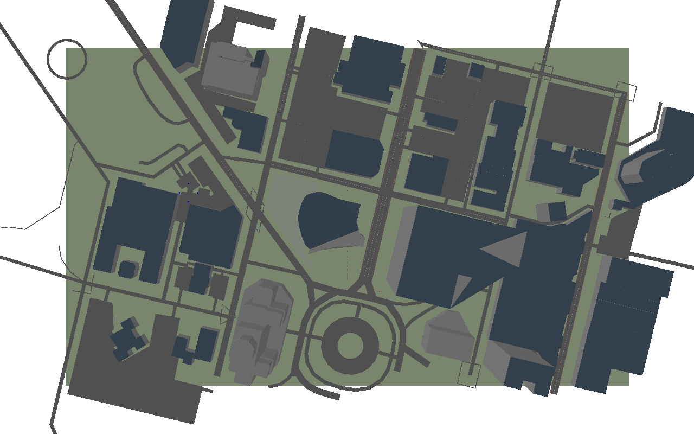

---
# SHASTA tutorial — iHuman Lab presentation template, extended for a hands-on session.
# See README.md for how this deck is organized and RUNSHEET.md for timing.
#
# Render with:  quarto render shasta-tutorial.qmd
#               quarto preview shasta-tutorial.qmd   (live-reload while editing)
title: "SHASTA Tutorial<br>Simulating [Human-Swarm Teaming]{.accent} on Real City Maps"
subtitle: "A hands-on introduction to the SHASTA simulator"
author: "Hemanth Manjunatha"
institute: "Oklahoma State University"
date: "2026-09-29"
description: "A hands-on introduction to SHASTA: install it, run a human-swarm mission in the GUI, and write your own experiment."
image: assets/world-overview.png
event_type: "Tutorial"
format:
  revealjs:
    theme: [default, theme.scss]
    slide-number: true
    transition: fade
    background-transition: fade
    logo: assets/logo.png
    footer: "iHuman Lab · Oklahoma State University"
    width: 1280
    height: 720
    margin: 0.1
    navigation-mode: linear
    controls: true
    progress: true
title-slide-attributes:
  data-background-image: assets/world-angled.png
  data-background-opacity: "0.35"
  data-background-color: "#252525"
---

## What This Tutorial [Covers]{.accent}

::: {.hook}
By the end, you'll have run a real swarm mission and written your own SHASTA experiment.
:::

::: {.flow-diagram}
::: {.flow-step}
**Part 1 — Why SHASTA**
what it simulates, and why
:::
::: {.flow-arrow}
↓
:::
::: {.flow-step}
**Part 2 — Install SHASTA**
from a clean checkout to your first mission
:::
::: {.flow-arrow}
↓
:::
::: {.flow-step}
**Part 3 — Experience a mission**
no code — just the GUI
:::
::: {.flow-arrow}
↓
:::
::: {.flow-step}
**Part 4 — Configure & extend**
the Python API, and your own experiment
:::
:::

---

::: {.divider}
[Part One]{.divider-kicker}
[Why SHASTA]{.divider-title}
[what it simulates, and why]{.divider-subtitle}
[OSM maps → pybullet world → swarms → a Gymnasium interface]{.divider-path}
:::

::: {.you-are-here}
[Why SHASTA]{.stop .here} [Install SHASTA]{.stop} [Experience a Mission]{.stop} [Configure & Extend]{.stop}
:::

---

## The [Question]{.accent}

::: {.hook}
How should a human coordinate a team of autonomous vehicles they can't fully see or predict?
:::

That's the human–swarm teaming question, and it shows up everywhere from disaster response to warehouse logistics to military reconnaissance. Answering it experimentally needs a testbed where three things are all changeable by the researcher, not fixed by the platform:

::: {.cards}
::: {.card}
[The World]{.card-title}
A real place, not an abstract grid — because how a human reads a street or a building matters to how they command a swarm in it.
:::
::: {.card}
[The Swarm]{.card-title}
How many vehicles, what kind, how they're organized — a formation of four drones is a different teaming problem than one of forty.
:::
::: {.card}
[The Interface]{.card-title}
What the human sees and how they issue orders — a map click, a voice command, and a joystick each change what "teaming" means.
:::
:::

::: {.punchline}
SHASTA is that testbed — and every one of those three is a config change, not a rewrite.
:::

## What Is [SHASTA]{.accent}

**S**imulator for **H**uman-**A**utonomy and **S**warm **T**eaming **A**pplications — a [pybullet](https://pybullet.org)-based simulator for studying human–swarm interaction on real city maps built from OpenStreetMap.

::: {.cards}
::: {.card}
[Real Maps]{.card-title}
Any place on Earth you can draw a bounding box around becomes a simulator map — real streets, real buildings.
:::
::: {.card}
[Two Vehicle Types]{.card-title}
UAVs (aerial, blue) and UGVs (ground, red) move in formation along the street network.
:::
::: {.card}
[Three Ways to Command]{.card-title}
A human via the GUI, a scripted policy, or a reinforcement-learning agent — same Gymnasium interface underneath.
:::
::: {.card .secondary}
[Real Physics]{.card-title}
Vehicles move through an actual [pybullet](https://pybullet.org) physics simulation, not a grid-world abstraction — collisions, formation spacing, and 3D altitude are all real.
:::
:::

## How It [Fits Together]{.accent}

::: {.arch}

::: {.arch-row}
::: {.arch-block}
[OPENSTREETMAP]{.arch-title}[`shasta fetch-osm`]{.arch-path}

A bounding box (south, west, north, east) around any real place — a campus, a neighborhood, a city block.
:::
:::

::: {.arch-link}
becomes
:::

::: {.arch-row}
::: {.arch-block}
[OSM2WORLD]{.arch-title}[`shasta build-map`]{.arch-path}

A custom tool turns the map into a 3D mesh and a street graph, fitting an affine transform so streets, buildings and vehicles all line up.
:::
:::

::: {.arch-link}
loads into
:::

::: {.arch-row}
::: {.arch-block}
[PYBULLET WORLD]{.arch-title}

The mesh loads directly — no Blender step needed. UAV and UGV groups spawn on it and move via physics constraints.
:::
:::

::: {.arch-link}
drives
:::

::: {.arch-row}
::: {.arch-block .secondary}
[GYMNASIUM ENV]{.arch-title}

`env.step({group_id: target_node})` is the one call that drives everything above it, whether the caller is a human, a script, or an RL agent.
:::
:::

:::

::: {.band}
Every layer here is something a researcher can swap — a different city, a different vehicle mix, a different policy — without touching the layers above it.
:::

## {background-image="assets/world-angled.png" background-opacity="0.85"}

::: {.slide-caption}
One real place — buildings and streets pulled straight from OpenStreetMap. This is Buffalo, NY; the same pipeline works for any city.
:::

## The [Teaming Loop]{.accent}

::: {.loop-grid}
::: {.loop-step}
[1]{.loop-number}[Order]{.loop-title}

A human, a scripted policy, or an RL agent picks a group and a target node.
:::
::: {.loop-step}
[2]{.loop-number}[Plan]{.loop-title}

`PathPlanning` finds a route for that group along the real street graph.
:::
::: {.loop-step .loop-decisive}
[3]{.loop-number}[Execute]{.loop-title}

`Formation` flies or drives the group along the route, one tick at a time.
:::
::: {.loop-step}
[4]{.loop-number}[Observe]{.loop-title}

Positions, battery, ammo, and mission progress come back as the observation.
:::
:::

::: {.band}
Every mission is one pass through this loop, over and over — and "Execute" is where a formation strategy, a communication delay, or a failure model gets injected.
:::

---

::: {.divider}
[Part Two]{.divider-kicker}
[Install SHASTA]{.divider-title}
[from a clean checkout to your first mission]{.divider-subtitle}
[a clone, a venv, one `pip install -e`, two checkpoint commands]{.divider-path}
:::

::: {.you-are-here}
[Why SHASTA]{.stop} [Install SHASTA]{.stop .here} [Experience a Mission]{.stop} [Configure & Extend]{.stop}
:::

---

## Install [SHASTA]{.accent}

```bash
pip install "ihuman-shasta[gui]"
```

::: {.card .secondary}
[Not on PyPI yet]{.card-title}
As of this tutorial, `ihuman-shasta` isn't published to PyPI — `pip install` fails with "No matching distribution found." Install from a clone instead (next slide). Check `pip install ihuman-shasta` again before your own session; this may already be fixed.
:::

## Install From a [Clone]{.accent}

```bash
git clone <the shasta-ub repository>
cd shasta-ub
python -m venv .venv && source .venv/bin/activate
pip install -e ".[gui]"
```

`[gui]` adds the human interface (`shasta gui`). Python 3.9 or newer.

::: {.checkpoint}
**Verified in this tutorial** — a clean editable install from a fresh checkout completes with no errors, on Python 3.10, from an empty virtual environment.
:::

## Checkpoint: [Verify the Install]{.accent}

```bash
shasta maps      # list the maps available
shasta demo      # headless — prints swarm progress, no window
```

::: {.checkpoint}
**`shasta maps` should print** a list of city names: `buffalo-small`, `buffalo-medium`, `chicago`, `new-york`, `san-jose`, and more.

**`shasta demo` should print**, and end with "All groups reached their targets":
```
Targets (map nodes): {0: 79, 1: 59}
step    0 centroids {0: [-350.6, -48.7], 1: [54.7, 82.4]}
...
step 1174 centroids {0: [-20.7, 147.6], 1: [123.9, 5.4]}
All groups reached their targets after 1174 steps.
```
:::

If you see both of those, the install is good — no 3D window needed yet.

---

::: {.divider}
[Part Three]{.divider-kicker}
[Experience a Mission]{.divider-title}
[no code — just the GUI]{.divider-subtitle}
[open it, pick a group, pick a target, send it]{.divider-path}
:::

::: {.you-are-here}
[Why SHASTA]{.stop} [Install SHASTA]{.stop} [Experience a Mission]{.stop .here} [Configure & Extend]{.stop}
:::

---

## Open the [GUI]{.accent}

```bash
shasta gui
```

::: {.checkpoint}
**You should see** a top-down map open, with your swarm groups on it (blue UAVs, red UGVs) and mission targets marked — no code needed for this part.
:::

{width="65%"}

## The [Controls]{.accent}

::: {.key-grid}
::: {.key-row}
[click]{.keycap .wide} [or]{.key-action} [`1`–`9`]{.keycap} [Pick a group — click its marker, click its button, or press its number]{.key-action}
:::
::: {.key-row}
[click]{.keycap .wide} [Pick a target — click near a street node; a white cross marks it]{.key-action}
:::
::: {.key-row}
[Enter]{.keycap .wide} [Send the group — or the **Send order** button, or double-click the node]{.key-action}
:::
::: {.key-row}
[Space]{.keycap .wide} [Pause / resume]{.key-action}
:::
::: {.key-row}
[-]{.keycap} [`+`]{.keycap} [Slow down / speed up]{.key-action}
:::
::: {.key-row}
[R]{.keycap} [Reset the view]{.key-action} [mouse wheel zooms, right-drag pans]{.key-note}
:::
::: {.key-row}
[V]{.keycap} [3D camera view, follows the selected group]{.key-action}
:::
:::

**Send ALL groups** and **Cancel order** are buttons in the side panel, not keys — for when you want everyone moving at once, or to call off an order mid-flight.

## What the [Side Panel]{.accent} Shows

::: {.columns}
::: {.column width="50%"}
::: {.check-card}
[While a mission is running]{.check-title}

::: {.check-item}
Mission progress — how many groups have reached their targets so far
:::
::: {.check-item}
The selected group's battery, ammo, distance to target, and ETA
:::
::: {.check-item}
An event log — orders sent, targets reached, groups arrived
:::
:::
:::
::: {.column width="50%"}
::: {.check-card}
[Options worth trying]{.check-title}

::: {.check-item}
`--map` — pick a different city (`shasta maps` lists them)
:::
::: {.check-item}
`--uav-groups` / `--ugv-groups` — change the swarm composition
:::
::: {.check-item}
`--seed` — reproduce the exact same mission again
:::
:::
:::
:::

::: {.punchline}
Try it now: pick a group, click a target near a street, press Enter.
:::

---

::: {.divider}
[Part Four]{.divider-kicker}
[Configure & Extend]{.divider-title}
[the Python API, and your own experiment]{.divider-subtitle}
[drive it headless, then subclass BaseExperiment]{.divider-path}
:::

::: {.you-are-here}
[Why SHASTA]{.stop} [Install SHASTA]{.stop} [Experience a Mission]{.stop} [Configure & Extend]{.stop .here}
:::

---

## Drive It From [Python]{.accent}

No window needed — the same simulation, scripted:

```python
from shasta.actors import UAV, UGV
from shasta.config import load_config
from shasta.env import ShastaEnv
from shasta.experiments import GoToNodeExperiment

config = load_config(headless=True)
config['experiment']['type'] = GoToNodeExperiment

groups = {0: [UAV() for _ in range(4)],   # group 0: four drones
          1: [UGV() for _ in range(3)]}   # group 1: three ground vehicles

env = ShastaEnv(config, groups)
obs, info = env.reset()

obs, reward, terminated, truncated, info = env.step({0: 5, 1: 5})
while not terminated:
    obs, reward, terminated, truncated, info = env.step(None)
env.close()
```

::: {.checkpoint}
**Verified in this tutorial** — this exact snippet runs end to end. `obs[0].shape` is `(4, 3)`: four UAVs, an (x, y, z) position each.
:::

## Four Things That Will [Trip You Up]{.accent}

::: {.hook}
All four below are things this tutorial hit directly while testing every command and snippet in it — not hypothetical.
:::

::: {.cards .vertical}
::: {.card .secondary}
[The map lives one level deeper than you'd guess]{.card-title}
`config['experiment']['map_to_use'] = "buffalo-medium"` — not `config['core']['map_name']`, which doesn't exist.
:::
::: {.card .secondary}
[Actors can't be reused across environments]{.card-title}
Build a fresh `groups` dict for every new `ShastaEnv(...)` — reusing the same UAV/UGV objects raises `ValueError: Cannot load an actor multiple times.`
:::
::: {.card .secondary}
[A group with no path can crash mid-mission]{.card-title}
If one group finishes well before another, continuing to call `env.step(None)` can raise `IndexError` in `GoToNodeExperiment.apply_actions` (intermittent — seen once in three runs in this tutorial). Give every group a similar-length route until this is fixed upstream.
:::
::: {.card .secondary}
[`Mission.random`'s count should match your group count]{.card-title}
`Mission.random(map, 3, seed=0)` against a two-group env leaves a target unassigned to any real group — `mission.is_complete()` then never returns `True`, even after every group you actually sent has arrived.
:::
:::

## Build Your Own [Experiment]{.accent}

Subclass `shasta.base_experiment.BaseExperiment` and implement four methods:

```python
class FlyNorthExperiment(BaseExperiment):
    def get_action_space(self): ...       # a gymnasium.spaces object
    def get_observation_space(self): ...  # likewise
    def apply_actions(self, actions, core): ...   # move things
    def get_observation(self, observation, core): ...  # shape the obs
    def get_done_status(self, observation, core): ...  # when to stop
    def compute_reward(self, observation, core): ...   # optional
```

See `labs/custom_experiment.py` for a complete, tested 70-line version — every actor in every group flies north for 300 steps, nothing more.

## The [Path from Here]{.accent}

::: {.flow-diagram}
::: {.flow-step}
**`labs/play.py`** — the mission from Part Two, with an EDIT ME block (map, group sizes, target)
:::
::: {.flow-step}
**`labs/custom_experiment.py`** — the minimal `BaseExperiment` subclass
:::
::: {.flow-step}
**`shasta/experiments.py`** — `GoToNodeExperiment`, the real one, ~40 lines
:::
::: {.flow-step}
**`shasta/primitives.py`** — reusable behaviors: `Formation`, `PathPlanning`
:::
:::

Building a map of your own campus or study site: `shasta fetch-osm` + `shasta build-map` (needs Java; not exercised in this tutorial — see the main `README.md`).

## {background-image="assets/background.jpg" background-opacity="0.25"}

<!-- Closing slide: logo, thank-you, contact. Keep this as your last slide. -->

::: {style="display:flex; flex-direction:column; align-items:center; justify-content:center; height:80vh; text-align:center;"}

{style="max-height:110px; border-radius:0 !important; box-shadow:none !important;"}

::: {style="font-family:'Rubik',sans-serif; font-size:2.8rem; font-weight:900; color:#ffffff; margin-top:0.8rem;"}
Thanks!
:::

::: {style="font-size:1.5rem; color:#EC672C; margin-top:1.2rem; font-weight:700;"}
Questions? See the SHASTA repository README.
:::

::: {style="font-size:1.5rem; color:rgba(255,255,255,0.35); margin-top:1rem; letter-spacing:2px;"}
your.name@okstate.edu
:::

:::
