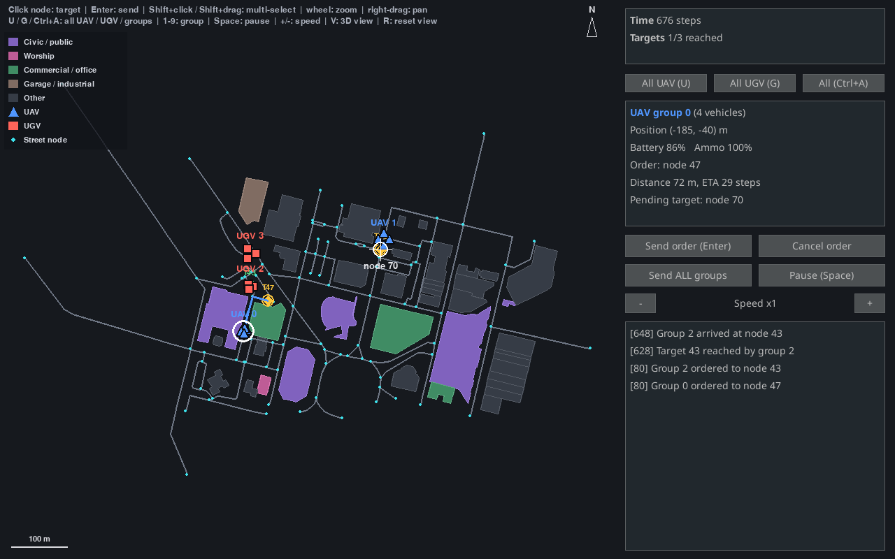

---
# SHaSTA tutorial — iHuman Lab presentation template, extended for a hands-on session.
# See README.md for how this deck is organized and RUNSHEET.md for timing.
#
# Render with:  quarto render shasta-tutorial.qmd
#               quarto preview shasta-tutorial.qmd   (live-reload while editing)
title: "SHaSTA<span class='title-fullname'>Simulator for Human And Swarm<br>[Team Applications]{.accent}</span>"
subtitle: "<span class='title-tagline'>A hands-on tutorial: putting a human in the loop with a swarm</span>"
author: "<span class='event-tag'>IEEE SMC 2026</span><br>Hemanth Manjunatha"
institute: "Oklahoma State University · University at Buffalo"
date: "2026-09-29"
description: "A hands-on introduction to SHaSTA for human–swarm interaction research: put a human in the loop, log what they do with LSL, and write your own experiment."
image: assets/world-overview.png
event_type: "Tutorial"
format:
  revealjs:
    theme: [default, theme.scss]
    slide-number: true
    transition: fade
    background-transition: fade
    logo: assets/logo.png
    footer: "SHaSTA Tutorial · OSU · UB"
    width: 1280
    height: 720
    margin: 0.1
    navigation-mode: linear
    controls: true
    progress: true
    include-after-body:
      text: |
        <script>
        document.addEventListener('DOMContentLoaded', function () {
          var titleSlide = document.getElementById('title-slide');
          if (!titleSlide) return;
          var row = document.createElement('div');
          row.style.cssText = 'position:absolute; top:528px; left:50%; transform:translateX(-50%); display:flex; align-items:center; gap:14px;';
          row.innerHTML =
            '' +
            '';
          titleSlide.appendChild(row);
        });
        </script>
title-slide-attributes:
  data-background-image: assets/world-angled.png
  data-background-opacity: "0.35"
  data-background-color: "#252525"
---

## Meet the [Team]{.accent}

::: {.hook}
Oklahoma State University × University at Buffalo
:::

::: {.team .cols-4}

::: {.member}


[Hemanth Manjunatha]{.member-name}
[Assistant Professor, MAE]{.member-role}
[Oklahoma State University]{.member-affil}
[iHuman Lab](https://ihuman-lab.github.io/lab-website/){.member-lab}
:::

::: {.member}


[Ehsan T. Esfahani]{.member-name}
[Associate Professor, MAE]{.member-role}
[University at Buffalo]{.member-affil}
[Human In the Loop Systems (HILS) Lab](https://www.acsu.buffalo.edu/~ehsanesf/){.member-lab}
:::

::: {.member}


[Souma Chowdhury]{.member-name}
[Associate Professor, MAE]{.member-role}
[University at Buffalo]{.member-affil}
[ADAMS Lab](https://adams.eng.buffalo.edu/){.member-lab}
:::

::: {.member}


[Karthik Dantu]{.member-name}
[Associate Professor, CSE]{.member-role}
[University at Buffalo]{.member-affil}
[DRONES Lab](http://drones.cse.buffalo.edu/){.member-lab}
:::

:::

::: {.member-link}
SHaSTA was built with UB alumni Prajit KrisshnaKumar, Joseph Distefano, Payam Ghassemi, Amir Behjat and Apurv Jani.
:::

## What This Tutorial [Covers]{.accent}

::: {.hook}
You will put a person in front of a swarm, record them on one clock, and swap in your own pieces.
:::

::: {.flow-diagram .compact}
::: {.flow-step}
**Part 1 — Why human–swarm interaction**
what to study, and what to measure
:::
::: {.flow-arrow}
↓
:::
::: {.flow-step}
**Part 2 — Install SHaSTA**
from a clean checkout to a first mission
:::
::: {.flow-arrow}
↓
:::
::: {.flow-step}
**Part 3 — Put a human in the loop**
the built-in interface, or your own
:::
::: {.flow-arrow}
↓
:::
::: {.flow-step}
**Part 4 — Measure the human, then extend**
LSL, and your own experiment
:::
:::

---

::: {.divider}
[Part One]{.divider-kicker}
[Why Human–Swarm Interaction]{.divider-title}
[the question, and what you need to study it]{.divider-subtitle}
[operator → swarm → measurement]{.divider-path}
:::

::: {.you-are-here}
[Why Human–Swarm]{.stop .here} [Install SHaSTA]{.stop} [Human in the Loop]{.stop} [Measure & Extend]{.stop}
:::

---

## The [Question]{.accent}

::: {.hook}
How should a person supervise a team of autonomous vehicles they can't fully see or predict?
:::

Human–swarm teams are used in disaster response, logistics and defence. What makes them hard to study is the person: too many vehicles overload them, they step in too much or too little, and they trust the swarm too much or too little. A useful testbed has to change four things, and measure the human.

::: {.cards .cols-4}
::: {.card}
[Interface]{.card-title}
How the person sees the swarm and gives orders: maps, communication, even VR.
:::
::: {.card}
[AI]{.card-title}
Learning agents that can command the swarm or advise the person: reinforcement and imitation learning.
:::
::: {.card}
[Human factors]{.card-title}
What the person's body and behaviour reveal: physiological sensing such as EEG and eye tracking.
:::
::: {.card .secondary}
[Swarm]{.card-title}
The vehicles and their behaviours: formations, path planning, composable primitives.
:::
:::

::: {.punchline}
SHaSTA is a testbed built around those four, with the human at the centre.
:::

## What Is [SHaSTA]{.accent}

**S**imulator for **H**uman **a**nd **S**warm **T**eam **A**pplications ([Manjunatha et al., 2024](https://doi.org/10.21203/rs.3.rs-4338790/v1)), a [pybullet](https://pybullet.org)-based simulator for studying how people command and work with swarms. Four components:

::: {.cards .cols-4}
::: {.card}
[SHaSTA core]{.card-title}
The swarm simulation: pybullet physics on real OpenStreetMap city maps, UAV and UGV groups, formation and path planning.
:::
::: {.card}
[Human interface]{.card-title}
Shows the swarm state and sends the operator's commands to the core.
:::
::: {.card .secondary}
[Data recording and sync]{.card-title}
Lab Streaming Layer time-stamps the operator's inputs and mission events.
:::
::: {.card .secondary}
[Physiological recording]{.card-title}
EEG, eye tracking and other sensors, streamed onto the same clock.
:::
:::

Every mission runs the same loop, and each step can be logged:

::: {.loop-grid .cols-4 .short}
::: {.loop-step}
[1]{.loop-number}[Observe]{.loop-title}

The operator sees positions, battery, ammo and mission progress.
:::
::: {.loop-step}
[2]{.loop-number}[Decide]{.loop-title}

They choose which group goes where.
:::
::: {.loop-step .loop-decisive}
[3]{.loop-number}[Command]{.loop-title}

`SwarmCommander` turns the order into a route on the street graph.
:::
::: {.loop-step}
[4]{.loop-number}[Execute]{.loop-title}

`Formation` moves the group along the route, and the state changes.
:::
:::

::: {.band}
The paper describes all four components. Today's `ihuman-shasta` ships the core and the human interface; Part 4 adds the LSL layer around it.
:::

---

::: {.divider}
[Part Two]{.divider-kicker}
[Install SHaSTA]{.divider-title}
[from a clean checkout to a first mission]{.divider-subtitle}
[clone → pip install -e → shasta demo]{.divider-path}
:::

::: {.you-are-here}
[Why Human–Swarm]{.stop} [Install SHaSTA]{.stop .here} [Human in the Loop]{.stop} [Measure & Extend]{.stop}
:::

---

## Install [SHaSTA]{.accent}

```bash
git clone <the shasta-ub repository>
cd shasta-ub
python -m venv .venv && source .venv/bin/activate
pip install -e ".[gui]"     # [gui] adds `shasta gui`; Python 3.9 or newer
```

Then verify:

```bash
shasta maps      # list the maps available
shasta demo      # headless: prints swarm progress, no window
```

::: {.checkpoint}
**`shasta maps` should list** city names such as `buffalo-small`, `buffalo-medium`, `chicago`, `new-york`. **`shasta demo` should end with** "All groups reached their targets after 1174 steps." Then the install is good, no 3D window needed yet. Verified from a fresh checkout on Python 3.10.
:::

::: {.card .secondary}
[Not on PyPI yet]{.card-title}
`pip install "ihuman-shasta[gui]"` fails with "No matching distribution found." Install from a clone as above. Check PyPI again before your own session; this may already be fixed.
:::

---

::: {.divider}
[Part Three]{.divider-kicker}
[Put a Human in the Loop]{.divider-title}
[the built-in interface, or your own]{.divider-subtitle}
[shasta gui → SwarmCommander → your interface]{.divider-path}
:::

::: {.you-are-here}
[Why Human–Swarm]{.stop} [Install SHaSTA]{.stop} [Human in the Loop]{.stop .here} [Measure & Extend]{.stop}
:::

---

## Open the [Interface]{.accent}

::: {.columns}
::: {.column width="64%"}
{fig-alt="The human interface mid-mission: the map with UAV and UGV groups and targets, and the side panel with group status and an event log."}
:::
::: {.column width="36%"}
```bash
shasta gui
```

::: {.check-card}
[What you are looking at]{.check-title}

::: {.check-item}
The map: blue UAVs, red UGVs, yellow targets
:::
::: {.check-item}
The side panel: mission progress and the selected group's status
:::
::: {.check-item}
The event log: every order and arrival
:::
:::
:::
:::

## The [Controls]{.accent}

::: {.key-grid}
::: {.key-row}
[click]{.keycap .wide} [or]{.key-action} [`1`–`9`]{.keycap} [Pick a group — click its marker, or press its number]{.key-action}
:::
::: {.key-row}
[click]{.keycap .wide} [Pick a target — click near a street node; a white cross marks it]{.key-action}
:::
::: {.key-row}
[Enter]{.keycap .wide} [Send the group — or the **Send order** button, or double-click the node]{.key-action}
:::
::: {.key-row}
[Space]{.keycap .wide} [Pause / resume]{.key-action}
:::
::: {.key-row}
[-]{.keycap} [`+`]{.keycap} [Slow down / speed up]{.key-action}
:::
::: {.key-row}
[V]{.keycap} [3D camera view, follows the selected group]{.key-action}
:::
::: {.key-row}
[panel]{.keycap .wide} [**Send ALL groups** and **Cancel order** are buttons in the side panel]{.key-action}
:::
:::

**Options for your study:** `--uav-groups` / `--ugv-groups` set how many vehicles the operator supervises, `--targets` / `--time-limit` set difficulty and time pressure, and `--seed` gives the same targets every run so trials are comparable.

## One Seam: [SwarmCommander]{.accent}

The interface is a thin window on `SwarmCommander`, which has no display dependency. Anything that can call it can be the human:

::: {.cards .cols-4}
::: {.card}
[Built-in interface]{.card-title}
the window you just saw
:::
::: {.card}
[Scripted operator]{.card-title}
a policy that plays the human
:::
::: {.card}
[AI advisor]{.card-title}
suggests or issues orders
:::
::: {.card}
[Your interface]{.card-title}
a web page, joystick, VR
:::
:::

```python
from shasta.interaction import Mission, SwarmCommander

commander = SwarmCommander(env, Mission.random(env.core.get_map(), 2, seed=0))
commander.send(0, commander.mission.targets[0])   # the human's orders
commander.send(1, commander.mission.targets[1])
while not commander.mission.is_over(commander.step_count):
    commander.update()                            # advance one tick
print(commander.events)                           # what happened, and when
```

::: {.checkpoint}
**Verified in this tutorial** — `labs/human_loop.py` runs this with no interface and no window. Set `headless=False` in `load_config` to watch it in the pybullet 3D window.
:::

---

::: {.divider}
[Part Four]{.divider-kicker}
[Measure the Human, Then Extend]{.divider-title}
[one clock for everything the person and the swarm do]{.divider-subtitle}
[events → LSL → recorder → analysis]{.divider-path}
:::

::: {.you-are-here}
[Why Human–Swarm]{.stop} [Install SHaSTA]{.stop} [Human in the Loop]{.stop} [Measure & Extend]{.stop .here}
:::

---

## Why [LSL]{.accent}

Lab Streaming Layer is the open-source standard for synchronising data from many devices and programs. SHaSTA's paper builds its data recording on it.

::: {.cards .cols-3}
::: {.card}
[One stream per source]{.card-title}
Each device or program publishes a stream: EEG, an eye tracker, event markers.
:::
::: {.card}
[One clock]{.card-title}
Every sample is time-stamped on a shared clock, so streams line up without extra cleaning.
:::
::: {.card}
[One recording]{.card-title}
A recorder such as LabRecorder saves every stream together for analysis.
:::
:::

In the paper's study, 20 participants commanded 3 UAV and 3 UGV platoons while EEG, eye tracking and game events were recorded through LSL. A session looks like this:

::: {.loop-grid .short}
::: {.loop-step}
[1]{.loop-number}[Start streams]{.loop-title}

Start each device's LSL stream.
:::
::: {.loop-step}
[2]{.loop-number}[Run]{.loop-title}

Run the scenario: the interface, or your own operator.
:::
::: {.loop-step}
[3]{.loop-number}[Record]{.loop-title}

Record every stream in one file, then analyse.
:::
:::

## Log the Operator, See It on the [Clock]{.accent}

```python
from pylsl import StreamInfo, StreamOutlet
info = StreamInfo("ShastaEvents", "Markers", 1, 0, "string", "shasta-demo")
outlet = StreamOutlet(info)          # any LSL recorder on the network can see it

sent = 0
def flush_events():                  # call after every commander.update()
    global sent
    for _, text in commander.events[sent:]:
        outlet.push_sample([text])   # time-stamped on LSL's clock
    sent = len(commander.events)
```

```
# what a recorder receives
  LSL time (s)  event
   1584705.990  Group 0 ordered to node 78
   1584706.233  Target 78 reached by group 0
   1584706.544  Mission complete in 1410 steps
```

::: {.checkpoint}
**Not in `ihuman-shasta` yet** — the paper's pattern around `SwarmCommander`. Tested script: `labs/lsl_markers.py`.
:::

## Four Things That Will [Trip You Up]{.accent}

::: {.hook}
All four below are things this tutorial hit directly while testing every command and snippet in it — not hypothetical.
:::

::: {.cards .cols-2}
::: {.card .secondary}
[The map lives one level deeper than you'd guess]{.card-title}
`config['experiment']['map_to_use'] = "buffalo-medium"` — not `config['core']['map_name']`, which doesn't exist.
:::
::: {.card .secondary}
[Actors can't be reused across environments]{.card-title}
Build a fresh `groups` dict for every new `ShastaEnv(...)` — reusing the same UAV/UGV objects raises `ValueError: Cannot load an actor multiple times.`
:::
::: {.card .secondary}
[A group with no path can crash mid-mission]{.card-title}
If one group finishes well before another, continuing to call `env.step(None)` can raise `IndexError` in `GoToNodeExperiment.apply_actions` (intermittent — seen once in three runs in this tutorial). Give every group a similar-length route until this is fixed upstream.
:::
::: {.card .secondary}
[`Mission.random`'s count should match your group count]{.card-title}
`Mission.random(map, 3, seed=0)` against a two-group env leaves a target unassigned to any real group — `mission.is_complete()` then never returns `True`, even after every group you actually sent has arrived.
:::
:::

## Build Your Own [Experiment]{.accent}

Subclass `shasta.base_experiment.BaseExperiment` and implement the methods:

```python
class FlyNorthExperiment(BaseExperiment):
    def get_action_space(self): ...       # a gymnasium.spaces object
    def get_observation_space(self): ...  # likewise
    def apply_actions(self, actions, core): ...   # move things
    def get_observation(self, observation, core): ...  # shape the obs
    def get_done_status(self, observation, core): ...  # when to stop
    def compute_reward(self, observation, core): ...   # optional
```

Where to start:

::: {.cards .cols-4}
::: {.card}
[Scripted operator]{.card-title}
`labs/human_loop.py`
:::
::: {.card}
[LSL markers]{.card-title}
`labs/lsl_markers.py`
:::
::: {.card}
[Smallest experiment]{.card-title}
`labs/custom_experiment.py`
:::
::: {.card}
[Human-facing layer]{.card-title}
`shasta/interaction.py`
:::
:::

A map of your own study site: `shasta fetch-osm` + `shasta build-map` (needs Java; not exercised here — see the main `README.md`).

## { background-opacity="0.25"}

<!-- Closing slide: logo, thank-you, contact. Keep this as your last slide. -->

::: {style="display:flex; flex-direction:column; align-items:center; justify-content:center; height:576px; text-align:center;"}

{style="max-height:110px; border-radius:0 !important; box-shadow:none !important;"}
{style="max-height:110px; border-radius:0 !important; box-shadow:none !important;"}

::: {style="font-family:'Rubik',sans-serif; font-size:2.8rem; font-weight:900; color:#ffffff; margin-top:0.8rem;"}
Thanks!
:::

::: {style="font-size:1.5rem; color:#EC672C; margin-top:1.2rem; font-weight:700;"}
{style="max-height:150px; border-radius:0 !important; box-shadow:none !important;"}

Questions? See the SHaSTA repository README.

ehsanesf@buffalo.edu  & hemanth.manjunatha@okstate.edu
:::

:::
