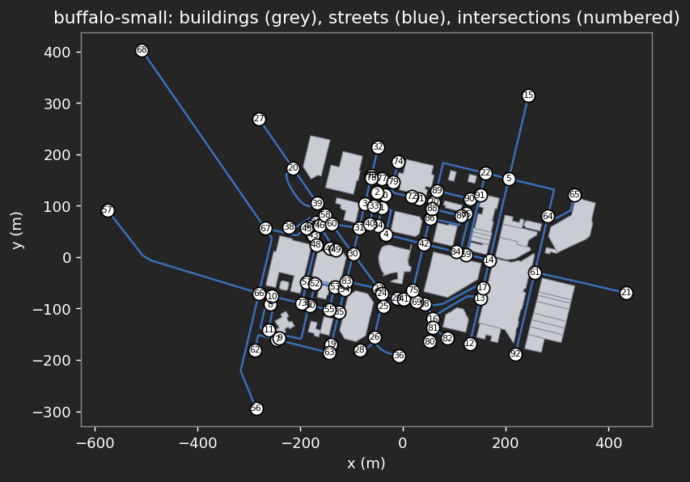
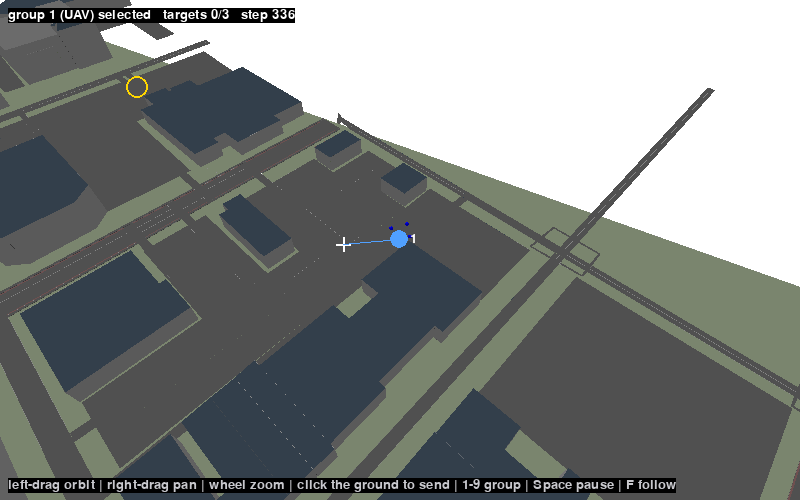
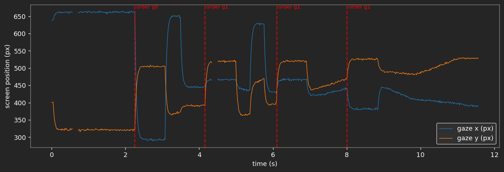

---
# SHaSTA tutorial — iHuman Lab presentation template, extended for a hands-on session.
# See README.md for how this deck is organized and RUNSHEET.md for timing.
#
# Render with:  quarto render shasta-tutorial.qmd
#               quarto preview shasta-tutorial.qmd   (live-reload while editing)
title: "Closing the [Human–AI]{.accent} Loop<span class='title-fullname'>Modular Architectures for Autonomous Teaming<br>and [Physiological Sensing]{.accent}</span>"
subtitle: "<span class='title-tagline'>A two-session hands-on tutorial: MOSAIC and SHaSTA</span><span class='title-venue'>IEEE SMC 2026 · Bellevue, WA</span>"
author: "Organizers: Hemanth Manjunatha · Ehsan Esfahani · Elahe Oveisi<br>Kristian Dalland · Bennett Kwaku Dogbey"
institute: "iHuman Lab · Oklahoma State University<br>Human in the Loop Systems Lab (HILS Lab) · University at Buffalo"
date: "2026-10-04"
description: "Closing the Human–AI Loop: Modular Architectures for Autonomous Teaming and Physiological Sensing. Session 2 is a hands-on introduction to SHaSTA for human–swarm interaction research: command a swarm from your browser, log what you do with LSL, and write your own experiment."
image: assets/world-overview.png
event_type: "Tutorial"
format:
  revealjs:
    theme: [default, theme.scss]
    slide-number: true
    transition: fade
    background-transition: fade
    logo: assets/logo.png
    footer: "SHaSTA Tutorial · OSU · UB"
    width: 1280
    height: 720
    margin: 0.1
    navigation-mode: linear
    controls: true
    progress: true
    include-after-body:
      text: |
        <script>
        // The two universities on the title slide
        document.addEventListener('DOMContentLoaded', function () {
          var titleSlide = document.getElementById('title-slide');
          if (!titleSlide) return;
          var col = document.createElement('div');
          col.style.cssText = 'position:absolute; top:50%; right:70px; transform:translateY(-50%); display:flex; flex-direction:column; align-items:center; gap:26px;';
          col.innerHTML =
            '' +
            '';
          titleSlide.appendChild(col);
        });
        </script>
title-slide-attributes:
  data-background-color: "#252525"
---

## Today's [Sessions]{.accent}

::: {.hook}
Two hands-on sessions, back to back, in the same room.
:::

:::: {.columns}

::: {.column width="50%"}
::: {.stat}
[8:30–10:30 AM]{.stat-number}
[Session 1 · MOSAIC]{.stat-label}
:::

A configurable testbed for human–AI teaming. Play a search-and-rescue mission in your browser, then change the task, the AI teammate and the sensing.
:::

::: {.column width="50%"}
::: {.stat .secondary}
[11:00 AM–1:00 PM]{.stat-number}
[Session 2 · SHaSTA]{.stat-label}
:::

A simulator for human–swarm teaming. Put a human in the loop with a swarm, and log what they do on one clock.
:::

::::

::: {.stats}
::: {.stat}
[Evergreen C]{.stat-number}
[Where]{.stat-label}
:::
::: {.stat}
[@Hyatt_Meeting]{.stat-number}
[Wi-Fi network]{.stat-label}
:::
::: {.stat}
[SMC26]{.stat-number}
[Wi-Fi password]{.stat-label}
:::
:::

::: {.notes}
Welcome. This is the tutorial "Closing the Human-AI Loop: Modular Architectures for
Autonomous Teaming and Physiological Sensing", in two sessions in Evergreen C.
Session 1, 8:30 to 10:30, is MOSAIC; Session 2, 11:00 to 1:00, is SHaSTA. Wi-Fi:
network @Hyatt_Meeting, password SMC26. Leave this slide up while people settle and
connect.
:::

---

::: {.divider}
[Session 2 · 11:00 AM–1:00 PM]{.divider-kicker}

[SHaSTA]{.divider-title}

[Simulator for Human And Swarm Team Applications]{.divider-subtitle}

[A hands-on tutorial: putting a human in the loop with a swarm]{.divider-path}
:::

---

## Meet the [Team]{.accent}

::: {.hook}
Oklahoma State University × University at Buffalo
:::

::: {.team .cols-4}

::: {.member}


[Hemanth Manjunatha]{.member-name}
[Assistant Professor, MAE]{.member-role}
[Oklahoma State University]{.member-affil}
[iHuman Lab](https://ihuman-lab.github.io/lab-website/){.member-lab}
:::

::: {.member}


[Ehsan T. Esfahani]{.member-name}
[Associate Professor, MAE]{.member-role}
[University at Buffalo]{.member-affil}
[Human In the Loop Systems (HILS) Lab](https://www.acsu.buffalo.edu/~ehsanesf/){.member-lab}
:::

::: {.member}


[Souma Chowdhury]{.member-name}
[Associate Professor, MAE]{.member-role}
[University at Buffalo]{.member-affil}
[ADAMS Lab](https://adams.eng.buffalo.edu/){.member-lab}
:::

::: {.member}


[Karthik Dantu]{.member-name}
[Associate Professor, CSE]{.member-role}
[University at Buffalo]{.member-affil}
[DRONES Lab](http://drones.cse.buffalo.edu/){.member-lab}
:::

:::

::: {.member-link}
SHaSTA was built with UB alumni Prajit KrisshnaKumar, Joseph Distefano, Payam Ghassemi, Amir Behjat and Apurv Jani.
:::

---

## What This Tutorial [Covers]{.accent}

::: {.hook}
You will put a person in front of a swarm, record them on one clock, and swap in your own pieces.
:::

::: {.flow-diagram .compact}
::: {.flow-step}
**Part 1 — Why human–swarm interaction**
what to study, and what to measure
:::
::: {.flow-arrow}
↓
:::
::: {.flow-step}
**Part 2 — Open the notebook**
nothing to install: a map and a config file in your browser
:::
::: {.flow-arrow}
↓
:::
::: {.flow-step}
**Part 3 — Put a human in the loop**
play the operator, then change the mission
:::
::: {.flow-arrow}
↓
:::
::: {.flow-step}
**Part 4 — Measure the human, then extend**
LSL, a recorded session, and your own experiment
:::
:::

---

::: {.divider}
[Part One]{.divider-kicker}
[Why Human–Swarm Interaction]{.divider-title}
[the question, and what you need to study it]{.divider-subtitle}
[operator → swarm → measurement]{.divider-path}
:::

::: {.you-are-here}
[Why Human–Swarm]{.stop .here} [Open the Notebook]{.stop} [Human in the Loop]{.stop} [Measure & Extend]{.stop}
:::

---

## The [Question]{.accent}

::: {.hook}
How should a person supervise a team of autonomous vehicles they can't fully see or predict?
:::

Human–swarm teams are used in disaster response, logistics and defence. What makes them hard to study is the person: too many vehicles overload them, they step in too much or too little, and they trust the swarm too much or too little. A useful testbed has to change four things, and measure the human.

::: {.cards .cols-4}
::: {.card}
[Interface]{.card-title}
How the person sees the swarm and gives orders: maps, communication, even VR.
:::
::: {.card}
[AI]{.card-title}
Learning agents that can command the swarm or advise the person: reinforcement and imitation learning.
:::
::: {.card}
[Human factors]{.card-title}
What the person's body and behaviour reveal: physiological sensing such as EEG and eye tracking.
:::
::: {.card .secondary}
[Swarm]{.card-title}
The vehicles and their behaviours: formations, path planning, composable primitives.
:::
:::

::: {.punchline}
SHaSTA is a testbed built around those four, with the human at the centre.
:::

---

## What Is [SHaSTA]{.accent}

**S**imulator for **H**uman **a**nd **S**warm **T**eam **A**pplications ([Manjunatha et al., 2024](https://doi.org/10.21203/rs.3.rs-4338790/v1)), a [pybullet](https://pybullet.org)-based simulator for studying how people command and work with swarms. Four components:

::: {.cards .cols-4}
::: {.card}
[SHaSTA core]{.card-title}
The swarm simulation: pybullet physics on real OpenStreetMap city maps, UAV and UGV groups, formation and path planning.
:::
::: {.card}
[Human interface]{.card-title}
Shows the swarm state and sends the operator's commands to the core.
:::
::: {.card .secondary}
[Data recording and sync]{.card-title}
Lab Streaming Layer time-stamps the operator's inputs and mission events.
:::
::: {.card .secondary}
[Physiological recording]{.card-title}
EEG, eye tracking and other sensors, streamed onto the same clock.
:::
:::

Every mission runs the same loop, and each step can be logged:

::: {.loop-grid .cols-4 .short}
::: {.loop-step}
[1]{.loop-number}[Observe]{.loop-title}

The operator sees positions, battery, ammo and mission progress.
:::
::: {.loop-step}
[2]{.loop-number}[Decide]{.loop-title}

They choose which group goes where.
:::
::: {.loop-step .loop-decisive}
[3]{.loop-number}[Command]{.loop-title}

`SwarmCommander` turns the order into a route on the street graph.
:::
::: {.loop-step}
[4]{.loop-number}[Execute]{.loop-title}

`Formation` moves the group along the route, and the state changes.
:::
:::

::: {.band}
The paper describes all four components. `ihuman-shasta` ships the core and the interface; the notebook adds LSL (`lsl_tools.py`).
:::

---

<!-- ============ PART 2 ============ -->

::: {.divider}
[Part Two]{.divider-kicker}
[Open the Notebook]{.divider-title}
[nothing to install: everything runs in your browser]{.divider-subtitle}
[server → notebook → first map]{.divider-path}

::: {.qr-card}
{fig-alt="QR code that opens the tutorial's Jupyter server"}

[Tutorial notebook]{.qr-title}
[On the tutorial server: the whole tutorial, run in your browser]{.qr-line}
[Sign in with your password, then open `01_shasta_hsi.ipynb`]{.qr-line}
[jupyter.ihuman-lab.work]{.qr-url}
:::
:::

::: {.you-are-here}
[Why Human–Swarm]{.stop} [Open the Notebook]{.stop .here} [Human in the Loop]{.stop} [Measure & Extend]{.stop}
:::

::: {.notes}
Nobody installs anything today: SHaSTA, its interface and the recording tools all run on the
tutorial server, and the interface is drawn in the browser. Leave this slide up while people scan
and sign in. Anyone whose laptop cannot reach the server pairs with a neighbor; the appendix has the
install for a laptop.
:::

---

## Open the [Notebook]{.accent}

::: {.hook}
Four steps, and nothing to install.
:::

:::: {.columns .install-split}

::: {.column width="55%"}
::: {.line-steps}
::: {.line-step}
[1]{.line-num} [Go to the server]{.line-title}

Scan the code on the last slide, or open `jupyter.ihuman-lab.work`
:::
::: {.line-step}
[2]{.line-num} [Sign in]{.line-title}

With the password you were given
:::
::: {.line-step}
[3]{.line-num} [Open the notebook]{.line-title}

`01_shasta_hsi.ipynb`, in the file list on the left
:::
::: {.line-step}
[4]{.line-num} [Pick the kernel]{.line-title}

**Python (smc)**, at the top right of the notebook
:::
:::
:::

::: {.column width="45%"}
::: {.feature-list}
::: {.feature-row}
[Notebook]{.feature-name} `01_shasta_hsi.ipynb`: the whole tutorial, in eight steps
:::
::: {.feature-row}
[Interface]{.feature-name} `live_play.py` and `world_view.py` show the interface and the 3D world in your browser
:::
::: {.feature-row}
[Settings]{.feature-name} `config.yaml`: the simulation as a text file
:::
::: {.feature-row}
[Recording]{.feature-name} `lsl_tools.py`: orders and gaze into one file
:::
:::
:::

::::

::: {.checkpoint}
The top right says **Python (smc)**. Run each cell with `Shift+Enter`, from the top.
:::

::: {.fig-note}
Prefer your own laptop? The appendix has the install, in one slide.
:::

::: {.notes}
Everything attendees need is already in the folder on the server: the notebook, `config.yaml`,
`live_play.py`, `world_view.py` and `lsl_tools.py`. If someone sees "No module named 'shasta'", the kernel is wrong:
pick Python (smc). The first code cell of the notebook must run first (it silences warnings and
sets pygame up to draw off-screen); everything after it can run in order.
:::

---

## Your First [Map]{.accent}

::: {.hook}
The city is a graph, and the simulation is a text file.
:::

:::: {.task-split}

::: {.task-col}
::: {.code-card}
[Step 1]{.code-file} [the map, as a street graph]{.code-where}

```{.python code-line-numbers="false"}
world_map = Map()
world_map.setup({"map_to_use": "buffalo-small"})
graph = world_map.get_node_graph()
# 93 intersections (nodes), 236 street segments (edges)
```
:::

::: {.code-card}
[`config.yaml`]{.code-file} [the simulation, as numbers]{.code-where}

```{.yaml code-line-numbers="false"}
swarm:
  uavs: 4          # drones in group 0
  ugvs: 3          # vehicles in group 1
  uav_speed: 2.5   # metres per second
mission:
  targets: 3
  time_limit: 2500
```
:::
:::

::: {.result-col}
::: {.result-img}
{fig-alt="The buffalo-small map: buildings in grey, streets in blue, and every intersection numbered."}
:::
:::

::::

::: {.notes}
SHaSTA builds its world from OpenStreetMap: buildings, a street network, and a table that converts
latitude and longitude to metres. Roads are a graph; the numbered circles are its nodes, the
intersections. Every order in the tutorial is "go to this node". The config file is read by SHaSTA
(window or not, the physics step, which map) and by the notebook (how many vehicles, how fast, the
mission).
:::

---

## First [Checkpoint]{.accent}

:::: {.columns}

::: {.column width="38%"}
::: {.check-card}
[Confirm]{.check-title}

::: {.check-item}
The kernel says Python (smc)
:::
::: {.check-item}
Step 1 printed the intersections and street segments
:::
::: {.check-item}
The map shows numbered intersections
:::
::: {.check-item}
No red error text under any cell
:::
:::
:::

::: {.column width="62%"}
::: {.tight-table}

| Symptom | Recovery |
|---|---|
| `No module named 'shasta'` | Wrong kernel: pick **Python (smc)** at the top right |
| `No module named 'live_play'` | `live_play.py` is not in the notebook's folder |
| The picture does not respond | Click the picture once, then use the mouse and keys |
| A blank picture | Run the cell again and wait a second |
| `Cannot load an actor multiple times` | Rerun the whole cell, not only its last line |
| The server does not open | Ask a helper; share a neighbor's screen meanwhile |

:::
:::

::::

::: {.punchline}
Everyone with a map on screen is ready for [Part Three]{.accent}.
:::

::: {.notes}
This is the checkpoint before the hands-on part. The most common problem is the kernel; the second
is the picture not receiving the mouse until it is clicked.
:::

---

::: {.divider}
[Part Three]{.divider-kicker}
[Put a Human in the Loop]{.divider-title}
[the built-in interface, or your own]{.divider-subtitle}
[shasta gui → SwarmCommander → your interface]{.divider-path}
:::

::: {.you-are-here}
[Why Human–Swarm]{.stop} [Open the Notebook]{.stop} [Human in the Loop]{.stop .here} [Measure & Extend]{.stop}
:::

---

## Play It [Yourself]{.accent}

:::: {.columns .run-split}

::: {.column width="46%"}

::: {.feature-list .compact}
::: {.feature-row}
[Open]{.feature-name} Step 3 of the notebook, *Human in the loop*
:::
::: {.feature-row}
[Run]{.feature-name} `Shift+Enter`, then click the picture so it receives your mouse
:::
::: {.feature-row}
[Command]{.feature-name} Click a group's marker, click a street node, press `Enter`
:::
::: {.feature-row}
[Watch]{.feature-name} The groups follow the streets; the targets are the yellow markers
:::
::: {.feature-row}
[Stop]{.feature-name} Press **Stop** to end and see how many targets you reached
:::
:::

:::

::: {.column width="54%"}
{fig-alt="The human interface mid-mission: the map with UAV and UGV groups and targets, and the side panel with group status and an event log."}

::: {.fig-note}
You should see this: the map and the swarm on the left, the status and event log on the right.
:::
:::

::::

::: {.notes}
Give everyone several minutes of free play. The picture is the real SHaSTA interface, drawn off-screen
on the server and sent to the browser; your clicks go back to it. It is the same window `shasta gui`
opens on a laptop. Anyone whose picture does not respond clicks it once.
:::

---

## The [Controls]{.accent}

::: {.hook}
Click the picture first. The mouse and keys then go to the interface.
:::

::: {.key-grid}
::: {.key-row}
[click]{.keycap .wide} [or]{.key-action} [`1`–`9`]{.keycap} [Pick a group — click its marker, or press its number]{.key-action}
:::
::: {.key-row}
[click]{.keycap .wide} [Pick a target — click near a street node; a white cross marks it]{.key-action}
:::
::: {.key-row}
[Enter]{.keycap .wide} [Send the group — or the **Send order** button, or double-click the node]{.key-action}
:::
::: {.key-row}
[Shift]{.keycap .wide} [Select several groups — shift-click their markers, or shift-drag a box]{.key-action}
:::
::: {.key-row}
[wheel]{.keycap .wide} [Zoom the map]{.key-action} [drag]{.keycap} [Pan with the right button]{.key-action}
:::
::: {.key-row}
[Space]{.keycap .wide} [Pause / resume]{.key-action}
:::
::: {.key-row}
[-]{.keycap} [`+`]{.keycap} [Slow down / speed up]{.key-action}
:::
::: {.key-row}
[V]{.keycap} [3D camera view, follows the selected group]{.key-action}
:::
:::

**Options for your study** are numbers in the notebook's Step 4: vehicles, targets, time, and the seed that repeats the targets.

---

## One Seam: [SwarmCommander]{.accent}

The interface is a thin window on `SwarmCommander`, which has no display dependency. Anything that can call it can be the human:

::: {.cards .cols-4}
::: {.card}
[Built-in interface]{.card-title}
the window you just saw
:::
::: {.card}
[Scripted operator]{.card-title}
a policy that plays the human
:::
::: {.card}
[AI advisor]{.card-title}
suggests or issues orders
:::
::: {.card}
[Your interface]{.card-title}
a web page, joystick, VR
:::
:::

```python
from shasta.interaction import Mission, SwarmCommander

commander = SwarmCommander(env, Mission.random(env.core.get_map(), 2, seed=0))
commander.send(0, commander.mission.targets[0])   # the human's orders
commander.send(1, commander.mission.targets[1])
while not commander.mission.is_over(commander.step_count):
    commander.update()                            # advance one tick
print(commander.events)                           # what happened, and when
```

::: {.checkpoint}
**Run it in the notebook** — Step 3's *No human needed* cell plays a whole mission this way, with a scripted operator and no window. Set `headless=False` in `load_config` to watch it in the pybullet 3D window.
:::

---

## No Human [Required]{.accent}

::: {.hook}
You just commanded the swarm by hand. The same environment runs with nobody at the keyboard.
:::

:::: {.task-split}

::: {.task-col}
::: {.code-card}
[notebook · Step 2]{.code-file} [an order, with no human]{.code-where}

```{.python code-line-numbers="false"}
obs, info = env.reset()
obs, reward, terminated, truncated, info = env.step({0: target})
while not terminated:
    obs, reward, terminated, truncated, info = env.step(None)
```
:::

[Run]{.task-label} Step 2, the cell called *Order a group, with no human*.

[Would a learning agent change this loop?]{.predict}
:::

::: {.result-col .fragment}
[What you get]{.task-label}

::: {.watch-list}
::: {.watch-item}
[1]{.watch-num} [The Gym API]{.watch-title} `reset()` and `step(action)`, the interface RL libraries expect
:::

::: {.watch-item}
[2]{.watch-num} [An order is the action]{.watch-title} `{group: node}`; `None` means keep going
:::

::: {.watch-item}
[3]{.watch-num} [No window]{.watch-title} PyBullet runs headless and the mission runs as fast as it can compute
:::
:::
:::

::::

::: {.punchline}
A person, a script, or an RL agent can command the swarm: [one environment, one interface]{.accent}.
:::

::: {.notes}
SHaSTA is a Gymnasium environment: `env.reset()` starts it and `env.step(action)` returns
`(observation, reward, terminated, truncated, info)`. Here the action is an order, a dictionary from a
group to a map node, and `None` keeps the groups going. So a script, or an agent trained with
reinforcement learning, can command the swarm with no person involved, and the person is one kind of
operator, not part of the environment. The notebook's Step 3 shows the same idea one level up: a
scripted operator drives `SwarmCommander`. This tutorial does not train an agent.
:::

---

## The PyBullet [World]{.accent}

::: {.hook}
SHaSTA's physics is PyBullet: no window needed, yet you can reach in.
:::

:::: {.columns .run-split}

::: {.column width="44%"}

::: {.feature-list .compact}
::: {.feature-row}
[Headless]{.feature-name} PyBullet runs in `DIRECT` mode: a trip across the map takes a fraction of a second
:::
::: {.feature-row}
[Render]{.feature-name} `getCameraImage` draws the 3D scene to an image, so a browser can show it
:::
::: {.feature-row}
[Interact]{.feature-name} A click becomes a ray into the world; where it meets the ground, the nearest street node is the order
:::
::: {.feature-row}
[Try it]{.feature-name} Step 3, *Interact with the PyBullet world*: drag to look around, click the ground to send the selected group
:::
:::

:::

::: {.column width="56%"}
{fig-alt="The 3D PyBullet world rendered in the browser: buildings and streets, a UAV group flying towards a clicked street node, and a yellow ring around a mission target."}

::: {.fig-note}
The white cross is the node that was clicked.
:::
:::

::::

::: {.notes}
PyBullet is the physics engine under SHaSTA, and it runs with no window at all: `DIRECT` mode. The 2D map is one view of it; this is another. PyBullet renders the scene to an image with
`getCameraImage`, so the notebook can show the 3D world in the browser and let you move the camera with the mouse. A click is turned into a ray through the camera, the ray is intersected with
the ground, and the nearest node of the street graph becomes `commander.send(selected_group, node)`. The code is `world_view.py`, next to the notebook: about a hundred lines. Because the
physics needs no window, the same world can also run with nobody watching, which is how a script or a learning agent uses it.
:::

---

## What You Can [Customize]{.accent}

::: {.hook}
Every setting is a number. Change them and play your own.
:::

:::: {.task-split}

::: {.task-col}
::: {.code-card}
[notebook · Step 4]{.code-file} [the build-your-own cell]{.code-where}

```{.python code-line-numbers="false"}
UAVS, UGVS = 4, 3          # vehicles in each group
SPEED = 2.5                # metres per second
TARGETS, RADIUS = 3, 12.0  # targets, and how close counts
TIME_LIMIT = 2500          # simulation steps
SEED = 0                   # the same targets every run
```
:::

[Run]{.task-label} Change the numbers, run the cell, and play.

[How does the operator's job change?]{.predict}
:::

::: {.result-col .fragment}
[What each one changes]{.task-label}

::: {.watch-list}
::: {.watch-item}
[1]{.watch-num} [Vehicles]{.watch-title} More to supervise: more load on the operator
:::

::: {.watch-item}
[2]{.watch-num} [Targets and radius]{.watch-title} More, or harder to reach
:::

::: {.watch-item}
[3]{.watch-num} [Time limit]{.watch-title} Less time, more pressure
:::

::: {.watch-item}
[4]{.watch-num} [Seed]{.watch-title} The same targets, so trials are comparable
:::
:::
:::

::::

::: {.notes}
These are the `swarm` and `mission` sections of `config.yaml`; Step 4 copies the config, changes them,
and starts the interface. The operator's workload is the research variable here: how many groups they
supervise, how many targets, how much time. Counts live in the config, so a study sets them once and
every participant gets the same task.
:::

---

<!-- ============ BREAK ============ -->

::: {.divider}
[Break · 10 minutes]{.divider-kicker}

[Take a Break]{.divider-title}

[Next · Part Four: Measure the Human, Then Extend]{.divider-path}
:::

::: {.notes}
Ten minutes. Leave this slide up. Helpers use the time to help anyone whose kernel is wrong or whose
picture does not respond. Part Four records a session while you play it, so the interface in Step 3
has to be working first.
:::

---

::: {.divider}
[Part Four]{.divider-kicker}
[Measure the Human, Then Extend]{.divider-title}
[one clock for everything the person and the swarm do]{.divider-subtitle}
[events → LSL → recorder → analysis]{.divider-path}
:::

::: {.you-are-here}
[Why Human–Swarm]{.stop} [Open the Notebook]{.stop} [Human in the Loop]{.stop} [Measure & Extend]{.stop .here}
:::

---

## Why [LSL]{.accent}

Lab Streaming Layer is the open-source standard for synchronising data from many devices and programs. SHaSTA's paper builds its data recording on it.

::: {.cards .cols-3}
::: {.card}
[One stream per source]{.card-title}
Each device or program publishes a stream: EEG, an eye tracker, event markers.
:::
::: {.card}
[One clock]{.card-title}
Every sample is time-stamped on a shared clock, so streams line up without extra cleaning.
:::
::: {.card}
[One recording]{.card-title}
A recorder such as LabRecorder saves every stream together for analysis.
:::
:::

In the paper's study, 20 participants commanded 3 UAV and 3 UGV platoons while EEG, eye tracking and game events were recorded through LSL. A session looks like this:

::: {.loop-grid .short}
::: {.loop-step}
[1]{.loop-number}[Start streams]{.loop-title}

Start each device's LSL stream.
:::
::: {.loop-step}
[2]{.loop-number}[Run]{.loop-title}

Run the scenario: the interface, or your own operator.
:::
::: {.loop-step}
[3]{.loop-number}[Record]{.loop-title}

Record every stream in one file, then analyse.
:::
:::

---

## Log the Operator, See It on the [Clock]{.accent}

::: {.hook}
Every order becomes a time-stamped marker, with its target on the screen.
:::

:::: {.task-split}

::: {.task-col}
::: {.code-card}
[notebook · Step 7]{.code-file} [two lines on the commander]{.code-where}

```{.python code-line-numbers="false"}
markers = MarkerOutlet("SHASTA-Events")
attach_markers(commander, markers)
attach_order_markers(commander, markers, view)
```
:::

[Run]{.task-label} Step 7: give a few orders, then press **Stop**.
:::

::: {.result-col}
[What a recorder receives]{.task-label} [(x, y): target, px]{.src-cap}

::: {.result-terminal}
```{.text code-line-numbers="false"}
 LSL time  marker
   0.00 s  session_start
   2.27 s  order  group 0 -> 10   (293, 505)
   3.60 s  order  group 1 -> 25   (467, 520)
   4.95 s  order  group 0 -> 40   (445, 391)
   7.05 s  session_end
```
:::
:::

::::

::: {.notes}
`attach_markers` and `attach_order_markers` are in `lsl_tools.py`, next to the notebook: they wrap the
commander so that every log line and every order is pushed to an LSL marker stream. An order marker also
carries the target's position on the screen, which is where the operator should look next; gaze can then
be compared with it. This is the paper's pattern around `SwarmCommander`; the LSL layer is not part of the
`ihuman-shasta` package yet.
:::

---

## Record Your Own [Session]{.accent}

::: {.hook}
Play the operator. Your orders and the gaze go into one file.
:::

::: {.loop-grid .short}
::: {.loop-step}
[1]{.loop-number}[Markers]{.loop-title}

Every order you give, with its target on the screen.
:::
::: {.loop-step}
[2]{.loop-number}[Gaze]{.loop-title}

Where the operator looks. Synthetic here: it looks at your last target, then follows the group.
:::
::: {.loop-step}
[3]{.loop-number}[Recorder]{.loop-title}

Picks up exactly these two streams and writes one XDF file.
:::
:::

::: {.code-card}
[notebook · Step 7]{.code-file} [the last cell]{.code-where}

```{.python code-line-numbers="false"}
play_shasta(gui, on_stop=finish)     # play, press Stop, and the file is saved
```
:::

::: {.band}
A real eye tracker streams the same way: it publishes a `Gaze` stream from the laptop it is plugged into, and the recorder picks it up. See the appendix.
:::

::: {.notes}
Step 7 has two cells: the first starts the streams and the recorder, the second plays the interface while
the synthetic gaze looks at the target you just ordered and then follows the selected group. Press Stop and
the session ends, the streams close, and `session.xdf` is saved next to the notebook. Rerun both cells to
record again. The synthetic gaze is made up, so no hardware is needed; the stream is marked synthetic in the
file.
:::

---

## Analyse the [Recording]{.accent}

::: {.hook}
Both streams share one clock, so a look lines up with an order.
:::

{height="285" fig-alt="Gaze x and y over time, with a red dashed line at each order."}

::: {.cards .cols-3}
::: {.card}
[Gaze over time]{.card-title}
Each red line is an order. The gaze jumps to the target right after it.
:::
::: {.card}
[Where they looked]{.card-title}
Fixations and a heatmap on the interface.
:::
::: {.card}
[Reaction to an order]{.card-title}
How long until the operator looks at the target, and for how long.
:::
:::

::: {.notes}
Step 8 loads `session.xdf` with `pyxdf` and draws figures like this one from the session in Step 7. The gaze
here is synthetic, built to look at the target right after each order, so it shows the method; with a real
tracker the same cells measure real latency and dwell time. The heatmap and fixations are drawn on a frame of
the interface. To analyse a real study, set `XDF_PATH` to the LabRecorder file.
:::

---

## Four Things That Will [Trip You Up]{.accent}

::: {.hook}
All four below are things this tutorial hit directly while testing every command and snippet in it — not hypothetical.
:::

::: {.cards .cols-2}
::: {.card .secondary}
[The map lives one level deeper than you'd guess]{.card-title}
`config['experiment']['map_to_use'] = "buffalo-medium"` — not `config['core']['map_name']`, which doesn't exist.
:::
::: {.card .secondary}
[Actors can't be reused across environments]{.card-title}
Build a fresh `groups` dict for every new `ShastaEnv(...)` — reusing the same UAV/UGV objects raises `ValueError: Cannot load an actor multiple times.`
:::
::: {.card .secondary}
[A group with no path can crash mid-mission]{.card-title}
If one group finishes well before another, continuing to call `env.step(None)` can raise `IndexError` in `GoToNodeExperiment.apply_actions` (intermittent — seen once in three runs in this tutorial). Give every group a similar-length route until this is fixed upstream.
:::
::: {.card .secondary}
[`Mission.random`'s count should match your group count]{.card-title}
`Mission.random(map, 3, seed=0)` against a two-group env leaves a target unassigned to any real group — `mission.is_complete()` then never returns `True`, even after every group you actually sent has arrived.
:::
:::

---

## Build Your Own [Experiment]{.accent}

::: {.hook}
Subclass `GoToNodeExperiment`, add your own rules, and compare strategies.
:::

:::: {.task-split}

::: {.task-col}
::: {.code-card}
[notebook · Step 5]{.code-file} [abridged]{.code-where}

```{.python code-line-numbers="false"}
class TargetCollector(GoToNodeExperiment):
    def apply_actions(self, actions, core):
        ...    # pick the next node with the strategy, fly to it
    def get_done_status(self, observation, core):
        ...    # done when every node has been visited
    def compute_reward(self, observation, core):
        return (1.0 if self.arrived_now else 0.0) - 0.001
```
:::

[Run]{.task-label} Step 5, then add a strategy of your own.
:::

::: {.result-col .fragment}
[Two strategies, the same five nodes]{.task-label}

::: {.tight-table}

| Strategy | Steps | Distance | Reward |
|---|---|---|---|
| nearest | 6023 | 2828 m | -1.02 |
| random | 6832 | 3196 m | -1.83 |

:::

::: {.watch-list}
::: {.watch-item}
[1]{.watch-num} [Your rules]{.watch-title} What the vehicles do, what is observed, when it ends
:::

::: {.watch-item}
[2]{.watch-num} [A reward]{.watch-title} +1 for each node, a small cost for each step
:::
:::
:::

::::

::: {.notes}
An experiment is a class that fills in `apply_actions`, `get_observation`, `get_done_status` and
`compute_reward` of `BaseExperiment`. `GoToNodeExperiment` already routes and flies in formation, so
`TargetCollector` extends it: one UAV group visits a list of nodes, picking the next with a strategy you
pass in. The table is the output of the notebook's cell. A map of your own study site: `shasta fetch-osm`
and `shasta build-map` (need Java; not exercised in this tutorial).
:::

---

## Open [Discussion]{.accent}

::: {.watch-list .discuss}
::: {.watch-item}
[1]{.watch-num} [Your question]{.watch-title} What would you ask about a person commanding a swarm, and what would you change in the map, the mission or the number of vehicles to ask it?
:::

::: {.watch-item}
[2]{.watch-num} [Human and autonomy]{.watch-title} Which decisions should the person keep and which should the swarm make? Would an LLM or a learned policy take some of them?
:::

::: {.watch-item}
[3]{.watch-num} [Sense the human]{.watch-title} Gaze, heart rate, EEG: which streams, and which orders would you mark? The same loop fits a rescuer in rooms in the other session.
:::
:::

::: {.notes}
Open on purpose: the three questions are prompts, not an agenda, so let the room choose. Give two minutes in pairs first, then take whatever comes. Questions 2 and 3 reach across to the MOSAIC session, so people who attend only one can still join. Write down what people say is missing; it becomes the issue list.
:::

---

## { background-opacity="0.25"}

<!-- Closing slide: logo, thank-you, contact. Keep this as your last slide. -->

::: {style="display:flex; flex-direction:column; align-items:center; justify-content:center; height:576px; text-align:center;"}

{style="max-height:110px; border-radius:0 !important; box-shadow:none !important;"}
{style="max-height:110px; border-radius:0 !important; box-shadow:none !important;"}

::: {style="font-family:'Rubik',sans-serif; font-size:2.8rem; font-weight:900; color:#ffffff; margin-top:0.8rem;"}
Thanks!
:::

::: {style="font-size:1.5rem; color:#EC672C; margin-top:1.2rem; font-weight:700;"}
{style="max-height:150px; border-radius:0 !important; box-shadow:none !important;"}

Questions? See the SHaSTA repository README.

ehsanesf@buffalo.edu  & hemanth.manjunatha@okstate.edu
:::

:::

---

::: {.divider}
[Appendix]{.divider-title}

[More ways to run it]{.divider-subtitle}

[On your laptop, and with a real eye tracker]{.divider-path}
:::

---

## Run SHaSTA on Your Own [Laptop]{.accent}

::: {.hook}
Everything here runs on a laptop too, with Python 3.9 or newer and Git.
:::

:::: {.columns .install-split}

::: {.column width="58%"}
::: {.panel-tabset .install-code}

### macOS / Linux

```bash
git clone <the shasta-ub repository>
cd shasta-ub
python3 -m venv .venv
source .venv/bin/activate
```

### Windows PowerShell

```powershell
git clone <the shasta-ub repository>
cd shasta-ub
python -m venv .venv
.venv\Scripts\Activate.ps1
```

:::

```bash
python -m pip install -e ".[gui]"
python -m pip install pylsl pyxdf ipywidgets ipyevents notebook
cd notebooks
python -m jupyter notebook 01_shasta_hsi.ipynb
```
:::

::: {.column width="42%"}
::: {.line-steps}
::: {.line-step}
[1]{.line-num} [Clone and isolate]{.line-title}

The code, and a private Python environment
:::
::: {.line-step}
[2]{.line-num} [Install SHaSTA]{.line-title}

`[gui]` adds the human interface; `-e` means edits apply without reinstalling
:::
::: {.line-step}
[3]{.line-num} [Notebook packages]{.line-title}

For LSL, the recording, and the browser interface
:::
::: {.line-step}
[4]{.line-num} [Open the notebook]{.line-title}

Start Jupyter from the `notebooks` folder
:::
:::
:::

::::

::: {.card .secondary}
[Not on PyPI yet]{.card-title}
`pip install "ihuman-shasta[gui]"` fails with "No matching distribution found." Install from a clone as above. The notebook asks for the kernel: choose **Python 3 (ipykernel)**. `shasta gui` opens the interface in its own window.
:::

::: {.notes}
The notebook draws the interface off-screen and shows it in the browser, so a laptop needs no display setup
beyond a browser. `shasta maps` lists the maps and `shasta demo` runs a headless mission, which is a good
check that the install works. `shasta gui` is the same interface in its own window.
:::

---

## Record a Real Study on a [Laptop]{.accent}

::: {.hook}
A USB eye tracker cannot plug into the server, so a real recording runs on the tracker's laptop.
:::

::: {.code-card}
[on the tracker's laptop]{.code-file} [in `notebooks/`]{.code-where}

```{.bash code-line-numbers="false"}
python tobii_to_lsl.py --width 1920 --height 1080     # the Tobii tracker -> an LSL "Gaze" stream
python shasta_gui_lsl.py --map buffalo-small          # the real interface + an LSL "Markers" stream
# LabRecorder: Update, select both streams, Start, run the task, Stop
```
:::

::: {.feature-list}
::: {.feature-row}
[Then]{.feature-name} LabRecorder writes one `.xdf` file. Upload it next to the notebook, set `XDF_PATH` in Step 8, and run the analysis unchanged.
:::
::: {.feature-row}
[Caveat]{.feature-name} `tobii_to_lsl.py` and `shasta_gui_lsl.py` have not been run against real hardware in this repository: check them on your own setup first.
:::
:::

::: {.notes}
`tobii_to_lsl.py` publishes the tracker as an LSL stream with the same name and channels as the notebook's
synthetic gaze, so the analysis cells do not change. `shasta_gui_lsl.py` is the normal interface plus an LSL
marker stream of the operator's orders. Start the tracker stream and LabRecorder first. Calibrate the tracker
in the vendor's software; the script does not calibrate.
:::
